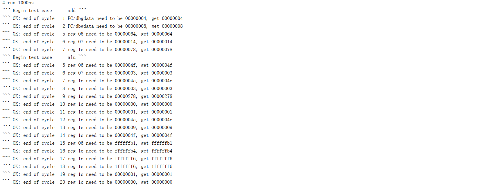
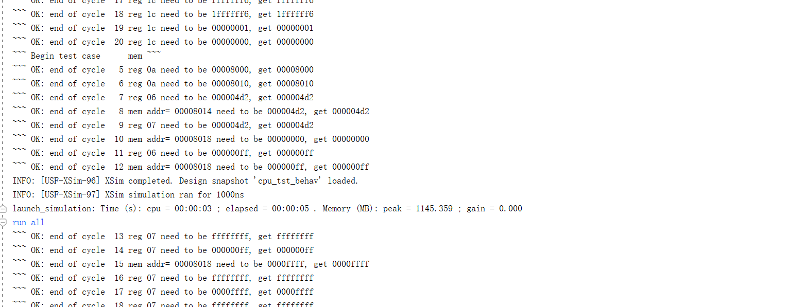
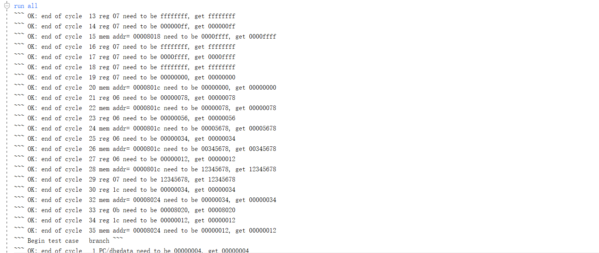
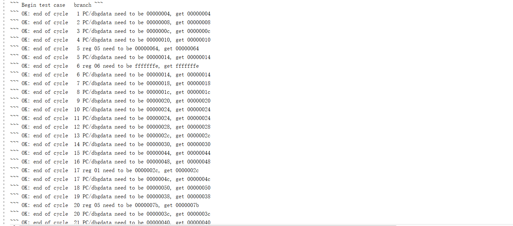
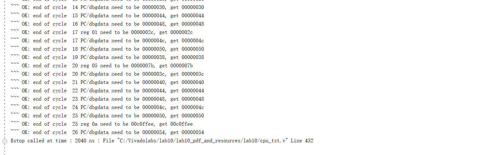
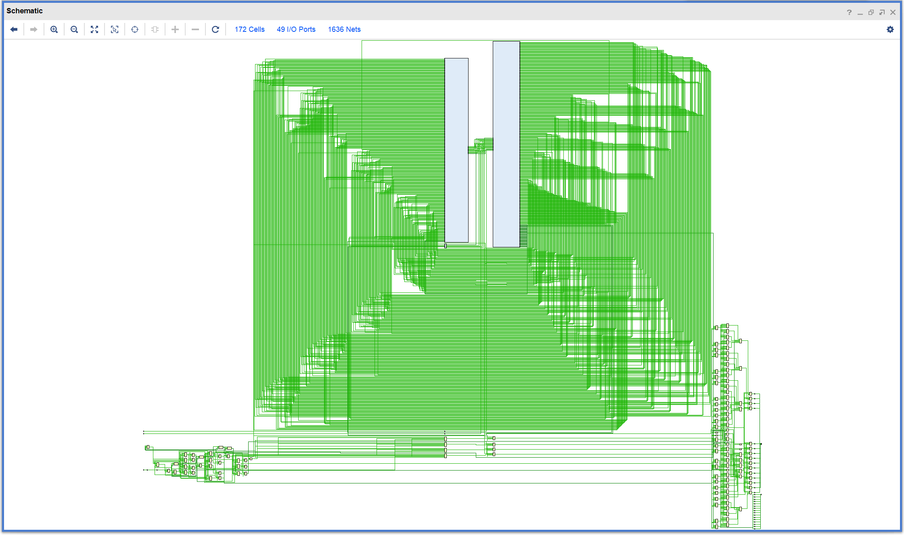
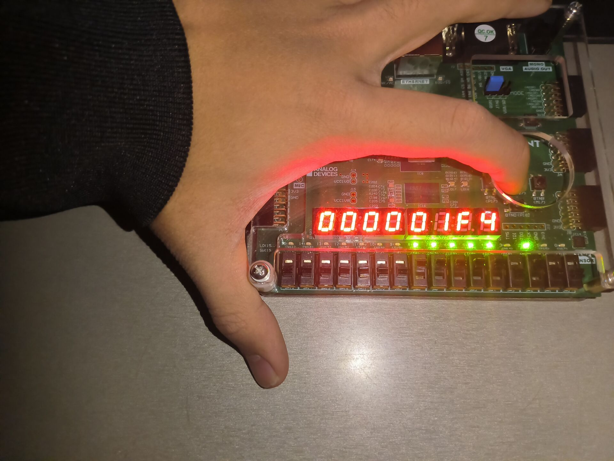
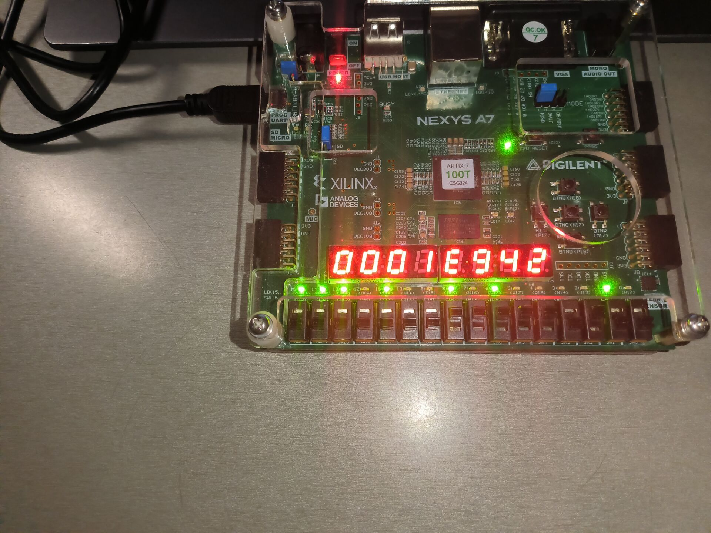
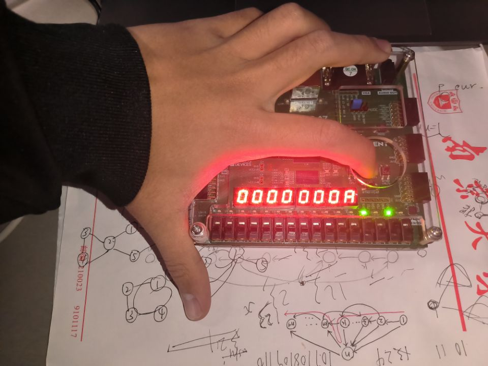
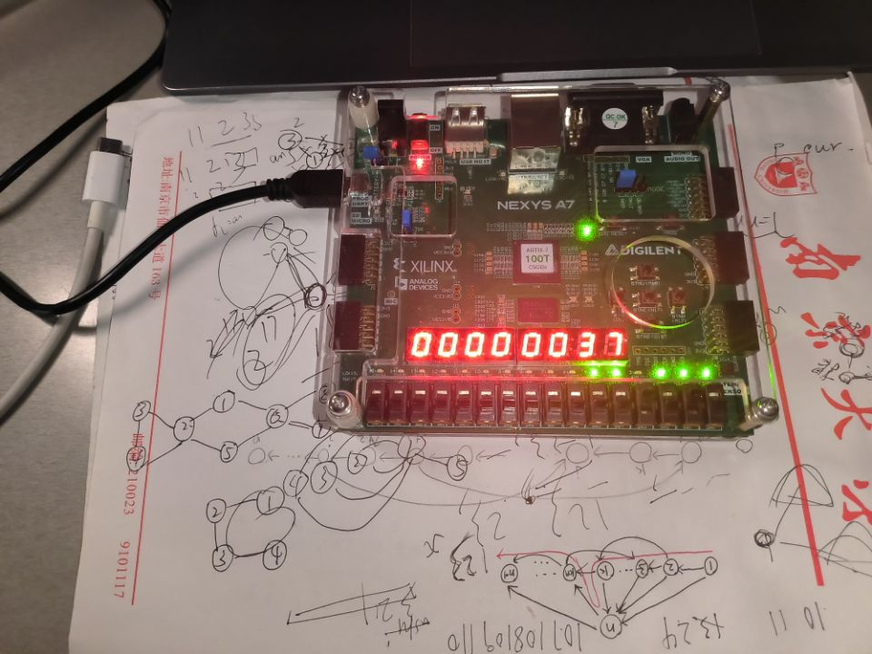

<center><font size=6>Lab10 流水线 CPU 设计与测试实验</font></center>

## 在进行实验之前，先了解流水线CPU原理
RISC-V指令执行过程可以分为如下5个功能阶段:
1. 取指 IF (Instruction Fetch)：主要完成从指令存储中读取指令的工作， 并同时计算下一个周期的 PC。
2. 译码 ID (Instruction Decode)：主要完成指令译码、立即数扩展、读取寄存器堆等的操作以及生成控制信号。
3. 执行 EX (Execution)：主要完成 ALU 运算，判断分支转移指令是否跳转等操作。
4. 访存 MEM (Memory access)：主要完成对内存的读写操作。
5. 写回 WB (Write Back)：主要完成将计算结果写回到寄存器中的操作。

&emsp;&emsp;分为IF、ID、EX、M、WB共5个流水段，每两个流水段之间有一个流水段寄存器，总共有4个流水段寄存器。
&emsp;&emsp;IF/ID 流水段寄存器中只需要保存 PC 和 Instr，共 64位。流水段寄存器的更新需要两个额外的控制信号，一个是 flushIF—冲刷 IF 阶段执行结果，另一个是stallID—阻塞 ID 执行阶段。这两个信号从其他流水段中直接连线过来，不需要经过段寄存器。关于冲刷和阻塞，PCsrc、stallIF、flushIF 及 stallID 这些控制信号均由其他流水段提供，采用跨越流水段的方式以连线方式连接。不可在这些信号上添加额外的寄存器或者将这些信号通过段寄存器传递。
&emsp;&emsp;将各个流水段所需的控制信号打包在一起，便于传输和管理。这样 EX 阶段的控制信号包括branch、ALUAsrc、ALUBsrc 及 ALUctr，共 10 位。ID 阶段的控制信号包括 MemOp 及 MemWr，共 4位。WB 阶段为 RegWr 和 MemtoReg，2 位。在完成了译码阶段的工作后，ID 阶段需要将指令执行的所有信息写入 ID/EX 流水段寄存器。具体写入内容包括数据和控制信号两部分。其中数据需要将 PC、imm、rs1data、rs2data，共 32×4=128 位写入段寄存器。控制部分需要将 rs1、rs2、rd、EX 阶段控制信号、MEM 阶段控制信号和 WB 阶段控制信号，共15+10+4+2=31 位写入段寄存器。因此，共需要长度为 159 位的段寄存器来存放 ID 阶段需要向后传递的所有数据及控制信息。
&emsp;&emsp;EX阶段，在执行阶段完成后，需要传递给下一阶段的数据主要包括 ALUResult 和 rs2data 共 64 位。需要传递的控制信号包括 rd、MEM 阶段控制信号及 WB 阶段控制信号，共 5+4+2=11 位。所以，EX/MEM 流水段寄存器需要保存一共 75 位的数据和控制信息。
&emsp;&emsp;MEM 阶段结束的下降沿上，MEM 阶段需要将 ALUResult 和数据存储的输出 Memout，共 64 位传给下一阶段。同时，MEM 阶段也要将 WB 阶段的 2 位控制信号以及目的寄存器号 rd 传给 WB 阶段。所以，MEM/WB 流水段寄存器中一共包含 71 位信息。MEM 阶段不存在 flush 和 stall 操作。

冒险处理方面，需要注意结构冒险、控制冒险、数据冒险这3中冒险。这里数据冒险只考虑RAW的情况。

## 实验内容
### (1)实验整体方案设计
&emsp;&emsp;设计流水线CPU，并设计顶层模块。这里采用累加求和程序验证，低12位输入，输入到a0寄存器(函数入参寄存器)，8位数码管显示a0的结果(函数结果寄存器)。
### (2)功能表、原理图、关键设计语句与源码
&emsp;&emsp;流水线CPU的原理图如下图:

InstrParse,InstrToImm,ALU32和之前单周期CPU还是一样的。
控制器Control:
```
`timescale 1ns / 1ps
module Control(
    input ban,
    output reg [2:0] ExtOp,
    output reg RegWr,
    output reg ALUASrc,
    output reg [1:0] ALUBSrc,
    output reg [3:0] ALUctr,
    output reg [2:0] Branch,
    output reg MemtoReg,
    output reg MemWr,
    output reg [2:0] MemOp,
    input [6:0] opcode,
    input [2:0] funct3,
    input [6:0] funct7    
    );
    always@(*)begin
if (ban) begin
            ExtOp = 3'b000;
            Branch = 3'b000;
            ALUBSrc = 2'b00;
            ALUctr = 4'b0000;
            MemOp = 3'b000;
            RegWr = 0;
            MemtoReg = 0;
            ALUASrc = 0;
            MemWr = 0;
        end
else begin
    if(opcode == 7'b0110111)
        begin
         ExtOp = 3'b001; RegWr = 1'b1; ALUBSrc = 2'b10; ALUctr = 4'b1111;
          Branch = 3'b000;MemtoReg = 1'b0;MemWr=1'b0; 
        MemOp = 3'b000; ALUASrc = 1'b0; 
        end
    else if(opcode == 7'b0010111) 
        begin 
        ExtOp = 3'b001; RegWr = 1'b1; ALUASrc = 1'b1; ALUBSrc = 2'b10; ALUctr = 4'b0000; 
        Branch = 3'b000;MemtoReg = 1'b0;MemWr=1'b0;
        MemOp = 3'b000;
        end
    else if(opcode == 7'b0010011)begin
        Branch = 3'b000;MemtoReg = 1'b0;MemWr=1'b0; MemOp = 3'b000;
        ExtOp = 3'b000;
        RegWr = 1'b1;
        ALUASrc = 1'b0; ALUBSrc = 2'b10;
        if(funct3 == 3'b101 && funct7[5] == 1'b1)begin 
            ALUctr = {1'b1, funct3};
        end
        else begin ALUctr = {1'b0, funct3}; end
    end
    else if(opcode == 7'b0110011)begin
        Branch = 3'b000;MemtoReg = 1'b0;MemWr=1'b0;
        RegWr = 1'b1; ALUctr = {funct7[5], funct3};
        ALUASrc = 1'b0; ALUBSrc = 2'b00;MemOp = 3'b000; ExtOp = 3'b000;
    end
    else if(opcode == 7'b1101111)begin
        Branch = 3'b001;MemtoReg = 1'b0;MemWr=1'b0;MemOp = 3'b000;
        ExtOp = 3'b100;RegWr = 1'b1;ALUASrc = 1'b1; ALUBSrc = 2'b01; ALUctr = 4'b0000;
    end
    else if(opcode == 7'b1100111)begin
        if(funct3 == 3'b000)
            begin ExtOp = 3'b000; RegWr = 1'b1; ALUASrc = 1'b1; ALUBSrc = 2'b01; 
            ALUctr = 4'b0000; Branch = 3'b010;MemtoReg = 1'b0;MemWr=1'b0; MemOp = 3'b000;end
        else begin ExtOp = 3'b000; RegWr = 1'b0; ALUASrc = 1'b0; ALUBSrc = 2'b00; 
        ALUctr = 4'b0000;Branch = 3'b000;MemtoReg = 1'b0;MemWr=1'b0; MemOp = 3'b000;end
    end
    else if(opcode == 7'b1100011)begin
        ExtOp = 3'b011; RegWr = 1'b0; ALUASrc = 1'b0; ALUBSrc = 2'b00;  MemOp = 3'b000;
        if(funct3 == 3'b000)begin ALUctr = 4'b0010; Branch = 3'b100;MemtoReg = 1'b0;MemWr=1'b0; end
        else if(funct3 == 3'b001)begin ALUctr = 4'b0010; Branch = 3'b101;MemtoReg = 1'b0;MemWr=1'b0;end
        else if(funct3 == 3'b100)begin ALUctr = 4'b0010;Branch = 3'b110;MemtoReg = 1'b0;MemWr=1'b0;end
        else if(funct3 == 3'b101)begin ALUctr = 4'b0010;Branch = 3'b111;MemtoReg = 1'b0;MemWr=1'b0;end
        else if(funct3 == 3'b110)begin ALUctr = 4'b0011;Branch = 3'b110;MemtoReg = 1'b0;MemWr=1'b0;end
        else if(funct3 == 3'b111)begin ALUctr = 4'b0011;Branch = 3'b111;MemtoReg = 1'b0;MemWr=1'b0;end
    end
    else if(opcode == 7'b0000011)begin
    Branch = 3'b000;MemtoReg = 1'b1;MemWr=1'b0;
    MemOp = funct3;
        ExtOp = 3'b000; RegWr = 1'b1; ALUASrc = 1'b0; ALUBSrc = 2'b10;ALUctr = 4'b0000;
    end
    else if(opcode == 7'b0100011)begin
    Branch = 3'b000;MemtoReg = 1'b0;MemWr=1'b1;MemOp = funct3;
        ExtOp = 3'b010; RegWr = 1'b0; ALUASrc = 1'b0; ALUBSrc = 2'b10;ALUctr = 4'b0000;
    end
    else begin
        ExtOp = 3'b000; RegWr = 1'b0;ALUASrc = 1'b0;ALUBSrc = 2'b00;ALUctr = 4'b0000; 
        Branch = 3'b000; MemtoReg = 1'b0; MemWr = 1'b0; MemOp = 3'b000;
    end
end
end
endmodule
```
寄存器堆
```
`timescale 1ns / 1ps
module regfile32(
    input reset,
    input [31:0] a0,//后面进行累加求和时，这个是入参保存寄存器
	output wire [31:0] busa,   //寄存器ra输出数据
	output wire [31:0] busb,   //寄存器rb输出数据
	input clk,
	input [4:0] ra,           //读寄存器编号ra
	input [4:0] rb,          //读寄存器编号rb
	input [4:0] rw,          //写寄存器编号rw
	input [31:0] busw,       //写入数据端口
	input we	             //写使能端，为1时，可写入
    );
    (* ram_style="registers" *) reg [31:0] regfiles[31:0];
  	initial
	begin
		regfiles[0]=32'b0;
	end
	assign busa=regfiles[ra]; //读端口ra
	assign busb=regfiles[rb];//读端口rb
	integer i;
	always@(posedge clk or posedge reset)
	begin
	   if(reset) begin
	       for(i = 0; i <= 31; i = i + 1)
	       begin 
	           if(i == 2)begin
	               regfiles[i] <= 32'h100;
	           end
	           else if(i == 10)begin
	               regfiles[i] <= a0;
	           end
	           else begin
	               regfiles[i] <= 0;
	               end 
	       end
	   end
	   else if(we==1'b1) regfiles[rw] <= (rw==5'b00000)? 32'b0:busw; //写端口
	end
endmodule
```
BranchControl:
```
`timescale 1ns / 1ps
module BranchControl(
    output reg Branchsel, PCsel,
    output flushIF, flushID,
    input zero, result0,
    input [2:0] Branch
    );
    assign flushIF = PCsel;
    assign flushID = PCsel;
    always @ (*) begin
        case (Branch)
        
            3'b000: begin Branchsel = 1'b0; PCsel = 1'b0; end //非跳转指令
            3'b001: begin Branchsel = 1'b0; PCsel = 1'b1; end //jal: 无条件跳转PC目标
            3'b010: begin Branchsel = 1'b1; PCsel = 1'b1; end //jalr: 无条件跳转寄存器目标
            3'b100: begin Branchsel = 1'b0; PCsel = (zero===1'bx)?1'b1:zero; end //beq: 条件分支，等于 修改过
            3'b101: begin Branchsel = 1'b0; PCsel = (zero===1'bx)?1'b1:~zero; end 
            //bne: 条件分支，不等于 修改过
            3'b110: begin Branchsel = 1'b0; PCsel = (result0===1'bx)?1'b1:result0; end 
            //blt, bltu: 条件分支，小于
            3'b111: begin Branchsel = 1'b0; PCsel = (result0===1'bx)?1'b1:(zero | ~result0); end 
            //bge, bgeu: 条件分支，大于等于
            default: begin Branchsel = 1'b0; PCsel = 1'b0; end
            
        endcase
    end
endmodule
```
RISC-V流水线CPU(不含存储器)
```
module rv32ip(
input [31:0] a0,
    input   clock,
    input   reset,
    output [31:0] imemaddr,
    input  [31:0] imemdataout,
    output  imemclk,
    output [31:0] dmemaddr,
    input  [31:0] dmemdataout,
    output [31:0] dmemdatain,
    output  dmemrdclk,
    output  dmemwrclk,
    output [2:0] dmemop,
    output  dmemwe,
    output [31:0] dbgdata);
//add your code here
wire done;
assign done = (reset == 1'b1 ? 0 : (imemdataout == 32'hdead10cc) ? 1 : 0);
assign imemclk = clock;assign dmemrdclk = clock;assign dmemwrclk = clock;

reg [31:0] PC;
assign imemaddr = PC;
assign dbgdata = PC;

reg [63:0] IF_ID_REG;//[63:32]PC [31:0] imemdataout
reg [158:0] ID_EX_REG;//[127:96] PC [95:64] imm [63:32] rs1data [31:0] rs2data;
reg [74:0]EX_MEM_REG;
reg [70:0]MEM_WB_REG;


//ID

wire [6:0]funct7, opcode;wire [4:0]rs1, rs2, rd; wire[2:0] funct3;
InstrParse cpuparse(.instr(IF_ID_REG[31:0]),.rd(rd),.rs1(rs1),.rs2(rs2),.funct3(funct3),
.funct7(funct7),.opcode(opcode));

wire [2:0]ExtOp, Branch, MemOp;wire MemWr,MemtoReg,ALUASrc,RegWr;wire[1:0] ALUBSrc;wire [3:0] ALUctr;
wire ban;
assign ban = done | reset;
Control cpucontrol (.opcode(opcode),.funct3(funct3),.funct7(funct7),.ExtOp(ExtOp),
.Branch(Branch),.MemOp(MemOp),.MemWr(MemWr)
,.MemtoReg(MemtoReg),.ALUASrc(ALUASrc),.RegWr(RegWr),.ALUBSrc(ALUBSrc),.ALUctr(ALUctr),.ban(ban));

wire [31:0] rs1data, rs2data;
wire [31:0] busw;
wire [31:0] wb_memout, wb_result;wire wb_MemtoReg; wire [4:0] wb_rd; wire wb_RegWr;
assign busw = (wb_MemtoReg == 1) ? wb_memout : wb_result;
regfile32 myregfile(.reset(reset),.busa(rs1data),.busb(rs2data),.clk(clock),.ra(rs1),
.rb(rs2),.rw(wb_rd),.busw(busw),.we(wb_RegWr),.a0(a0));

wire [31:0] imm;
InstrToImm cpuimmex(.instr(IF_ID_REG[31:0]),.ExtOp(ExtOp),.imm(imm));


// EX

wire [31:0] EX_PC,EX_imm; 
reg [31:0] EX_rs1data, EX_rs2data; 
wire[4:0] EX_rd; 
wire[3:0] ex_ALUctr; 
wire ex_RegWr, ex_ALUASrc, ex_MemtoReg, ex_MemWr;
wire[2:0] ex_MemOp, ex_Branch;wire[1:0] ex_ALUBSrc;
assign EX_PC =ID_EX_REG[127:96]; 
//assign EX_rs2data = ID_EX_REG[31:0];assign EX_rs1data=ID_EX_REG[63:32];
assign EX_imm=ID_EX_REG[95:64];
assign EX_rd = ID_EX_REG[132:128]; 
assign ex_ALUctr = ID_EX_REG[136:133];
assign ex_RegWr = ID_EX_REG[137];
assign ex_ALUBSrc = ID_EX_REG[139:138]; 
assign ex_ALUASrc = ID_EX_REG[140]; assign ex_MemtoReg = ID_EX_REG[141];
assign ex_MemWr = ID_EX_REG[142]; 
assign ex_MemOp = ID_EX_REG[145:143];
assign ex_Branch = ID_EX_REG[148:146];

// 转发
wire mem_RegWr , mem_MemtoReg;
wire [4:0]mem_rd;
wire [31:0] mem_result;

 
wire [4:0] ex_rs1, ex_rs2; 
assign ex_rs1 = ID_EX_REG[153:149]; 
assign ex_rs2 = ID_EX_REG[158:154];
always@(*)begin
    if(ex_rs1 == mem_rd && mem_RegWr == 1'b1)begin
        if(mem_MemtoReg == 1'b1)begin
            EX_rs1data = dmemdataout;
        end
        else begin
            EX_rs1data = (ex_rs1 == 5'b00000) ? 0 : mem_result;
        end
    end
    else if(ex_rs1 == wb_rd && wb_RegWr == 1'b1)begin
        if(wb_MemtoReg == 1'b1)begin
             EX_rs1data = wb_memout;
        end
        else begin
            EX_rs1data = (ex_rs1 == 5'b00000) ? 0 : wb_result;
        end
    end
    else begin EX_rs1data = ID_EX_REG[63:32]; end
    if(ex_rs2 == mem_rd && mem_RegWr == 1'b1)begin
        if(mem_MemtoReg == 1'b1)begin
            EX_rs2data = dmemdataout;
        end
        else begin
            EX_rs2data = (ex_rs2 == 5'b00000) ? 0 : mem_result;
        end
    end
    else if(ex_rs2 == wb_rd && wb_RegWr == 1'b1)begin
        if(wb_MemtoReg == 1'b1)begin
             EX_rs2data = wb_memout;
        end
        else begin
            EX_rs2data = (ex_rs2 == 5'b00000) ? 0 : wb_result;
        end
    end
    else begin EX_rs2data = ID_EX_REG[31:0]; end
end

wire stallIF, stallID, stallEX, flushEX;
assign stallIF = (ex_rs1 == mem_rd && mem_MemtoReg == 1'b1) | (ex_rs2 == mem_rd && mem_MemtoReg == 1'b1);
assign stallID = stallIF; assign stallEX = stallIF;
assign flushEX = stallIF;


wire [31:0] result;wire zero;
wire [31:0] dataa;wire [31:0]datab;
assign dataa = (ex_ALUASrc == 1'b1)? EX_PC : EX_rs1data;
assign datab = (ex_ALUBSrc == 2'b00) ? EX_rs2data : ((ex_ALUBSrc == 2'b01) ? 32'h00000004 : EX_imm);
ALU32 cpualu(.result(result),.zero(zero),.dataa(dataa),.datab(datab),.aluctr(ex_ALUctr));

wire Branchsel, PCsel, flushIF, flushID;
BranchControl cpubranch(.Branchsel(Branchsel),.PCsel(PCsel),.flushIF(flushIF),
.flushID(flushID),.Branch(ex_Branch),.zero(zero),.result0(result[0]));
wire [31:0] Branchtarget;
assign Branchtarget = (EX_imm & 32'hfffffffc) + ((Branchsel == 1) ? (EX_rs1data & 32'hfffffffc): EX_PC);

// MEM

wire mem_MemWr; 
wire [31:0] mem_rs2;
wire[2:0]mem_MemOp;
assign mem_RegWr = EX_MEM_REG[74];
assign mem_MemWr = EX_MEM_REG[73];
assign mem_MemtoReg = EX_MEM_REG[72];
assign mem_rd = EX_MEM_REG[68:64];
assign mem_result = EX_MEM_REG[63:32];
assign mem_rs2 = EX_MEM_REG[31:0];
assign mem_MemOp = EX_MEM_REG[71:69];

assign dmemaddr = mem_result;
assign dmemdatain = mem_rs2;
assign dmemop=mem_MemOp;
assign dmemwe = (~reset & mem_MemWr);
//(~reset & ~done & mem_MemWr);


assign wb_result = MEM_WB_REG[31:0]; 
assign wb_memout = MEM_WB_REG[63:32]; 
assign wb_rd = MEM_WB_REG[68:64];
assign wb_RegWr = MEM_WB_REG[69];
assign wb_MemtoReg = MEM_WB_REG[70];


always@(negedge clock or posedge reset)begin
if(reset)begin
    PC <= 32'h0;IF_ID_REG <= 0; ID_EX_REG <= 0; EX_MEM_REG <= 0; MEM_WB_REG <= 0;
end
else begin
if(imemdataout == 32'hdead10cc)begin//终止
    PC <= PC;
end 
   else if(stallIF == 1'b1)begin//阻塞
        PC <= PC;
    end
    else begin
        PC <= (PCsel == 1'b1)? Branchtarget : (PC + 32'h4);//判断是PC+4还是跳转
    end
    if(stallID == 1'b1)begin
        IF_ID_REG <= IF_ID_REG;
    end
    else if(flushIF == 1'b1)begin
        IF_ID_REG <= 0;
        end
    else begin
        IF_ID_REG <= {PC, imemdataout};
        end
    if(stallEX == 1'b1)begin
        ID_EX_REG <= {ID_EX_REG[158:64] ,EX_rs1data, EX_rs2data};
    end
    else if(flushID == 1'b1)begin
        ID_EX_REG <= 0;
    end
    else begin
        ID_EX_REG <= {rs2,rs1,Branch, MemOp, MemWr, MemtoReg, ALUASrc, ALUBSrc, 
        RegWr, ALUctr,rd, IF_ID_REG[63:32], imm, rs1data, rs2data};
    end
    if(flushEX == 1'b1)begin
        EX_MEM_REG <= 0;
    end
    else begin
    EX_MEM_REG <= {ex_RegWr,ex_MemWr,ex_MemtoReg,ex_MemOp,EX_rd, result, EX_rs2data};
    end
    MEM_WB_REG <= {mem_MemtoReg,mem_RegWr,mem_rd,dmemdataout,mem_result};
end
end
endmodule

```
### (3)实验数据仿真测试波形图
仿真测试代码如下:
```
`timescale 1 ns / 10 ps
module cpu_tst();


wire [63:0] IF_ID_REG;
wire [158:0] ID_EX_REG;
wire [74:0]EX_MEM_REG;
wire [70:0]MEM_WB_REG;
assign IF_ID_REG = mycpu.IF_ID_REG;
assign ID_EX_REG = mycpu.ID_EX_REG;
assign EX_MEM_REG = mycpu.EX_MEM_REG;
assign MEM_WB_REG = mycpu.MEM_WB_REG;


integer numcycles;  //number of cycles in test

reg clk,reset;  //clk and reset signals

reg[8*8:1] testcase; //name of testcase

// CPU declaration

// signals
wire [31:0] iaddr,idataout;
wire iclk;
wire [31:0] daddr,ddataout,ddatain;
wire drdclk, dwrclk, dwe;
wire [2:0]  dop;
wire [31:0] cpudbgdata;


//main CPU
rv32ip mycpu(.clock(clk), 
             .reset(reset), 
				 .imemaddr(iaddr), .imemdataout(idataout), .imemclk(iclk), 
				 .dmemaddr(daddr), .dmemdataout(ddataout), 
                 .dmemdatain(ddatain), .dmemrdclk(drdclk), .dmemwrclk(dwrclk), 
                 .dmemop(dop), .dmemwe(dwe), 
				 .dbgdata(cpudbgdata));

				  
//instruction memory, no writing
testmem instructions(
	.address(iaddr[17:2]),
	.clock(iclk),
	.data(32'b0),
	.wren(1'b0),
	.q(idataout));
	

//data memory	
dmem datamem(.addr(daddr), 
             .dataout(ddataout), 
				 .datain(ddatain), 
				 .rdclk(drdclk), 
				 .wrclk(dwrclk), 
				 .memop(dop), 
				 .we(dwe));

//useful tasks
task step;  
//step for one cycle ends 1ns AFTER the posedge of the next cycle
	begin
		#9  clk=1'b1; 
		#10 clk=1'b0;
		numcycles = numcycles + 1;	
		#1 ;
	end
endtask
				  
task stepn; //step n cycles
   input integer n; 
	integer i;
	begin
		for (i =0; i<n ; i=i+1)
			step();
	end
endtask

task resetcpu;  //reset the CPU and the test
	begin
		reset = 1'b1; 
		step();
		step();
		#5 reset = 1'b0;
		numcycles = 0;
	end
endtask

task loadtestcase;  //load intstructions to instruction mem
	begin
		$readmemh({testcase, ".hex"},instructions.ram);
		$display("~~~ Begin test case %s ~~~", testcase);
	end
endtask
	
task checkreg;//check registers
   input [4:0] regid;
	input [31:0] results; 
	reg [31:0] debugdata;
	begin
	    debugdata=mycpu.myregfile.regfiles[regid]; //wait for signal to settle
		 if(debugdata==results)
		 	begin
				$display("~~~ OK: end of cycle %3d reg %h need to be %h, get %h", 
                numcycles, regid, results, debugdata);
			end
		else	
			begin
				$display("~~~ Error: end of cycle %3d reg %h need to be %h, get %h", 
                numcycles, regid, results, debugdata);
			 end
	end
endtask

task checkmem;//check registers
   input [31:0] inputaddr;
   input [31:0] results;	
	reg [31:0] debugdata;
	reg [14:0] dmemaddr;
	begin
	    dmemaddr=inputaddr[16:2];
	    debugdata=datamem.mymem.ram[dmemaddr]; 
		 if(debugdata==results)
		 	begin
				$display("~~~ OK: end of cycle %3d mem addr= %h need to be %h, get %h", 
                numcycles, inputaddr, results, debugdata);
			end
		else	
			begin
				$display("~~~ Error: end of cycle %3d mem addr= %h need to be %h, get %h", 
                numcycles, inputaddr, results, debugdata);
			 end
	end
endtask

task checkpc;//check PC
	input [31:0] results; 
	begin
		 if(cpudbgdata==results[23:0])
		 	begin
				$display("~~~ OK: end of cycle %3d PC/dbgdata need to be %h, get %h", 
                numcycles,  results, cpudbgdata);
			end
		else	
			begin
				$display("~~~ Error: end of cycle %3d PC/dbgdata need to be %h, get %h", 
                numcycles, results, cpudbgdata);
			 end
	end
endtask

integer maxcycles =10000;


task checkmagnum;
    begin
	    if(numcycles>maxcycles)
		 begin
		   $display("~~~ Error:test case %s does not terminate!", testcase);
		 end
		 else if(mycpu.myregfile.regfiles[10]==32'hc0ffee)
		    begin
		       $display("~~~ OK:test case %s finshed OK at cycle %d.", testcase, 
               numcycles-1);
		    end
		 else if(mycpu.myregfile.regfiles[10]==32'hdeaddead)
		 begin
		   $display("~~~ ERROR:test case %s finshed with error in cycle %d.", testcase, 
           numcycles-1);
		 end
		 else
		 begin
		    $display("~~~ ERROR:test case %s unknown error in cycle %d.", testcase, 
            numcycles-1);
		 end
	 end
endtask

task loaddatamem;
    begin
	     $readmemh({testcase, "_d.hex"},datamem.mymem.ram);
	 end
endtask

	
initial begin:TestBench
    #80
    // output the state of every instruction
 /*	$monitor("cycle=%d, pc=%h, instruct= %h op=%h,
 rs1=%h,rs2=%h, rd=%h, imm=%h, IF_ID= %h, ID_EX=%h 
 EX_MEM=%h MEM_WB=%h IF_btarget= %h", numcycles,  
 mycpu.pc, mycpu.instr, mycpu.ID_op, mycpu.ID_rs1,
 mycpu.ID_rs2,mycpu.ID_rd,mycpu.ID_imm, mycpu.IF_ID,
 mycpu.ID_EX,mycpu.EX_MEM,mycpu.MEM_WB,mycpu.
 IF_btarget);  */ 
	testcase = "add";
	//addi t1,zero,100
    //addi t2,zero,20
    //add t3,t1,t2
    loadtestcase();
    resetcpu();
    step();
    
	checkpc(32'h4);
    step();
    
	checkpc(32'h8);
    step();
	
	step();	
	step();
	checkreg(6,100);
	step();
	checkreg(7,20);
	step();
	checkreg(28,120);
		
	testcase = "alu";
	//addi t1,zero,79
	//addi t2,zero,3
	//sub  t3,t1,t2  
	//and  t3,t1,t2
	//sll  t3,t1,t2
	//slt  t3,t1,t2
	//slt  t3,t2,t1
	//xor  t3,t2,t1
	//srl  t3,t1,t2
	//or   t3,t1,t2
	//addi t1,zero,-3
    //add  t3,t1,t2
    //sra  t3,t1,t2
    //srl  t3,t1,t2
	loadtestcase();
	resetcpu();
	step();
	step();
	step();
	step();
	step();
	checkreg(6,79); //t1=79
	step();
	checkreg(7,3);  //t2=3
	step();
	checkreg(28,76); //t3=76
	step();
	checkreg(28,3); //t3=3
	step();
	checkreg(28,632); //t3=632
	step();
	checkreg(28,0); //t3=0
	step();
	checkreg(28,1); //t3=1
	step();
	checkreg(28,76); //t3=76
	step();
	checkreg(28,9); //t3=9
	step();
	checkreg(28,79); //t3=79
	step();
	checkreg(6,-79); //t1=-79,ffffffb1, 10110001
	step();
	checkreg(28,-76); //t3=-76
	step();
	checkreg(28,32'hfffffff6); //t3=fffffff6, 11110110
	step();
	checkreg(28,32'h1ffffff6); //t3=1ffffff6
	step();
	checkreg(28,1); // t3=1, slt -79<3
	step();
	checkreg(28,0); //t3=0 sltu ffffffb1>3
	testcase = "mem";
	//lui a0, 0x00008
	//addi a0, a0,16
	//addi t1,zero, 1234
	//sw t1,4(a0)
	//lw t2,4(a0)
	//sw zero,8(a0)
	//addi t1,zero, 255
	//sb   t1,8(a0)
	//lb   t2,8(a0)
	//lbu  t2,8(a0)
	//sb   t1,9(a0)
	//lh   t2,8(a0)
	//lhu  t2,8(a0)
	//lb   t2,9(a0)
	//lb   t2,10(a0)
	//sw   zero,12(a0)
	//addi t1,zero, 0x78
	//sb   t1,12(a0)
	//addi t1,zero, 0x56
	//sb   t1,13(a0)
	//addi t1,zero, 0x34
	//sb   t1,14(a0)
	//addi t1,zero, 0x12
	//sb   t1,15(a0)
	//lw   t2,12(a0)
	//lbu  t3,14(a0) //load use
	//sw   t3,20(a0)
	//addi a1,a0,16
	//lbu  t3,15(a0)
	//sb   t3,4(a1)
	loadtestcase();
	resetcpu();
	step();
	step();
	step();
	step();
	step();
	checkreg(10,32'h8000);
	step();
	checkreg(10,32'h8010);
	step();
	checkreg(6,32'd1234);
	step();
	checkmem(32'h8014,32'd1234);
	step();
	checkreg(7,32'd1234);
	step();
	checkmem(32'h8018,32'd0);
	step();
	checkreg(6,32'd255);
	step();
	checkmem(32'h8018,32'hff);
	step();
	checkreg(7,32'hffffffff);
	step();
	checkreg(7,32'hff);
	step();
	checkmem(32'h8018,32'hffff);
	step();
	checkreg(7,32'hffffffff);
	step();
	checkreg(7,32'hffff);
	step();
	checkreg(7,32'hffffffff);
	step();
	checkreg(7,32'h0);
	step();
	checkmem(32'h801c,32'h0);
	step();
	checkreg(6,32'h78);
	step();
	checkmem(32'h801c,32'h78);
	step();
	checkreg(6,32'h56);
	step();
	checkmem(32'h801c,32'h5678);
	step();
	checkreg(6,32'h34);
	step();
	checkmem(32'h801c,32'h345678);
	step();
	checkreg(6,32'h12);
	step();
	checkmem(32'h801c,32'h12345678);
	step();
	checkreg(7,32'h12345678);
	step();
	checkreg(28,32'h00000034);
	step();//stall 1 cycle
	step();
	checkmem(32'h8024,32'h00000034);
	step();
	checkreg(11,32'h00008020);
	step();
	checkreg(28,32'h00000012);
	step();
	checkmem(32'h8024,32'h00000012);
	testcase = "branch";
	//	addi t0,zero,100           00
	//	addi t1,zero,-2            04
	//	beq  t1,t0, error          08
	//	bne  t0,t1, bnenext        0C
	//	j    error                 10
	//bnenext: 	blt  t0,t1,error   14
	//	bge  t1,t0,error           18
	//	bltu t0,t1,bltunext        1C
	//	j    error                 20
	//bltunext:	bgeu t0,t1,error   24
	//	jal  ra, func              28
	//error: 	li   a0,0xdeaddead 2C 30
	//	j    finish                34
	//right:	li   a0,0xc0ffee   38 3C
	//	j    finish                40
	//func:	addi t0,zero,123       44
	//	jalr t1,ra,12              48
	//finish:	nop                4C
	loadtestcase();
	resetcpu();
	step();
	checkpc(32'h4);
	step();
	checkpc(32'h8);
	step();
	checkpc(32'hc);
	step();
	checkpc(32'h10);
	step();
	checkreg(5,32'd100);
	checkpc(32'h14);
	step();
	checkreg(6,32'hfffffffe);
	checkpc(32'h14);
	step();
	checkpc(32'h18);
	step();
	checkpc(32'h1C);
	step();
	checkpc(32'h20);
	step();
	checkpc(32'h24);
	step();
	checkpc(32'h24);
	step();
	checkpc(32'h28);
	step();
	checkpc(32'h2C);
	step();
	checkpc(32'h30);	
	step();
	checkpc(32'h44);
	step();
	checkpc(32'h48);
	step();
	checkreg(1,32'h2c);
	checkpc(32'h4c);
	step();
	checkpc(32'h50);
	step();
	checkpc(32'h38);
	step();
	checkreg(5,32'd123);
	checkpc(32'h3c);
	step();
	checkpc(32'h40);
	step();
	checkpc(32'h44);
	step();
	checkpc(32'h48);
	step();
	checkpc(32'h4c);
	step();
	checkpc(32'h50);
	checkreg(10,32'hc0ffee);
	step();
	checkpc(32'h54);
	step();
	
	
	
	$stop;
		
end
endmodule
```
仿真指令存储器:
```
module testmem(
	address,
	clock,
	data,
	wren,
	q);

	input	[15:0]  address;
	input	  clock;
	input	[31:0]  data;
	input	  wren;
	output reg	[31:0]  q;
	
	reg [31:0] ram [65535:0];
	always@(posedge clock)
		q <= ram[address];
		
endmodule
```
仿真数据存储器:
```
module dmem(addr, dataout,  datain, rdclk, wrclk, memop, we);
	input  [31:0] addr;
	output reg [31:0] dataout;
	input  [31:0] datain;
	input  rdclk;
	input  wrclk;
	input [2:0] memop;
	input we;
	
	wire [31:0] memin;
	reg  [3:0] wmask;
	wire [7:0] byteout;
	wire [15:0] wordout;
	wire [31:0] dwordout;
 

assign memin = (memop[1:0]==2'b00)?{4{datain[7:0]}}:((memop[1:0]==2'b10)?datain:{2{datain[15:0]}}) ; 
//lb: same for all four, lh:copy twice; lw:copy

//four memory chips	
testdmem mymem(.wea(wmask),.dina(memin), .addrb(addr[16:2]), .clkb(rdclk), .addra(addr[16:2]), .clka(wrclk), 
.ena(we), .doutb(dwordout),.enb(1'b1) );
//datamem mymem(.wea(wmask),.dina(memin), .addrb(addr[16:2]), .clkb(rdclk), 
//.addra(addr[16:2]), .clka(wrclk), .ena(we), .doutb(dwordout),.enb(1'b1) );

//wmask,addr[16:2]
assign wordout = (addr[1]==1'b1)? dwordout[31:16]:dwordout[15:0];

assign byteout = (addr[1]==1'b1)? ((addr[0]==1'b1)? 
dwordout[31:24]:dwordout[23:16]):((addr[0]==1'b1)? dwordout[15:8]:dwordout[7:0]);


always @(*)
begin
  case(memop)
  3'b000: //lb
     dataout = { {24{byteout[7]}}, byteout};
  3'b001: //lh
     dataout = { {16{wordout[15]}}, wordout};
  3'b010: //lw
     dataout = dwordout;
  3'b100: //lbu
     dataout = { 24'b0, byteout};
  3'b101: //lhu
     dataout = { 16'b0, wordout};
  default:
     dataout = dwordout;
  endcase
end

always@(*)
begin
	if(we==1'b1)
	begin
		case(memop)
			3'b000://sb
			begin
				wmask[0]=(addr[1:0]==2'b00)?1'b1:1'b0;
				wmask[1]=(addr[1:0]==2'b01)?1'b1:1'b0;
				wmask[2]=(addr[1:0]==2'b10)?1'b1:1'b0;
				wmask[3]=(addr[1:0]==2'b11)?1'b1:1'b0;
			end
			3'b001://sh
			begin
				wmask[0]=(addr[1]==1'b0)?1'b1:1'b0;
				wmask[1]=(addr[1]==1'b0)?1'b1:1'b0;
				wmask[2]=(addr[1]==1'b1)?1'b1:1'b0;
				wmask[3]=(addr[1]==1'b1)?1'b1:1'b0;
			end		
			3'b010://sw
			begin
				wmask=4'b1111;
			end
			default:
			begin
				wmask=4'b0000;
			end
		endcase
	end
	else
	begin
	   wmask=4'b0000;
	end
end
endmodule

```
```
module testdmem(
    addra,
    clka,
    dina,
    ena,
    wea,
    addrb,
    clkb,
    doutb,
    enb);
	
    input	[14:0]  addra;
    input	clka;
    input	[31:0]  dina;
    input   ena;
	input   [3:0]  wea;
	input   [14:0] addrb;
	input   clkb;
	input	enb;
	output reg	[31:0]  doutb;
	reg [31:0] ram [32767:0];
	reg  [31:0] tempout;
	wire [31:0] tempin;
integer i;
	initial begin
	   for(i = 0; i <= 32767; i = i + 1)begin
	       ram[i] = 0;
	   end
	end
	
	always@(posedge clkb)
	begin
	   if(ena)
			tempout<=ram[addra];
	   else
			if(enb) doutb <= ram[addrb];
	end
	
   assign tempin[7:0]   = (wea[0])? dina[7:0]  : tempout[7:0];
   assign tempin[15:8]  = (wea[1])? dina[15:8] : tempout[15:8];
   assign tempin[23:16] = (wea[2])? dina[23:16]: tempout[23:16];
   assign tempin[31:24] = (wea[3])? dina[31:24]: tempout[31:24];
	
	always@(negedge clka)
	begin
		if(ena) 
		begin
			ram[addra]<=tempin;
		end
	end
		
endmodule
```
仿真测试图:





### (4)验证
顶层模块源码:
```
`timescale 1ns / 1ps
module rv32ip_top(
input CLK100MHZ,
input [11:0] n,//入参
input reset,
output [15:0] sum,//累加和
output [6:0] segs,
output [7:0] AN
    );
wire [31:0] iaddr,idataout;
wire iclk;
wire [31:0] daddr,ddataout,ddatain;
wire drdclk, dwrclk, dwe;
wire [2:0]  dop;
wire [31:0] cpudbgdata;
wire clk;

clkgen myclkgen(.clkin(CLK100MHZ),.rst(1'b0),.clken(1'b1),.clkout(clk));
rv32ip  mycpu(.a0({20'h00000, n}),.clock(clk), .reset(reset), 
				 .imemaddr(iaddr), .imemdataout(idataout), .imemclk(iclk), 
				 .dmemaddr(daddr), .dmemdataout(ddataout), .dmemdatain
				 (ddatain), .dmemrdclk(drdclk),
				  .dmemwrclk(dwrclk), .dmemop(dop), .dmemwe(dwe),  .dbgdata(cpudbgdata)); 
// instrucation memory
 InstrMem myinstrmem(.instr(idataout),.addr(iaddr),.InstrMemEn(1'b1),.clk(iclk)	);
//data memory	
DataMem mydatamem(.dataout(ddataout), .clk(dwrclk),  
.we(dwe),  .MemOp(dop), .datain(ddatain),.addr(daddr[15:0])); 
    
    assign sum = mycpu.myregfile.regfiles[10][15:0];
    wire [31:0]res;
    assign res = mycpu.myregfile.regfiles[10];//a0寄存器为10号寄存器,是入参寄存器，也是结果寄存器

reg [15:0] counter;//数码管刷新计数器
reg [7:0] anout;
reg [6:0] segsout;
wire [6:0] connection [7:0];
assign segs=segsout;
assign AN=anout;
seg_decode seg_7(.in(res[31:28]),.out(connection[7]));
seg_decode seg_6(.in(res[27:24]),.out(connection[6]));
seg_decode seg_5(.in(res[23:20]),.out(connection[5]));
seg_decode seg_4(.in(res[19:16]),.out(connection[4]));
seg_decode seg_3(.in(res[15:12]),.out(connection[3]));
seg_decode seg_2(.in(res[11:8]),.out(connection[2]));
seg_decode seg_1(.in(res[7:4]),.out(connection[1]));
seg_decode seg_0(.in(res[3:0]),.out(connection[0]));
//数码管显示
always @(posedge CLK100MHZ) begin
    counter<=counter+1;
        case (counter)
            6000: begin
                anout<=8'b01111111;
                segsout<=connection[7];
            end
            12000: begin
                anout<=8'b10111111;
                segsout<=connection[6];
            end
            18000: begin
                anout<=8'b11011111;
                segsout<=connection[5];
            end
            24000: begin
                anout<=8'b11101111;
                segsout<=connection[4];
            end
            30000: begin
                anout<=8'b11110111;
                segsout<=connection[3];
            end
            36000: begin
                anout<=8'b11111011;
                segsout<=connection[2];
            end
            42000: begin
                anout<=8'b11111101;
                segsout<=connection[1];
            end
            48000: begin
                anout<=8'b11111110;
                segsout<=connection[0];
                counter<=0;
            end
        endcase
end
endmodule
```
指令存储器:
```
`timescale 1ns / 1ps
module InstrMem(
    output reg [31:0] instr, //输出32位指令
    input [31:0] addr,       //32位地址数据，实际有效字长根据指令存储器容量来确定
    input InstrMemEn,        //指令存储器片选信号
    input clk               //时钟信号，下降沿有效   
    );
    (* ram_style="distributed" *) reg [31:0] ram[16384:0];
	//64KB的存储器空间，可存储16k条指令，地址有效长度16位
    //读取指令
initial $readmemh("C:/Vivadolabs/lab10/lab10_pdf_and_resources/lab10/fibn.txt", ram);
    always @ (posedge clk) begin
       if (InstrMemEn) instr = ram[addr[15:2]];
    end
endmodule
```
数据存储器:
```
`timescale 1ns / 1ps
module DataMem(
   output [31:0] dataout,   //输出数据
   input clk,                   //时钟信号
   input we,                   //存储器写使能信号，高电平时允许写入数据
   input [2:0] MemOp,          //读写字节数控制
   input [31:0] datain,        //下输入数据
   input [15:0] addr           //存储器地址
    );
    (* ram_style="block" *)  reg [31:0] ram [2**14-1:0];  //设置使用块RAM综合成存储器
//initial $readmemh("./main_d.hex", ram);

wire [31:0] intmp;
wire [31:0] outtmp;
assign outtmp = ram[addr[15:2]];

wire [15:0] houttmp = addr[1] ? outtmp[31:16] : outtmp[15:0];
wire [7:0] bouttmp = addr[1:0] == 2'b11 ? outtmp[31:24]
                   : addr[1:0] == 2'b10 ? outtmp[23:16]
                   : addr[1:0] == 2'b01 ? outtmp[15:8]
                   : outtmp[7:0];


always @(negedge clk)  begin
    if (we) ram[addr[15:2]] <= intmp; //下降沿写入存储器数据，写使能有效时，写入数据
end

assign dataout = MemOp == 3'b000 ? {{24{bouttmp[7]}}, bouttmp}
               : MemOp == 3'b001 ? {{16{houttmp[15]}}, houttmp}
               : MemOp == 3'b010 ? outtmp
               : MemOp == 3'b100 ? {24'h000000, bouttmp}
               : MemOp == 3'b101 ? {16'h0000, houttmp}
               : 32'h00000000;

assign intmp = MemOp == 3'b000 ? 
                    (addr[1:0] == 2'b00 ? {outtmp[31:8], datain[7:0]}
                   : addr[1:0] == 2'b01 ? {outtmp[31:16], datain[7:0], outtmp[7:0]}
                   : addr[1:0] == 2'b10 ? {outtmp[31:24], datain[7:0], outtmp[15:0]}
                   :{datain[7:0], outtmp[23:0]})
             : MemOp == 3'b001 ? 
                    (addr[1] ? {datain[15:0], outtmp[15:0]} : {outtmp[31:16], datain[15:0]})
             : MemOp == 3'b010 ? datain
             : 32'h00000000;
endmodule
```
电路图:

存储器部分:
.png)
CPU：
.png)
.png)
下面是验证部分:
累加求和，1加到500，结果为125250:


斐波那契数列第10位，为55:


### (5)错误现象及分析
&emsp;&emsp;开始对于dead10cc终止指令的判断部分有误，直接放到了最外层else判断里面，导致这时只处理了PC，但没管流水段寄存器。dead10cc应当和阻塞一样，PC赋原值，流水段寄存器还是和之前一样的操作，这样就不会漏指令。

## 思考题
### 1、如何添加中断与 CSR 寄存器支持。
&emsp;&emsp;可能需要修改指令执行阶段，添加异常处理逻辑，使得在检测到中断或异常时，能够在流水线中正确地切换到异常处理的流程。在流水线中添加对CSR寄存器的读写逻辑，并确保这些操作在正确的时机执行。肯能添加中断控制器。
&emsp;&emsp;关于CSR，RISC-V架构中的CSR（Control and Status Registers）包含了控制和监视处理器状态的寄存器。这些CSR寄存器被设计用于特权级别的管理、中断、异常处理、性能监控等方面。包括M、S、U三个级别，每个级别都有若干不同的寄存器。
&emsp;&emsp;实现CSR需要考虑以下几个方面:
1. CSR编码和地址空间分配： 根据RISC-V规范，每个CSR都有一个唯一的编码和地址。在CPU设计中，需要为每个CSR分配相应的地址空间，并确保它们在读写时能够正确映射到内部寄存器。
2. 读写操作支持： 流水线CPU需要支持对CSR寄存器的读取和写入操作。这涉及到在流水线中添加逻辑以识别CSR相关的指令，并将读写操作映射到对应的CSR寄存器。
3. 特权级别切换： CSR寄存器在不同特权级别（Machine、Supervisor、User）可能有不同的访问权限。处理器需要能够正确处理特权级别的切换，以确保合适的CSR在合适的特权级别下可访问和操作。
4. 异常和中断处理： 一些CSR寄存器与异常处理和中断相关，例如保存异常处理程序地址的寄存器。在流水线CPU设计中，必须正确处理异常和中断，以确保在异常发生时保存和恢复相关的CSR状态。
### 2、简述高级流水线设计方法。
可以考虑以下几个方面:
1. 超标量和超流水线设计： 超标量处理器能够同时执行多个指令，而超流水线则将指令的执行分解为更多的阶段。通过使用这两种设计方法，可以提高并行性和整体性能。然而，需要注意平衡超标量和超流水线的设计，以避免增加复杂性而导致的性能下降。
2. 指令级并行性（ILP）： 在流水线中充分利用指令级并行性是提高性能的关键。通过识别和执行可以并行执行的指令，例如乱序执行和超标量执行，可以最大限度地提高ILP。
3. 分支预测： 分支指令可能导致流水线流失效，影响性能。使用高效的分支预测机制，例如动态分支预测器，有助于减少分支带来的性能损失。
4. 数据前推和数据回写： 数据相关性是影响流水线性能的一个因素。使用数据前推技术可以减少由于数据相关性而引起的停顿。另外，高效的数据回写策略也是关键，以确保正确地写回结果并减小相关性延迟。
5. 多级缓存： 高级流水线设计通常涉及多级缓存系统，包括指令缓存和数据缓存。合理设计缓存层次结构可以降低存储器访问延迟，提高整体性能。
6. 乱序执行： 乱序执行允许指令按照它们的可用数据而不是它们的顺序执行。这可以通过乱序执行引擎来实现，有助于更好地利用指令级并行性。
7. 异常和中断处理： 高级流水线需要有效的异常和中断处理机制。这可能包括中断处理的优先级、合适的中断响应时间以及确保异常和中断不会导致流水线的严重停顿。
### 3、如何设计更多流水段的 CPU。
&emsp;&emsp;可以考虑向流水线中添加更多的阶段来进一步优化性能。
&emsp;&emsp;可以考虑添加一下阶段:
1. Out-of-Order Execution（乱序执行）： 在执行阶段之后，添加一个阶段用于重新排序乱序执行的指令，以最大程度地利用可用的执行单元。
2. Load/Store Queue（加载/存储队列）： 在访存阶段之后，添加一个阶段用于处理加载和存储指令，以最大程度地减少内存相关的延迟。
3. Branch Prediction（分支预测）： 在取指阶段之后，添加一个用于分支预测和处理的阶段，以最小化分支导致的流水线停顿。
4. Exception Handling（异常处理）： 添加一个用于处理异常和中断的阶段，确保对异常情况的适当响应。