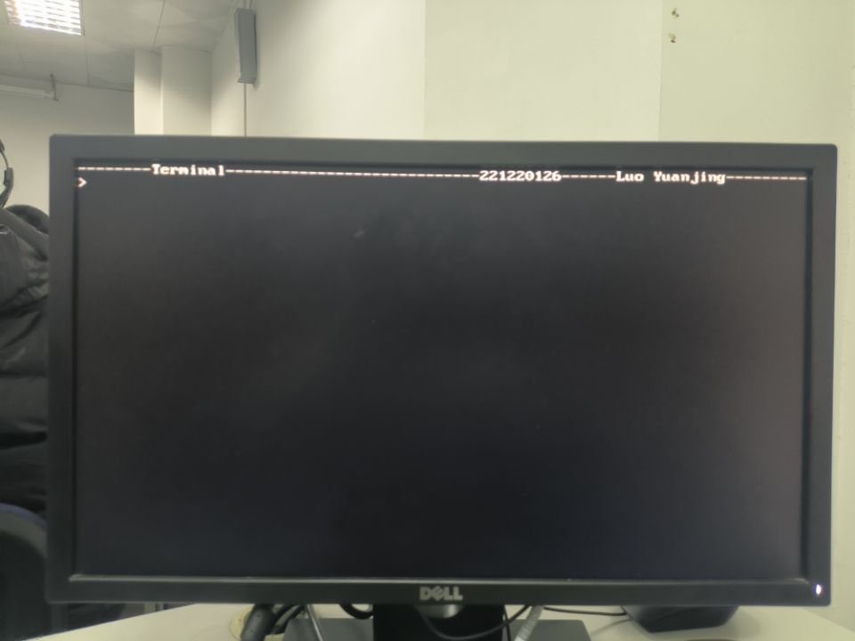
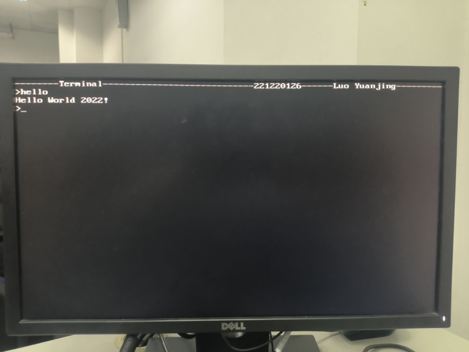
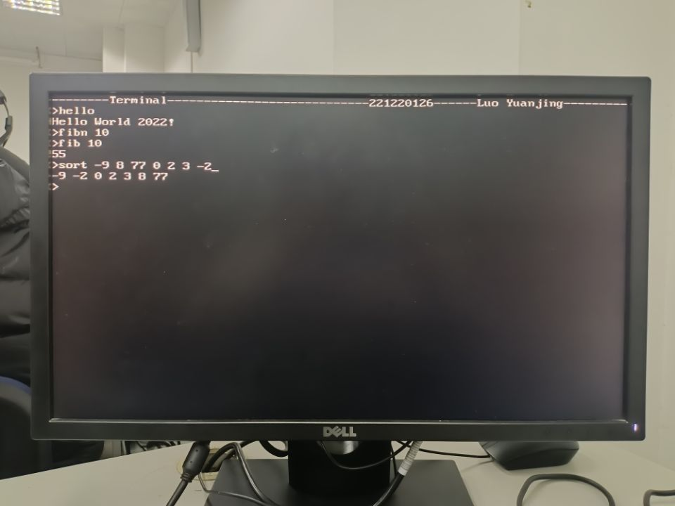
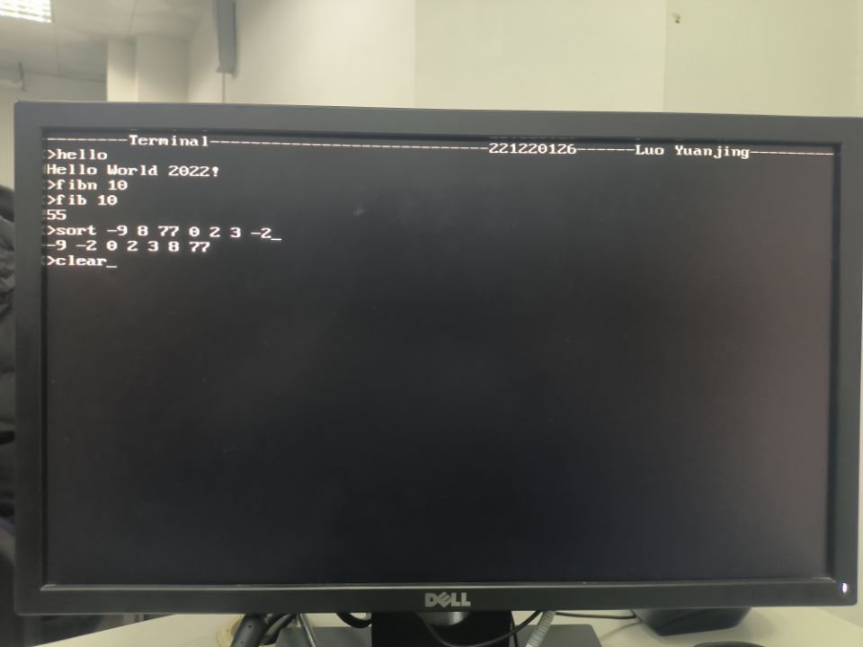
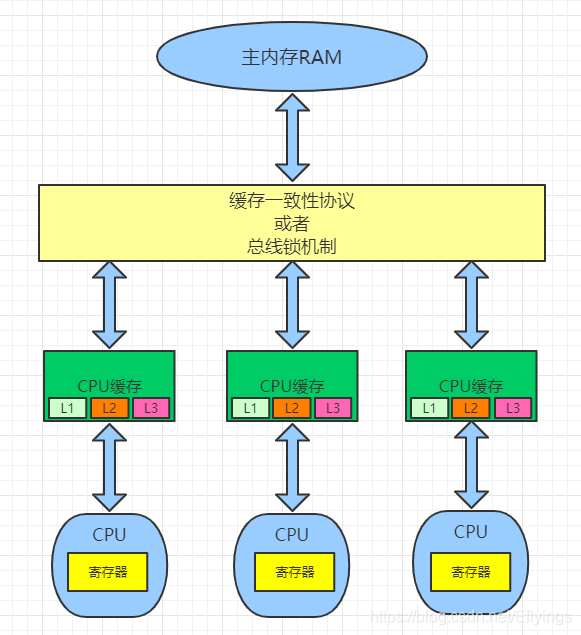

<center><font size=6>Lab11 计算机系统设计</font></center>

## 在进行实验前，先了解实验原理
### 硬件部分
&emsp;&emsp;CPU 与外设的通信可以使用内存映射方式，即预先定义特定的内存地址映射到特定外设的输入或输出端口，CPU 通过 load/store 命令对这些内存地址进行读写操作来控制外设。在这种方式下 CPU 不需要区分哪些内存地址是对应外设，哪些是对应数据存储器。硬件部件将需要处理的数据地址和读写信号放在总线上，并将总线上的数据取回即可。每个外设只需要关注自己映射的一小块存储空间即可。
&emsp;&emsp;采用外设内存映射的方式。首先，将高 12 位地址为全零的空间，即 0x000 00000 至 0x000 fffff 分配给指令存储器，也就是指令存储段的最大存储空间是 1MB。其次，可以将高 12 位地址为 0x001 的地址空间分配给数据存储器，用于程序正常运行时存储需要的常量、全局变量、堆及栈等数据空间。最后，将高 12 位其它地址分别为每个外设分配特定的空间，例如，以 0x002 开头的地址可以分配给显示器，0x003 开头的地址可以分配给键盘，依次类推。
&emsp;&emsp;不同类型的内存段设计:
&emsp;&emsp;CPU 只读型：主要包括定时器、实验板上的拨档开关等。这类外设对应的空间比较小，一般只有 32或 64 位，只需要将外设对应的 wire 型变量在时钟信号有效时赋值给特定寄存器，在 CPU 读取地址匹配时
将该寄存器的内容放置在 CPU 的数据总线上即可。
&emsp;&emsp;CPU 只写型：主要是输出设备，例如显示器、LED 或七段数码管等。CPU 总是在时钟信号有效时写入数据，外设可以根据自己的时钟频率，在时钟信号有效时读取对应的数据，放置在自己的寄存器中，用于驱动外设。如果有必要，在存储容量小时也可以使用类似寄存器堆的实现方式来非同步读取。
&emsp;&emsp;CPU 读写型：此类外设的存储空间，CPU 既能读又能写。比如键盘接口的存储空间设计。需要特别考虑读写有效时序，防止读写冲突以及数据冒险的情形。
常见外设接口实现和内存映射实现见讲义。
### 软件部分
&emsp;&emsp;提前安装 riscv32-unknown-elf 工具链来编译系统软件。然后编写合适的 Makefile 进行编译
这里Makefile如下:
```
1. default: all
2.
3. XLEN ?=32
4. RISCV_PREFIX ?=riscv$(XLEN)-unknown-elf-
5. RISCV_GCC ?=$(RISCV_PREFIX) gcc
6. GCC_WARNS := -Wall -Wextra -Wconversion -pedantic -Wcast-qual -Wcast-align
7. -Wwrite -strings
8. RISCV_GCC_OPTS ?= -static -mcmodel=medany -fvisibility=hidden -Tsections.ld
9. -nostdlib -nolibc -nostartfiles ${GCC_WARNS}
10. RISCV_OBJDUMP ?=$(RISCV_PREFIX)objdump --disassemble-all 
11. --disassemble-zeroes --section=.text --section=.text.startup
12. --section=.text.init --section=.data
13. RISCV_OBJCOPY ?= $(RISCV_PREFIX) objcopy -O verilog
14. RISCV_HEXGEN ?= ’BEGIN{output=0;}{ gsub(”\r”,””,$$(NF)); if ($$1 ~/@/)
15. {if ($$1 ~/@00000000/) {output=code;} else {output=1- code;};
16. gsub(”@”,”0x”,$$1); addr=strtonum($$1); if (output==1)
17. {printf ”@%08x\n”,(addr%262144)/4;}}
18. else {if (output==1) { for(i=1;i<NF;i+=4)
19. print $$(i+3)$$(i+2)$$(i+1)$$i;}}}’
20. RISCV_COEGEN ?= ’BEGIN{printf ”memory_initialization_radix=16;\n
21. memory_initialization_vector=\n”; addr=0;} { gsub(”\r”,””, $$(NF));
22. if ($$1 ~/@/) {gsub(”@”,”0x”,$$1);addr=strtonum($$1);
23. for(;addr<temp;addr++){print "00000000,";}} else {printf ”%s,\n”,
24. $$1; addr=addr+1;}} END{print ”0;\n”;}’
25.
26.
27. SRCS := $(wildcard *.c)
28. OBJS := $(SRCS: .c=.o)
29. EXEC := main
30. 
31. .c.o:
32. $(RISCV_GCC) -c $(RISCV_GCC_OPTS) $< -o $@
33. 
34. ${EXEC}.elf : $(OBJS)
35. ${RISCV_GCC}${RISCV_GCC_OPTS} -e entry $(OBJS) -o $@
36. ${RISCV_OBJDUMP} ${EXEC}.elf > ${EXEC}.dump
37.
38. ${EXEC}.tmp : ${EXEC}.elf
39. $(RISCV_OBJCOPY) $ < $@
40. 
41. ${EXEC}.hex : ${EXEC}.tmp
42. awk -v code=1 $(RISCV_HEXGEN) $< > $@
43. awk -v code=0 $(RISCV_HEXGEN) $< > ${EXEC}_d.hex
44.
45. ${EXEC}.coe: ${EXEC}.hex
46. awk ${RISCV_COEGEN} $< > $@
47. awk ${RISCV_COEGEN} ${EXEC}_d.hex > ${EXEC}_d.coe
48. 
49. .PHONY: all clean
50.
51. all: ${EXEC}.coe
52. 
53. clean:
54. rm -f *.o
55. rm -f *.dump
56. rm -f *.tmp
57. rm -f *.elf
58. rm -f *.hex
59. rm -f *.coe
```
&emsp;&emsp;Makefile最终会生成.o,.dump,.tmp,.elf,.hex,.coe文件。main.hex为指令，main_d.hex为数据。
在 Make 过程中，利用 sections.ld 文件来规定可执行文件的地址映射，该文件具体的示例如下：
```
1. ENTRY(entry)
2. OUTPUT_FORMAT(”elf32-littleriscv”)
3.
4. SECTIONS {
5. . = 0x00000000;
6. .text : {
7. *(entry)
8. main.o (.text)
9. *(.text*)
10. *(text_end)
11. }
12. etext = .;
13. _etext = .;
14. . = 0x00100000;
15. .rodata : {
16. *(.rodata*)
17. }
18. .data : {
19. *(.data)
20. }
21. edata = .;
22. _data = .;
23. .bss : {
24. _bss_start = .;
25. *(.bss*)
26. *(.sbss*)
27. *(.scommon)
28. }
29. _stack_top = ALIGN(1024);
30. . = _stack_top + 1024;
31. _stack_pointer = .;
32. end = .;
33. _end = .;
34. _heap_start = ALIGN(1024);
35. }
```
&emsp;&emsp;该文件主要规定了二进制可执行文件的地址分配。首先，第 1 行说明了程序入口为 entry 函数（在本次实验系统里可以不用规定）。从第 5 行开始，规定了代码和数据的排布方式。最重要的是.text 代码段的规定。在硬件中规定了 reset 后从 0x00000000 地址开始执行，所以需要规定代码段从 0x00000000 开始，同时要把入口函数 entry 放在代码段的开始位置，这是在第 6 行中规定的。后续的函数顺序可以自行定义。
&emsp;&emsp;在第 13 行规定了数据段的开始地址是 0x00100000，这和硬件规定是一致的。在 MakeFile 里，也会专门利用 awk 提取数据段内容（默认非代码段的数据全部放入数据存储），统一放入 main_d.mif 中用于初始化数据存储。
&emsp;&emsp;最后软件会编写hello代码，sys.c代码以及main.c代码。
&emsp;&emsp;RV32I 指令中没有常用的乘除法指令，如果在代码中需要用到整数乘除法操作，可以参考如下的函数设计，将对应的函数链接到主程序中即可。
```
unsigned int mulsi3(unsigned int a, unsigned int b) {
unsigned int res = 0;
while (a) {
if (a & 1) res += b;
a >>= 1;
b <<= 1;
}
return res;
}
unsigned int umodsi3(unsigned int a, unsigned int b) {
unsigned int bit = 1;
unsigned int res = 0;
while (b < a && bit && !(b & (1UL << 31))) {
b <<= 1;
bit <<= 1;
}
while (bit) {
if (a >= b) {
a -= b;
res |= bit;
}
bit >>= 1;
b >>= 1;
}
return a;
}
unsigned int udivsi3(unsigned int a, unsigned int b) {
unsigned int bit = 1;
unsigned int res = 0;
while (b < a && bit && !(b & (1UL << 31))) {
b <<= 1;
bit <<= 1;
}
while (bit) {
if (a >= b) {
a -= b;
res |= bit;
}
bit >>= 1;
b >>= 1;
}
return res;
}
```
### 调试工具
串行接口:
```
module serial_tx( 
 input clk, //输入时钟 clk 是 100MHz，用于产生 115200Hz 的发送时钟
input [7:0] data, //数据输入 data 通过串行方式由送至 tx_out
input tx_enable, //握手信号，用于和上层模块通信
output reg tx_out, //连接到顶层模块中的 UART_RXD_OUT 信号
output tx_ready //握手信号，用于和上层模块通信
);
wire tx_clk; // serial clock
reg tx_busy;
reg [10:0] tx_buf;
reg [3:0] tx_count;
initial
begin
tx_count= 4'd0;
tx_busy = 1'b0;
tx_out = 1'b1;
end
clkgen #(115200) mytxclk(clk,1'b0,1'b1,tx_clk); //always enable tx_clock
assign tx_ready = ~ tx_busy;
always@(posedge tx_clk) //state change only at the tx_clk edge
begin
if(tx_busy) //busy, ignore tx_enable and send
begin
tx_out<=tx_buf[0];
tx_buf[9:0]<=tx_buf[10:1]; //shift tx_buf
if(tx_count>=4'd10) //finished
begin
tx_busy = 1'b0;
tx_count<=4'd15;
end
else
begin
tx_busy = 1'b1;
tx_count<=tx_count+4'd1;
end
end
else
begin
tx_out=1'd1;
if(tx_enable) //load the buffer and start next cycle
begin
tx_buf[0]<=1'b0;
tx_buf[8:1]<=data[7:0];
tx_buf[9]<=~(^data[7:0]);
tx_buf[10]<=1'b1;
tx_busy<=1'd1;
tx_count<=4'd0;
end
else //no data
begin
tx_buf<=tx_buf;
tx_busy<=1'd0;
tx_count<=4'd0;
end
end
end
endmodule
```
串口接收模块:
```
module serial_rx(
input clk,
input txd_in,
output reg [7:0] rx_data,
output reg rx_finish,
input rx_ready
);
wire rx_clk;
reg [2:0] clk_sync;
reg [2:0] start_sync;
reg [3:0] rx_count;
reg [10:0] rx_buf;
wire sampling;
wire start_bit;
reg rx_busy;
reg rx_clk_rst;
initial
begin
rx_finish =1'b0;
rx_busy =1'b0;
rx_clk_rst =1'b0;
end
clkgen #(115200) mytxclk(clk,rx_clk_rst,rx_busy,rx_clk); //rst clk at negedge
always @ (posedge clk)
begin
clk_sync <= {clk_sync[1:0],rx_clk};
end
assign sampling = ~clk_sync[2] & clk_sync[1]; //sampling of receive clock
// posedge because we start the clock at begining of the bit
always @ (posedge clk)
begin
start_sync <= {start_sync[1:0],txd_in};
end
assign start_bit = start_sync[2] & ~start_sync[1]; //find negedge of start bit
always @ (posedge clk) //triger the clock when find negedge
begin
if(rx_busy) //receiving
begin
rx_clk_rst<=1'b0; //reset only last one clock
if(rx_finish)
begin
rx_busy<=1'b0;
end
else
begin
rx_busy<=rx_busy;
if(sampling)
begin
if(rx_count>=4'd10)
begin
if( (rx_buf[0]==0)&&(^rx_buf[9:1]) )
begin
rx_data[7:0]<=rx_buf[8:1];
rx_finish<=1'b1;
end
end
else
begin
rx_buf[rx_count]<= txd_in;
rx_count <= rx_count + 4'd1;
end
end
end
end
else//not busy
begin
if(start_bit & (~rx_finish)) //start receiving when find start bit
begin
rx_busy<=1'b1;
rx_clk_rst<=1'b1;
rx_count<=4'd0;
rx_data<=8'd0;
rx_finish<=1'b0;
end
else
begin
rx_busy<=1'b0;
rx_clk_rst<=1'b0;
end
if(rx_ready)
begin
rx_finish<=1'b0;
end
end
end
endmodule
```
## 实验内容
&emsp;&emsp;本实验需要进行上板验收，通过连接键盘和显示器演示完整的计算机系统；支持单步执行模式，用按钮作时钟，在七段数码管上显示当前 PC。
实验报告里只展示比作的第一个实验，后续实验在1.9验收时展示。
实验一:终端实验
1) Xterm命令：根据键盘输入命令执行对应的子程序，并将执行结果输出到屏幕上。
    输入 hello，显示 Hello World!
    输入 clear，清屏。
    输入 fib n，显示斐波那契数列。
    输入 sort，通过键盘输入未排序数据，然后把排好序的数据显示在显示器上。

### (1)实验整体方案设计
&emsp;&emsp;在之前实验的基础上实现基本的计算机系统。软件上，补全main.c和sys.c代码，进行编译链接生成最终的指令main.hex和最终的数据main_d.hex。
### (2)功能表、原理图、关键设计语句与源码
首先是硬件部分
CPU和之前两次实验一样，这里不多赘述。此次实验我采用的是单周期CPU。
需要注意kbcode2ascii和VGA的ACSII要修改地址
```
`timescale 1ns / 1ps

module kbcode2ascii(
      output[7:0] asciicode,
      input [7:0] kbcode
);
    reg [7:0] kb_mem[255:0];
    initial
    begin
     $readmemh("C:/Vivadolabs/lab5/lab5_pdf_and_resources/lab5/scancode.txt", kb_mem, 0, 255);  
     //修改scancode.txt存放路径
    end
    assign   asciicode = kb_mem[kbcode];
endmodule
```
```
`timescale 1ns / 1ps

module ASCII(
input clk,
input [7:0] addr,
output [127:0] outdata
    );

reg [127:0] ascii_mem[255:0];

initial
begin
    $readmemh("C:/Vivadolabs/lab6/lab6_pdf_and_resources/lab6/ASC16.txt", ascii_mem, 0, 255);
end
assign outdata = ascii_mem[addr];

endmodule
```
指令存储器:
```
`timescale 1ns / 1ps

module InstrMem(
    output reg [31:0] instr, //输出32位指令
    input [31:0] addr,       //32位地址数据，实际有效字长根据指令存储器容量来确定
    input InstrMemEn,        //指令存储器片选信号
    input clk               //时钟信号，下降沿有效    
 );
   (* ram_style="distributed" *) reg [31:0] ram[16384:0];//64KB的存储器空间，可存储16k条指令，地址有效长度16位
   initial begin
       $readmemh( "C:/Vivadolabs/lab11/lab11software/main.hex",ram);
   end
    always @ (posedge clk) begin
       if (InstrMemEn) instr = ram[addr[15:2]];
    end
endmodule
```
数据存储器:
```
`timescale 1ns / 1ps

module DataMem(
   output reg [31:0] dataout,     
   input clk,                   
   input we,                   
   input [2:0] MemOp,        
   input [31:0] datain,        
   input [17:0] addr          
);
(* ram_style="block" *)  reg [31:0] ram [2**16-1:0]; 
initial begin
       $readmemh( "C:/Vivadolabs/lab11/lab11software/main_d.hex",ram);
end
//from mem32b
reg [31:0] intmp; 
reg [31:0] outtmp; 

reg [20:0]i;
always @(posedge clk) begin
 outtmp <= ram[addr[17:2]]; 

end
always @(negedge clk) begin
 if (we) ram[addr[17:2]] <= intmp; 
end

always @(*)
begin
 if (~we) begin 
 case ({MemOp,addr[1:0]})
 5'b01000: begin dataout = outtmp; end
 
 5'b10000: begin dataout = {24'h000000, outtmp[7:0]}; end
 5'b10001: begin dataout = {24'h000000, outtmp[15:8]}; end
 5'b10010: begin dataout = {24'h000000, outtmp[23:16]}; end
 5'b10011: begin dataout = {24'h000000, outtmp[31:24]}; end
 
 5'b10100: begin dataout = {16'h0000, outtmp[15:0]}; end
 5'b10110: begin dataout = {16'h0000, outtmp[31:16]}; end
 
 5'b00000: begin dataout = {{24{outtmp[7]}}, outtmp[7:0]}; end
 5'b00001: begin dataout = {{24{outtmp[15]}}, outtmp[15:8]}; end
 5'b00010: begin dataout = {{24{outtmp[23]}}, outtmp[23:16]}; end
 5'b00011: begin dataout = {{24{outtmp[31]}}, outtmp[31:24]}; end
 
 5'b00100: begin dataout = {{16{outtmp[15]}}, outtmp[15:0]}; end
 5'b00110: begin dataout = {{16{outtmp[31]}}, outtmp[31:16]}; end

 default:dataout = outtmp;
 endcase

 end
 else begin 
 case ({MemOp,addr[1:0]})
 5'b01000: begin intmp = datain; end
 
 5'b00000: begin intmp = {outtmp[31:8], datain[7:0]}; end
 5'b00001: begin intmp = {outtmp[31:16], datain[7:0],outtmp[7:0]}; end
 5'b00010: begin intmp = {outtmp[31:24], datain[7:0],outtmp[15:0]}; end
 5'b00011: begin intmp = {datain[7:0],outtmp[23:0]}; end
 
 5'b00100: begin intmp = {outtmp[31:16], datain[15:0]}; end
 5'b00110: begin intmp = {datain[15:0],outtmp[31:16]}; end
 default:intmp = datain;
 endcase
 end
end
//end

endmodule
```

下面是软件部分:
首先是主函数:
```
#include "sys.h"


char hello[]="Hello World 2022!\n";

int main();

//setup the entry point
void entry()
{
    asm("lui sp, 0x00120"); //set stack to high address of the dmem
    asm("addi sp, sp, -4");
    main();
}

int main()
{
    vga_init();
  
    //putstr(hello);
		int ev;
    while (1)
    {
			if((ev = poll_event()) == -1) continue;
			putch((char)ev);
    };
    return 0;
}
```
主函数中定义的poll_event()接收键盘输入值
putch则是显示当前命令
关于函数和宏的声明，在sys.h中:
```
#define VGA_START    0x00200000
#define VGA_LINE_O   0x00210000
#define VGA_MAXLINE  30
#define LINE_MASK    0x003f
#define VGA_MAXCOL   80
#define KEY_START 0x00300000
#define KEY_HEAD 0x003ffff0
#define KEY_TAIL 0x003fffe0
#define BUFFERSIZE 32
void putstr(char* str);
void putch(char ch);

void vga_init(void);

int poll_event(void);
```
这些函数定义以及整个终端的运行逻辑在sys.c中
```
#include "sys.h"

extern char hello[];

char* vga_start = (char*) VGA_START;
int   vga_line=0;
int   vga_ch=0;
int		now_line=0;

void newline(){
	if(vga_line >= VGA_MAXLINE){
		for(int i = 1; i < VGA_MAXLINE - 1; i++){
			for(int j = 0; j < VGA_MAXCOL; j++){
				vga_start[(i << 7) + j] = vga_start[((i + 1 )<<7) + j];
			}
		}
		for(int j = 0; j < VGA_MAXCOL; j++)
			vga_start[((VGA_MAXLINE - 1) << 7) + j] = 0;
		vga_line = VGA_MAXLINE - 1;
	}
}

unsigned int __mulsi3(unsigned int a, unsigned int b);
int atoi(int line, int ch){
	int ans = 0;
	while(vga_start[(line << 7) + ch] == ' '){
		ch++;
		if(ch == VGA_MAXCOL){
			ch = 0;
			line++;
		}
	}
	int minus = 0;
	int nonumber = 1;
	if(vga_start[(line << 7) + ch] == '-'){
		minus = 1;
		ch++;
		if(ch == VGA_MAXCOL){
			ch = 0;
			line++;
		}
	}
	while(vga_start[(line << 7) + ch] <= '9' && vga_start[(line<<7)+ch]>='0'){
		nonumber = 0;
		ans = __mulsi3(ans, 10);
		ans += vga_start[(line<<7)+ch] - '0';
		ch++;
		if(ch==VGA_MAXCOL){
			ch = 0;
			line++;
		}
	}
	if(nonumber){
		return -1;
	}
	if(minus)
		return -ans;
	return ans;
}

unsigned int fibonacci(int n){
	if(n == 1 || n == 2) return 1;
	unsigned int f0 = 1;
	unsigned int f1 = 1;
	unsigned int f2 = 2;
	for(int i = 3; i < n; i++){
		f0 = f1;
		f1 = f2;
		f2 = f0+f1;
	}
	return f2;
}
unsigned int __umodsi3(unsigned int a, unsigned int b);
unsigned int __udivsi3(unsigned int a, unsigned int b);

void putint(int n){
	char temp[32];
	int idx = 0;
	int minus = 0;
	if(n < 0){
		minus = 1;
		n = -n;
	}
	char str[32];
	if(n == 0){
		str[0] = '0'; str[1] = '\0';
		putstr(str);
		return;
	}	
  while(n){
		temp[idx++] = __umodsi3(n, 10) + '0';
		n = __udivsi3(n, 10);
	}
	if(minus){
		temp[idx++] = '-';
	}
	str[idx--] = '\0';
	for(int i = 0; idx >= 0; idx--, i++)
		str[idx] = temp[i];
	putstr(str);
}


void quicksort(int l, int r);
char sort_error[] = "The number of data is too large. The limit is 32.";
int arr[32];
void sort(int line){
	int idx = 0;
	int ch = 5;
	while( 1 ){
		if(idx >= 32){
			putstr(sort_error);
			return;
		}
		arr[idx++] = atoi(line, ch);
		while( vga_start[(line << 7) + ch] == ' '){
			ch++;
			if(ch == VGA_MAXCOL){
				ch = 0;
				line++;
			}
		}
		if(vga_start[(line << 7) + ch] == '-'){
			ch++;
			if(ch == VGA_MAXCOL){
				ch = 0;
				line++;
			}
		}
		while(vga_start[(line << 7) + ch] <= '9' && vga_start[(line << 7) + ch] >= '0'){
			ch++;
			if(ch == VGA_MAXCOL){
				ch = 0;
				line++;
			}
		}
		if(vga_start[(line << 7) + ch] != ' ') break;
	}

	quicksort(0, idx - 1);
	vga_line += now_line + 1;
	vga_ch = 0;
	for(int i = 0; i < idx; i++){
		putint(arr[i]);
		putch(' ');
	}
	putch('\n');
}
int partition(int l, int r){
	int tmp;
	int x = arr[r];
	int i = l - 1;
	for(int j = l; j < r; j++){
		if(arr[j] <= x){
			i++;
			tmp = arr[i];
			arr[i] = arr[j];
			arr[j] = tmp;
		}
	}
	tmp = arr[i + 1];
	arr[i + 1] = arr[r];
	arr[r] = tmp;
	return i + 1;
}
void quicksort(int l, int r){
	if(l < r){
		int q = partition(l, r);
		quicksort(l, q - 1);
		quicksort(q + 1, r);
	}
}


char name[] = "--------Terminal----------------------------221220126------Luo Yuanjing----------------";
void vga_init(){
    vga_line = 1;
    vga_ch =1;
    for(int i=0;i<VGA_MAXLINE;i++)
        for(int j=0;j<VGA_MAXCOL;j++)
            vga_start[ (i<<7)+j ] =0;
		for(int i = 0; i <VGA_MAXCOL;i++)
			vga_start[i] = name[i];
		vga_start[(1<<7)] = '>';
		vga_start[(1<<7)+1] = '_';
}

void putch(char ch) {
  if(ch==8) //backspace
  {
      //TODO
			if(now_line>0){
				if(vga_ch>0){
					vga_start[ (vga_line<<7) + vga_ch] = 0;
					vga_ch--;
					vga_start[ (vga_line<<7) + vga_ch] = 0x5f;
				}
				else{
					now_line--;
					vga_start[(vga_line<<7) + vga_ch] = 0;
					vga_line--;
					vga_ch = 79;
					vga_start[(vga_line<<7) + vga_ch] = 0x5f;
				}
			}
			else{
				if(vga_ch>1){
					vga_start[(vga_line<<7) + vga_ch] = 0;
					vga_ch--;
					vga_start[(vga_line<<7) + vga_ch] = 0x5f;
				}
			}

      return;
  }
  if(ch==10 || ch == 13) //enter
  {
      //TODO
			if(now_line == 0){
				if(vga_ch == 6){
					if(vga_start[(vga_line<<7) + 1] == 'h'){
						if(vga_start[(vga_line<<7)+2]=='e' &&
								vga_start[(vga_line<<7)+3]=='l' &&
								vga_start[(vga_line<<7)+4]=='l' &&
								vga_start[(vga_line<<7)+5]=='o' ){
							vga_start[(vga_line<<7)+vga_ch] = 0;
							vga_line++;
							if(vga_line>=VGA_MAXCOL){
								newline();
							}
							vga_ch=0;
							putstr(hello);
							return;
						}
					}
					else if(vga_start[(vga_line<<7)+1]=='c'){
						if(vga_start[(vga_line<<7) + 2] =='l' && 
								vga_start[(vga_line<<7) + 3] =='e' &&
								vga_start[(vga_line<<7) + 4] =='a' &&
								vga_start[(vga_line<<7) + 5] =='r' 
								){
							for(int i = 1; i < VGA_MAXLINE; i++){
								for(int j = 0; j < VGA_MAXCOL; j++)
									vga_start[(i<<7) + j] = 0;
							}
							vga_line = 1; vga_ch = 1; 
                            vga_start[(1 << 7)] = '>';vga_start[(1<<7) + 1] = '_';
							now_line = 0;
							return;
						}
					}
					
				}
				if(vga_start[(vga_line<<7) + 1] == 'f'
						&& vga_start[(vga_line << 7) + 2] == 'i'
						&& vga_start[(vga_line<<7) + 3] =='b'
						&& vga_start[(vga_line<<7) + 4] ==' '){
					int n = atoi(vga_line, 4);

					//if(n == -1){
						//vga_start[(vga_line<<7) + vga_ch] = 0;
						//vga_line++;
						//newline();
						//vga_start[(vga_line<<7)] = '>';
						//vga_ch = 1;
						//vga_start[(vga_line<<7) + vga_ch] = '_';
						//return;
					//}
					unsigned int fib = fibonacci(n);
					vga_start[(vga_line << 7) + vga_ch] = 0;
					vga_line++;
					newline();
					vga_ch = 0;
					putint(fib);
					putch('\n');
					return;
				}
			}
			if( vga_start[((vga_line - now_line) << 7) + 1] == 's' &&
						vga_start[((vga_line - now_line) << 7) + 2] == 'o' &&
						vga_start[((vga_line - now_line) << 7) + 3] == 'r' &&
						vga_start[((vga_line - now_line) << 7) + 4] == 't' &&
						vga_start[((vga_line - now_line) << 7) + 5] == ' '){
					vga_start[(vga_line << 7) + vga_ch] = '_';
					sort(vga_line - now_line);
					return;
			}
			vga_start[(vga_line << 7) + vga_ch] = 0;
			vga_line++;
			newline();
			vga_ch = 1;
			vga_start[(vga_line<<7)] = '>';
			vga_start[(vga_line<<7)+vga_ch] = '_';
			now_line = 0;
      return;
  }
  vga_start[ (vga_line<<7)+vga_ch] = ch;
  vga_ch++;
  if(vga_ch>=VGA_MAXCOL)
  {
     //TODO
		 vga_line++;
		 if(vga_line >= VGA_MAXLINE){
				for(int i = 1; i < VGA_MAXLINE - 1; i++){
					for(int j = 0; j < VGA_MAXCOL; j++){
						vga_start[(i << 7) + j] = vga_start[((i + 1) << 7) + j];
					}
				}
				for(int j = 0; j < VGA_MAXCOL; j++)
					vga_start[((VGA_MAXLINE - 1) << 7) + j] = 0;
				vga_line = VGA_MAXLINE - 1;
		 }
		 vga_ch = 0;
		 now_line++;
  }
	vga_start[(vga_line<<7)+vga_ch] = 0x5f;
  return;
}

void putstr(char *str){
    for(char* p=str;*p!=0;p++)
      putch(*p);
}


// keyboard


int* key_head = (int*) KEY_HEAD;
int* key_tail = (int*) KEY_TAIL;
int* key_start = (int*) KEY_START;


int poll_event(){
	if(*key_head == *key_tail)
		return -1;
	int ret = key_start[*key_head];
	*key_head = __umodsi3(*key_head + 1, BUFFERSIZE);
	return ret;
}

```
最后，由于rv32i没有乘除指令，需要用别的方式实现，这里在mul.c里定义:
```
unsigned int __mulsi3(unsigned int a, unsigned int b) {
    unsigned int res = 0;
    while (a) {
        if (a & 1) res += b;
        a >>= 1;
        b <<= 1;
    }
    return res;
}

unsigned int __umodsi3(unsigned int a, unsigned int b) {
    unsigned int bit = 1;
    unsigned int res = 0;

    while (b < a && bit && !(b & (1UL << 31))) {
        b <<= 1;
        bit <<= 1;
    }
    while (bit) {
        if (a >= b) {
            a -= b;
            res |= bit;
        }
        bit >>= 1;
        b >>= 1;
    }
    return a;
}

unsigned int __udivsi3(unsigned int a, unsigned int b) {
    unsigned int bit = 1;
    unsigned int res = 0;

    while (b < a && bit && !(b & (1UL << 31))) {
        b <<= 1;
        bit <<= 1;
    }
    while (bit) {
        if (a >= b) {
            a -= b;
            res |= bit;
        }
        bit >>= 1;
        b >>= 1;
    }
    return res;
}

```
### (3)实验数据仿真测试波形图
### (4)验证
添加相应的xdc文件，综合、实现、生成比特流文件验证。
终端效果:

hello命令:

fib命令:

sort命令:

clear命令:


### (5)错误现象及分析
&emsp;&emsp;实验过程中，在编写软件代码的部分时，VGA和键盘的内存映射地址曾出现偏差导致错误。检查修改后消除错误。

## 思考题
### 1.编译运行流行的 benchmark，对 CPU 进行性能评估。
&emsp;&emsp;benchmark在ics的PA实验的AM(abstract-machine)中，实验内容的第二题(选做)要移植AM。将选定的基准测试工具代码集成到 Vivado 项目中。要确保代码能够与 CPU 设计进行交互，并且能够正确编译。再通过 Vivado 工具链编译整个设计，确保基准测试代码正确地与 CPU 设计集成，并能够成功综合。综合成功，生成比特流文件以加载到 FPGA 开发板中。最后运行基准测试工具。记录测试结果并进行分析，比如计算 MIPS（每秒百万条指令）或其他指标，以评估 CPU 设计的性能。
### 2.如何在系统中使用高速缓冲存储器。
&emsp;&emsp;之前在lab7的第二个选做实验中，实现了高速缓冲储存器cache。现在要在设计的计算机系统中实现它，则是在CPU和内存之间加上cache缓存。
CPU，缓存，内存架构如图:

这里我们不考虑总线锁机制。
此前所实现的cache代码如下:
```
module cache(
    input clk,
    input rst,
    input  [31:0] addr,
    input  rd_req,
    input  wr_req,
    input  [31:0] wr_data,
    output reg [31:0] rd_data,
    output [2:0] info
);
    parameter LINE_ADDR_LEN = 2;
    parameter SET_ADDR_LEN = 3;
    parameter TAG_ADDR_LEN = 12 - LINE_ADDR_LEN - SET_ADDR_LEN;
    parameter MEM_ADDR_LEN = 12;
    parameter UNUSED_ADDR_LEN = 32 - TAG_ADDR_LEN - SET_ADDR_LEN - LINE_ADDR_LEN - 2 ;//未用位表示的部分
    parameter LINE_SIZE = 1 << LINE_ADDR_LEN;
    parameter SET_SIZE = 1 << SET_ADDR_LEN;

    reg [31:0] cache_mem [SET_SIZE-1:0][LINE_SIZE-1:0];
    reg [TAG_ADDR_LEN-1:0] cache_tags [SET_SIZE-1:0];
    reg valid [SET_SIZE-1:0];//valid位
    reg dirty [SET_SIZE-1:0];//脏位

    wire [1:0]   word_addr;
    wire [LINE_ADDR_LEN-1:0]   line_addr;//行
    wire [SET_ADDR_LEN-1:0]    set_addr;
    wire [TAG_ADDR_LEN-1:0]    tag_addr;//tag
    wire [UNUSED_ADDR_LEN-1:0] unused_addr;//未用位
    
    reg [1:0] word_addr_reg;
    reg [LINE_ADDR_LEN-1:0] line_addr_reg;
    reg [SET_ADDR_LEN-1:0] set_addr_reg;
    reg [TAG_ADDR_LEN-1:0] tag_addr_reg;
    reg [UNUSED_ADDR_LEN-1:0] unused_addr_reg;

    reg [1:0] cache_stat;
    parameter IDLE = 2'b00;
    parameter COMPARE = 2'b01;
    parameter WRITEBACK = 2'b10;
    parameter LOADMEM = 2'b11;

    reg [SET_ADDR_LEN-1 :0] mem_rd_set_addr;
    reg [TAG_ADDR_LEN-1 :0] mem_rd_tag_addr;
    wire[MEM_ADDR_LEN-1 :0] mem_rd_addr = {mem_rd_tag_addr,mem_rd_set_addr,2'b00};
    reg [MEM_ADDR_LEN-1 :0] mem_wr_addr;
    reg  [32*LINE_SIZE-1:0] mem_wr_line;
    wire [32*LINE_SIZE-1:0] mem_rd_line;
    assign {unused_addr, tag_addr, set_addr, line_addr, word_addr} = addr;
    reg cache_hit;
    reg rd_or_wr_proc;
    reg state_renewed;
    reg mem_rd_ready;
    reg mem_wr_ready;
    assign info = {valid[set_addr],dirty[set_addr],cache_hit};

    integer i;
    integer j;
    integer k;
    integer l;
    always @ (posedge clk) begin
        if(rst) begin
            for(i=0; i<SET_SIZE; i = i + 1) begin
                dirty[i] <= 1'b0;
                valid[i] <= 1'b0;
                cache_tags[i] <= 0;
            end
            cache_hit <= 1'b0;
            cache_stat <= IDLE;
            mem_wr_line <= 0;            
            mem_wr_addr <= 0;
            state_renewed <= 1'b0;
            mem_rd_ready <= 1'b0;
            mem_wr_ready <= 1'b0;
            {mem_rd_tag_addr,mem_rd_set_addr} <= 0;
            rd_data <= 0;
        end else begin
            case(cache_stat)
                IDLE:begin
                    if(rd_req | wr_req) begin
                        cache_stat <= COMPARE;
                        {unused_addr_reg, tag_addr_reg, set_addr_reg, line_addr_reg, word_addr_reg} <= addr;
                        if (rd_req) begin
                            rd_or_wr_proc <= 1'b1;
                        end
                        else begin
                            rd_or_wr_proc <= 1'b0;
                        end    
                    end
                end
                COMPARE:begin
                    if(state_renewed) begin
                        state_renewed <= 1'b0;
                        if(cache_hit) begin
                            if(rd_or_wr_proc) begin
                                rd_data <= cache_mem[set_addr_reg][line_addr_reg];
                            end
                            else begin 
                                cache_mem[set_addr_reg][line_addr_reg] <= wr_data;
                                dirty[set_addr_reg] <= 1'b1;
                            end 
                            cache_stat <= IDLE;
                        end
                        else begin
                            {mem_rd_tag_addr,mem_rd_set_addr} <= {tag_addr_reg, set_addr_reg};
                            if(dirty[set_addr_reg]) begin
                                cache_stat  <= WRITEBACK;
                            end
                            else begin
                                cache_stat  <= LOADMEM;
                            end
                        end 
                    end
                    else begin
                        state_renewed <= 1'b1;
                        if(valid[set_addr_reg] && cache_tags[set_addr_reg] == tag_addr_reg) begin
                            cache_hit = 1'b1;            
                        end
                        else begin
                            cache_hit = 1'b0;            
                        end
                    end
                end
                WRITEBACK: begin
                    if(mem_wr_ready) begin
                        mem_wr_ready <= 1'b0;
                        cache_stat <= LOADMEM;
                    end
                    else begin
                        mem_wr_ready <= 1'b1;
                        mem_wr_addr <= {cache_tags[set_addr_reg],set_addr_reg};
                        mem_wr_line[31:0] <= cache_mem[set_addr_reg][0];
                        mem_wr_line[63:32] <= cache_mem[set_addr_reg][1];
                        mem_wr_line[95:64] <= cache_mem[set_addr_reg][2];
                        mem_wr_line[127:96] <= cache_mem[set_addr_reg][3];
                    end
                end
                LOADMEM: begin
                    if(mem_rd_ready) begin
                        mem_rd_ready <= 1'b0;
                        cache_stat <= COMPARE;
                        cache_mem[mem_rd_set_addr][0] <= mem_rd_line[31:0];
                        cache_mem[mem_rd_set_addr][1] <= mem_rd_line[63:32];
                        cache_mem[mem_rd_set_addr][2] <= mem_rd_line[95:64];
                        cache_mem[mem_rd_set_addr][3] <= mem_rd_line[127:96];
                        cache_tags[mem_rd_set_addr] <= mem_rd_tag_addr;
                        valid [mem_rd_set_addr] <= 1'b1;
                        dirty [mem_rd_set_addr] <= 1'b0;
                    end
                    else begin
                        mem_rd_ready <= 1'b1;
                    end
                end
            endcase
        end
    end

    wire [MEM_ADDR_LEN-1:0] mem_addr = (cache_stat == WRITEBACK) ? mem_wr_addr : mem_rd_addr;

    main_mem main_mem_0(
        .clk(clk),
        .rst(rst),
        .rd_en(cache_stat == LOADMEM && !mem_rd_ready),
        .rd_line(mem_rd_line),
        .wr_en(cache_stat == WRITEBACK && mem_wr_ready),
        .wr_line(mem_wr_line),
        .addr(mem_addr)
    );
endmodule

module main_mem(
    input clk,
    input rst,
    input rd_en,
    output reg [127:0] rd_line,
    input wr_en,
    input [127:0] wr_line,
    input [11:0] addr
);
    reg [31:0] ram [2**12-1:0];
    integer i;
    always @(posedge clk) begin
        if(rst) begin
            for(i = 0; i < 2**12; i = i + 1) begin
                ram[i] <= 0;
            end
        end
        else begin
            if(wr_en) begin
                ram[addr] <= wr_line[31:0];
                ram[addr+1] <= wr_line[63:32];
                ram[addr+2] <= wr_line[95:64];
                ram[addr+3] <= wr_line[127:96];
            end
            if(rd_en) begin
                rd_line[31:0] <= ram[addr];
                rd_line[63:32] <= ram[addr+1];
                rd_line[95:64] <= ram[addr+2];
                rd_line[127:96] <= ram[addr+3];
            end
        end
    end
endmodule
```
&emsp;&emsp;可以看到，cache需要输入时钟(选择和系统同频时钟)，置零信号(rst==0)。看看CPU的模块声明中的变量:
```
module SingleCycleCPU(
 	input 	      clock,
	input 	      reset,
	output [31:0] InstrMemaddr,      //指令存储器地址
	input  [31:0] InstrMemdataout,   //指令内容
	output        InstrMemclk,       // 指令存储器读取时钟，为了实现异步读取，设置读取时钟和写入时钟反相
	output [31:0] DataMemaddr,       //数据存储器地址
	input  [31:0] DataMemdataout,   //数据存储器输出数据
	output [31:0] DataMemdatain,    //数据存储器写入数据
	output 	      DataMemrdclk,     //数据存储器读取时钟，为了实现异步读取，设置读取时钟和写入时钟反相
	output	      DataMemwrclk,      //数据存储器写入时钟
	output [2:0]  DataMemop,         //数据读写字节数控制信号
	output        DataMemwe,         //数据存储器写入使能信号
	output reg [31:0] dbgdata            //debug调试信号，输出16位指令存储器地址有效地址
);
```
&emsp;&emsp;这里，我们就把DataMemaddr，即要读取的数据地址输入到cache的addr中，作为cache需要访问的数据地址。而cache的输出数据rd_data则输入到CPU的DataMemdataout中作为输入。CPU的DataMemdatain作为写入数据，输入到cache的wr_data中。根据CPU的DataMemop和写使能信号DataMemwe来确定cache的rd_req和wr_req。这样，实现CPU和cache的连接。
&emsp;&emsp;另一边，将cache和数据存储器相连，则实现分层存储。
&emsp;&emsp;这样，就实现了再系统中使用高速缓冲存储器。
### 3.如何通过使用 DDR，移植一个简单操作系统。
&emsp;&emsp;FPGA开发板上有DDR存储器，可作为计算机系统的随机访问存储器。
&emsp;&emsp;我们选择一个简易的操作系统，如PA实验中的nanos操作系统。在之前所实现的操作系统的xdc文件中，增加DDR接口。然后，要确保 FPGA 项目中包含了正确配置的 DDR 控制器。这个过程通常包括配置控制器以匹配 DDR 的时序和规格，以及正确连接到 FPGA 内部总线。之后便是操作系统的移植。用riscv工具链编译相关代码，生成二进制文件，读入到DDR存储器中。后综合、实现、生成比特流。加载比特流文件到FPGA中进行验证。