<center><font size=6>Lab4 乘除法器实验</font></center>

## 在进行实验内容之前我们先进行无符号数乘除法器的设计
## 1、无符号数乘法器设计
原理图如下:
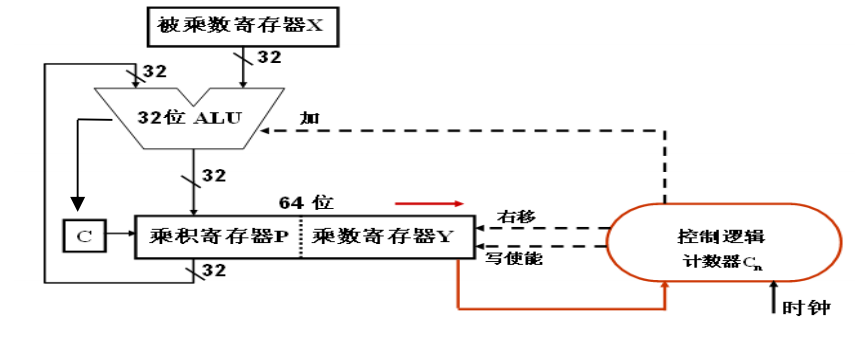
源码:
```
`timescale 1ns / 1ps
module mul_32u(
    output [63:0] p, //乘积
    output out_valid, //高电平有效时，表示乘法器结束工作
    input clk, //时钟
    input rst, //复位信号
    input [31:0] x, //被乘数
    input [31:0] y, //乘数
    input in_valid //高电平有效，表示乘法器开始工作
);
//add your code here
    reg [5:0] cn; //移位次数寄存器
    always @(posedge clk or posedge rst) begin
    if (rst) cn <= 0;
    else if (in_valid) cn <= 32;
    else if (cn != 0) cn <= cn - 1;
    end
    reg [31:0] rx, ry, rp; //加法器操作数和部分积
    wire [31:0] Add_result; //加法运算结果
    wire cout; //进位
 // adder32 是 32 位加法器模块的实例化，参见实验 3 的设计
     Adder32 my_adder(.f(Add_result),.cout(cout),.x(rp),.y(ry[0] ? rx : 0),.sub(1'b0),.OF(),
     .SF(),.ZF(),.CF());
    always @(posedge clk or posedge rst) begin
        if (rst) {rp, ry, rx} <= 0;
        else if (in_valid) {rp, ry, rx} <= {32'b0, y, x};
        else if (cn != 0) {rp, ry} <= {cout, Add_result, ry[31:1]};
    end
    assign out_valid = (cn == 0);
    assign p = {rp, ry};
endmodule
```
仿真测试源码:
```
`timescale 1ns / 1ps
module mul_32u_tb( );
  parameter N = 32;               // 定义位宽
  parameter SEED = 1;              // 定义不同的随机序列
     reg clk, rst;
     reg [N-1:0] x, y;
     reg in_valid;
     wire [2*N-1:0] p;
     wire  out_valid;

  mul_32u my_mul_32u (.clk(clk),.rst(rst),.x(x),.y(y),.in_valid(in_valid),.p(p),.out_valid(out_valid)); // 
  
    reg [2*N-1:0] temp_P;
   integer i, errors;
  task checkP;
    begin
      temp_P = x*y;
      if (out_valid &&(temp_P !=p)) begin
        errors=errors+1;
        $display($time," Error: x=%8h, y=%8h, expected %16h (%d), got %16h (%d)",
                 x, y, temp_P, temp_P, p, p); 
        end
    end
  endtask


  initial begin : TB   // Start testing at time 0
     clk = 0;
	 forever 
	#2 clk = ~clk;	     //
  end

  initial 
   begin	
    errors = 0;
           x = $random(SEED);                        // Set pattern based on seed parameter
   for (i=0; i<10000; i=i+1) begin                //计算10000次
        rst = 1'b0;
        #2
        rst = 1'b1;                             //上电后1us复位信号
	    x=$random; y=$random;
     	#2
    	rst = 1'b0;	
	    in_valid=1'b1;                        //初始化数据
	    #5
	    in_valid=1'b0;
	    #150;	                          // wait 150 ns, then check result
	     checkP;
      end  
    $display($time, " Multipler32U test end. Errors %d .",errors); 
    $stop(1);          // end test
  end

 endmodule
```
仿真测试图:
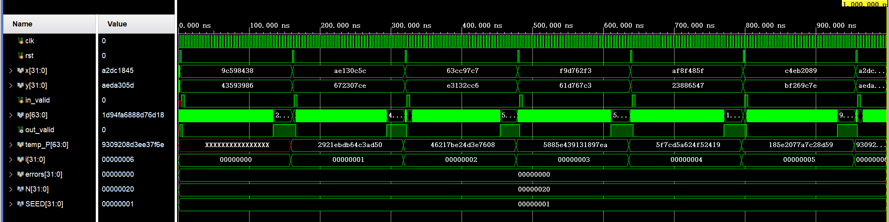
## 无符号数除法器设计
原理图如下:
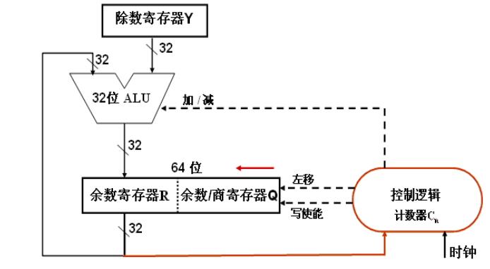
源码:
```
`timescale 1ns / 1ps
module div_32u(
    output  [31:0] Q,          //商
    output  [31:0] R,          //余数
    output out_valid,        //除法运算结束时，输出为1
    output in_error,         //被除数或除数为0时，输出为1
    input clk,               //时钟 
    input rst,             //复位信号
    input [31:0] X,           //被除数
    input [31:0] Y,           //除数
    input in_valid          //输入为1时，表示数据就绪，开始除法运算
);

// add your code here
 reg [5:0] cn;
 reg [63:0] RDIV;
 reg [31:0] TempQ;
 reg temp_out_valid;
 wire [31:0] diff_result;
 wire cout;
 assign in_error = ((X == 0) || (Y == 0)); //预处理，除数和被除数异常检测报错
 assign out_valid=(in_error||temp_out_valid); //如果检测异常，则结束运算
 always @(posedge clk or posedge rst) begin
 if (rst) cn <= 0; 
 else if (in_valid) cn <= 32;
 else if (cn != 0) cn <= cn - 1;
 end
 // adder32 是 32 位加法器模块的实例化，参见实验 3 的设计
 Adder32 my_adder(.f(diff_result),.cout(cout),.x(RDIV[63:32]),.y(Y),.sub(1'b1),.OF(),.SF(),.ZF(),.CF()); 
 //减法，当 cout=0 时，表示有借位。
 always @(posedge clk or posedge rst) begin
    if (rst) begin RDIV = 0; TempQ=0; end
    else if (in_valid) begin RDIV = {32'b0, X};TempQ=32'b0; temp_out_valid=1'b0;end//0扩展
    else if ((cn >= 0)&&(!out_valid)) begin
        if(cout) begin //判断是否有借位，=1，表示够减，没有借位
            RDIV[63:32] = diff_result[31:0]; //把差值赋值到中间被除数的高 32 位
            TempQ[cn]=1'b1; //商在该位置 1
        end
        if(cn>0) RDIV=RDIV <<1; 
        else temp_out_valid=1'b1;
    end
 end
 assign Q = TempQ;
 assign R =RDIV[63:32];
endmodule
```
仿真测试源码:
```
`timescale 1ns / 1ps
module div_32u_tb( );
  parameter N = 32;               // 定义位宽
  parameter SEED = 1;              // 定义不同的随机序列
     reg clk, rst;
     reg [N-1:0] x, y;
     reg in_valid;
     wire [N-1:0] q,r;
     wire  out_valid;
     wire  in_error;

  div_32u my_div_32u (.Q(q),.R(r),.out_valid(out_valid),.in_error(in_error),.clk(clk),.rst(rst),
  .X(x),.Y(y),.in_valid(in_valid)); // 
  
   reg [N-1:0] temp_Q;
   reg [N-1:0] temp_R;
   integer i, errors;
  task checkP;
    begin
      temp_Q = x / y;
      temp_R = x % y;
       if (out_valid &&((temp_Q !=q)||(temp_R !=r))) begin
        errors=errors+1;
        $display($time," Error: x=%d, y=%d, expected Quot= %d, Rem=%d(%h),got Quot= %d,Rem=%d(%h)",
                 x, y, temp_Q,temp_R,temp_R, q,r, r); 
        end
    end
  endtask


  initial begin : TB   // Start testing at time 0
     clk = 0;
	 forever 
	#2 clk = ~clk;	     //模拟时钟信号
  end

  initial 
   begin	
    errors = 0;
           x = $random(SEED);                        // Set pattern based on seed parameter
   for (i=0; i<10000; i=i+1) begin                //计算10000次
        rst = 1'b0;
        #2
        rst = 1'b1;                             //上电后1us复位信号
        x=$random; y=$random;
//	    x=0; y=1;
     	#2
    	rst = 1'b0;	
	    in_valid=1'b1;                        //初始化数据
	    #5
	    in_valid=1'b0;
	    #150;	                          // wait 150 ns, then check result
	     checkP;
      end  
    $display($time, " Divider32U test end. Errors %d .",errors); 
    $stop(1);          // end test
  end
```
仿真测试图:
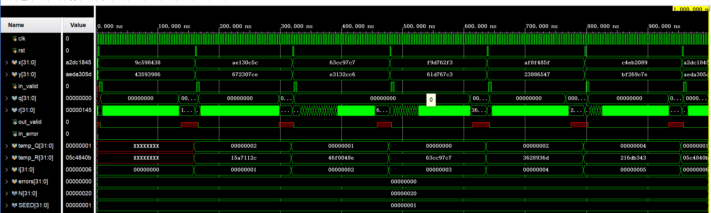
## 实验内容
## 1、补码 1 位乘法器设计
### (1)实验整体方案设计
<font size=2>&emsp;&emsp;这里我们需要构建一个补码1位乘法器。A.D.Booth 提出了一种补码相乘算法，可以将符号位与数值位合在一起参与运算，直接得出用补码表示的乘积，且正数和负数同等对待。这种算法被称为 Booth（布斯）算法。
&emsp;&emsp;计算机中操作数的长度都是字节的倍数，因而其位数应该是偶数。假定两个偶数位的带符号整数x 和 y 的机器级表示分别为［x］补和［y］补，［x×y］补的 Booth 一位乘法运算规则如下：
① 乘数最低位增加一位辅助位 Y-1= 0。
② 根据 Yi Yi-1的值，决定下一步的运算：当 Yi Yi-1=00 或者=11 时，不操作；当 Yi Yi-1=01 时，部分积 Pi加被乘数 X；当 Yi Yi-1=10 时，部分积 Pi减被乘数 X。
③ 每次加减后，算术右移一位，得到部分积 Pi+1。
④ 重复第②和第③步 n 次，结果得［x×y］补。
顶层模块设计如图:
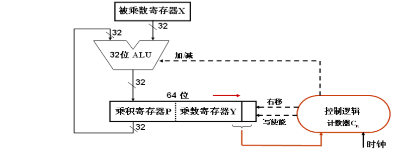
</font>

### (2)功能表、原理图、关键设计语句与源码
原理图:

源码:
```
`timescale 1ns / 1ps
module mul_32b(
    output [63:0] p,         //乘积
    output out_valid,        //高电平有效时，表示乘法器结束工作
    input clk,              //时钟 
    input rst_n,             //复位信号
    input [31:0] x,           //被乘数
    input [31:0] y,           //乘数
    input in_valid           //高电平有效，表示乘法器开始工作
); 
//add your code here
    reg [5:0] cn; //移位次数寄存器
    always @(posedge clk or posedge rst_n) begin
        if (rst_n) cn <= 0;//复位
        else if (in_valid) cn <= 32;//准备开始工作
        else if (cn != 0) cn <= cn - 1;
    end
    reg [31:0] rx, rp; //加法器操作数和部分积
    reg [32:0] ry;//初始末尾加一位0
    wire [31:0] Adder_result; //加法器运算结果
    wire cout; //进位
 // adder32 是 32 位加法器模块的实例化，参见实验 3 的设计
     Adder32 my_adder(.f(Adder_result),.cout(cout),.x(rp),.y((ry[1:0]==2'b00||ry[1:0]==2'b11)?32'b0:rx),
     .sub((ry[1:0]==2'b10)?1'b1:1'b0),.OF(),.SF(),.ZF(),.CF());
    always @(posedge clk or posedge rst_n) begin
        if (rst_n) {rp, ry, rx} <= 0;
        else if (in_valid) {rp, ry, rx} <= {32'b0, {y,1'b0}, x};
        else if (cn != 0) {rp, ry} <= {Adder_result[31], Adder_result, ry[32:1]};//注意是算术右移
    end
    assign out_valid = (cn == 0);
    assign p = {rp, ry[32:1]};
endmodule
```
其中调用的加法器源码:
```
`timescale 1ns / 1ps
module Adder32(
      output [31:0] f,
      output OF, SF, ZF, CF,
      output cout,
      input [31:0] x, y,
      input sub
	);
//add your code here
    wire [31:0] new_y;
    assign new_y = (sub == 1'b0) ? y : ~y;//判断，如果是减法需要取反
    wire  c16;
    CLA_16 add1(.f(f[15:0]),.cout(c16),.x(x[15:0]),.y(new_y[15:0]),.cin(sub));
    CLA_16 add2(.f(f[31:16]),.cout(cout),.x(x[31:16]),.y(new_y[31:16]),.cin(c16));

    assign ZF = f == 0;
    assign SF = f[31];
    assign CF = cout ^ sub;
    assign OF = (~x[31] & ~y[31] & f[31]) | (x[31] & y[31] & ~f[31]);

endmodule
module CLA_16(
       output wire [15:0] f,
       output wire  cout, 
       input [15:0] x, y,
       input cin
  );
       wire [3:0] Pi,Gi;          // 4位组间进位传递因子和生成因子
       wire [4:0] c;             // 4位组间进位和整体进位
       assign c[0] = cin;
      CLA_group cla0(f[3:0],Pi[0],Gi[0],x[3:0],y[3:0],c[0]);
      CLA_group cla1(f[7:4],Pi[1],Gi[1],x[7:4],y[7:4],c[1]);
      CLA_group cla2(f[11:8],Pi[2],Gi[2],x[11:8],y[11:8],c[2]);
      CLA_group cla3(f[15:12],Pi[3],Gi[3],x[15:12],y[15:12],c[3]);
      CLU clu(c[4:1],Pi,Gi, c[0]);
 	  assign cout = c[4];
 endmodule
module CLA_group (
     output [3:0] f,
     output pg,gg,
     input [3:0] x, y,
      input cin
);
	  wire [4:0] c;
	  wire [4:1] p, g;
	  assign c[0] = cin;
	  FA_PG fa0(f[0], p[1], g[1],x[0], y[0], c[0]);
	  FA_PG fa1(f[1], p[2], g[2],x[1], y[1], c[1]);
	  FA_PG fa2(f[2], p[3], g[3],x[2], y[2], c[2]);
	  FA_PG fa3(f[3], p[4], g[4],x[3], y[3], c[3]);
	  CLU clu(c[4:1],p, g, c[0]);
//	  assign cout = c[4];
	  assign pg=p[1] & p[2] & p[3] & p[4];
	  assign gg= g[4] | (p[4] & g[3]) | (p[4] & p[3] & g[2]) |  (p[4] & p[3] & p[2] & g[1]);
endmodule

module CLU (
      output [4:1] c,
      input [4:1] p, g,
      input c0
);
	  assign c[1] = g[1] | (p[1] & c0);
	  assign c[2] = g[2] | (p[2] & g[1]) | (p[2] & p[1] & c0);
	  // 以下两个表达式使用了位拼接运算和归约运算
	  assign c[3] = g[3] | (p[3] & g[2]) | (&{p[3:2], g[1]}) | (&{p[3:1], c0});
	  assign c[4] = g[4] | (p[4] & g[3]) | (&{p[4:3], g[2]}) | (&{p[4:2], g[1]}) | (&{p[4:1], c0});
endmodule
module FA_PG (
     output f, p, g,
     input x, y, cin
	);
	  assign f = x ^ y ^ cin;
	  assign p = x | y;
	  assign g = x & y;
endmodule
```
### (3)实验数据仿真测试波形图
仿真测试源码:
```
`timescale 1ns / 1ps
module mul_32b_tb(   );
  parameter N = 32;               // 定义位宽
  parameter SEED = 1;              // 定义不同的随机序列
     reg clk, rst;
     reg signed [(N-1):0] x, y;
     reg in_valid;
     wire [2*N-1:0] p;
     wire  out_valid;

  mul_32b my_mul_32b (.clk(clk),.rst_n(rst),.x(x),.y(y),.in_valid(in_valid),.p(p),.out_valid(out_valid)); // 
  
    reg signed [2*N-1:0] temp_P;
   integer i, errors;
  task checkP;
    begin
      temp_P = x*y;
      if (out_valid &&(temp_P !=p)) begin
        errors=errors+1;
        $display($time," Error: x=%8h, y=%8h, expected %16h (%d), got %16h (%d)",
                 x, y, temp_P, temp_P, p, p); 
        end
    end
  endtask
  
  initial begin : TB   // Start testing at time 0
     clk = 0;
	 forever 
	#2 clk = ~clk;	     //
  end
 /* initial begin
    errors = 0;
    rst = 1'b0;
    #2
    rst = 1'b1;
    x = 32'h00000004;
    y = 32'hfffffffd;
    #2
    in_valid=1'b1;
    #5
    in_valid=1'b0;
    #150;
    checkP;
  end*/

  initial 
   begin	
    errors = 0;
           x = $random(SEED);                        // Set pattern based on seed parameter
   for (i=0; i<10000; i=i+1) begin                //计算10000次
        rst = 1'b1;
        #2
        rst = 1'b0;                             //上电后1us复位信号
	    x=$random; y=$random;
     	#2
	    in_valid=1'b1;                        //初始化数据
	    #5
	    in_valid=1'b0;
	    #150;	                          // wait 150 ns, then check result
	     checkP;
      end  
    $display($time, " Multipler32U test end. Errors %d .",errors); 
    $stop(1);          // end test
  end
```
仿真测试图:
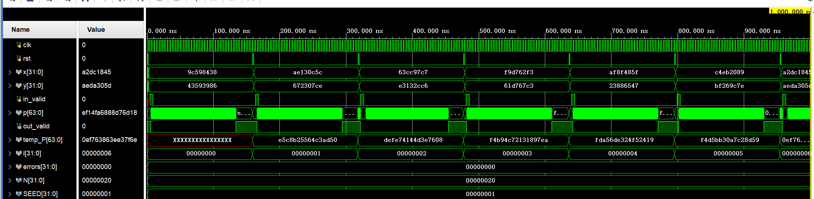
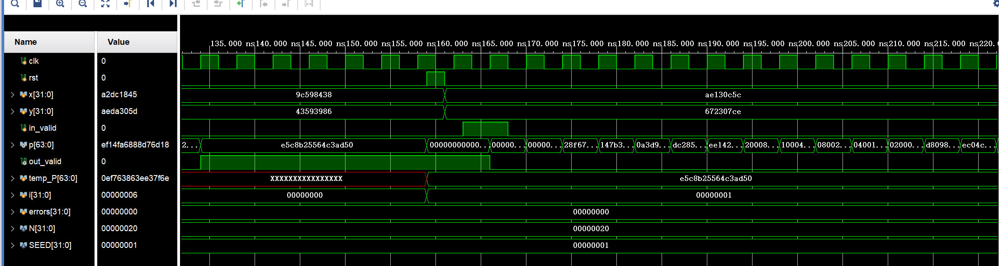
仿真测试后发现errors=0，说明没有出现错误。
### (4)验证
上述仿真测试即验证的一部分。
下面进行综合、实现,分析资源占用情况。

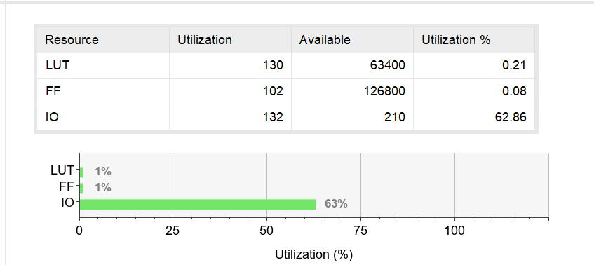
资源占用情况如上图。LUT总共占用130，IO引脚占用132。
### (5)错误现象及分析
在完成本次实验的过程中，没有出现错误。

## 2、快速乘法器
### (1)实验整体方案设计
<font size=2>&emsp;&emsp;为了提高乘法计算效率，可以采用硬件叠加或流水处理的快速乘法器件，如阵列乘法器，采用全加器阵列实现。
&emsp;&emsp;加法阵列可改用基于 CSA（Carry Save Adder，进位保留加法器）方式的结构。CSA 将本级进位与本级和一样同时输出至下一级，而不是向前传递到本级的下一位，因而求和速度快，且向下级传递的速度与字长无关。如下图:
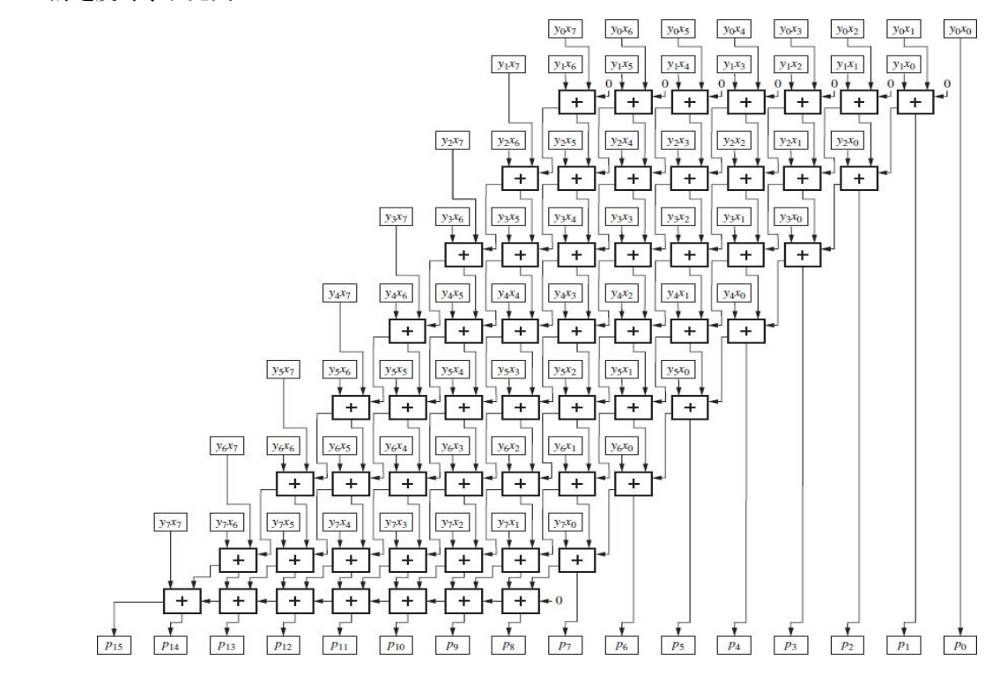
利用CSA结构，将乘法扩展至32位。
其顶层模块设计和这里的8位CSA类似。
</font>

### (2)功能表、原理图、关键设计语句与源码
原理图:仿照之前的8位CSA结构扩展至32位。
源码:
```
`timescale 1ns / 1ps
module mul_32k(
  input [31:0] X, Y,
  output reg [63:0] P       // output variable for assignment
  );
//add your code here  
  integer i;
  reg [63:0] cout; 
  reg [63:0] a,b,c;//3个临时变量
  reg cin;//用于最后
  reg a2,b2,c2;//用于最后的3个临时变量
  always@(*) begin
    cout=0;
    P={32'b0,X&{32{Y[0]}}};
    for(i=1;i<=31;i=i+1) begin
        a=P;
        b=((X&{32{Y[i]}})<<i);
        c=cout<<1;
        P=a^b^c;
        cout=(a&b)|(b&c)|(c&a);
    end
    //最后P+(cout<<1),cin=0，从第32位开始
    cin=0;
    cout=cout<<1;
    for(i=32;i<=62;i=i+1) begin
        a2=P[i];
        b2=cout[i];
        c2=cin;
        P[i]=a2^b2^c2;
        cin=(a2&b2)|(a2&c2)|(b2&c2);
    end
    P[63]=cin;
  end
endmodule
```
### (3)实验数据仿真测试波形图
仿真测试源码:
```
`timescale 1ns / 1ps
module mul_32k_tb(    );
  parameter N = 32;               // 定义位宽
  parameter SEED = 1;              // 定义不同的随机序列
  reg [N-1:0] X, Y;
  wire [2*N-1:0] P;

  mul_32k UUT ( .X(X), .Y(Y), .P(P) ); // Instantiate the UUT
  integer i,errors;
  reg [2*N-1:0] temp_P;
  task checkP;
    begin
      temp_P = X*Y;
      if (P !== temp_P) begin
        errors=errors+1;
        $display($time," Error: X=%d, Y=%d, expected %d (%16H), got %d (%16H)",
                 X, Y, temp_P, temp_P, P, P); $stop(1); end
    end
  endtask
  initial begin : TB   // Start testing at time 0
    errors=0;
    X=$random(SEED);
    for ( i=0; i<=10000; i=i+1 ) begin
      X=$random;   Y=$random;
     #10;           // wait 10 ns, then check result
        checkP;
      end
    $display($time, " Test ended. Errors:%d",errors); $stop(1);          // end test
  end
endmodule
```
仿真测试波形图:
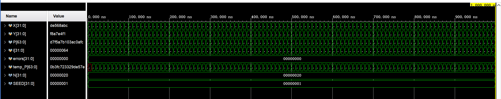
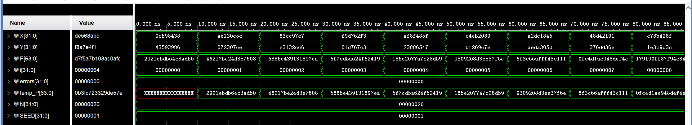
测试后，发现errors=0，说明没有出现错误。
### (4)验证
上述仿真测试即验证的一部分。
下面进行综合、实现,分析资源占用情况。
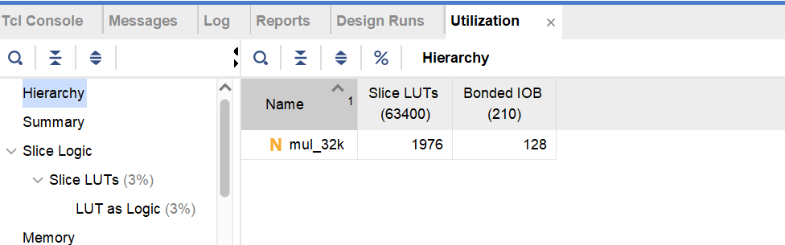
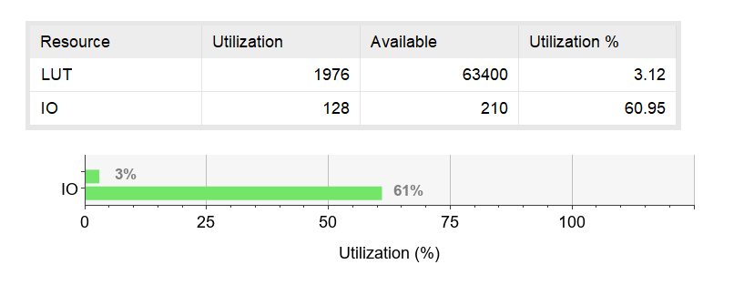
资源占用情况如上图。LUT占用1976,IO引脚128.
### (5)错误现象及分析
完成该实验的过程中，没有出现错误。

## 3、补码除法器
### (1)实验整体方案设计
<font size=2>&emsp;&emsp;补码作为带符号数的表示形式，与补码的其它运算一样，补码除法也可以将符号位和数值位合并在一起进行运算，而且商的符号位直接在除法运算中产生。对于两个 n 位二进制数补码除法，被除数需要进行n 位符号扩展。若被除数为 2n 位，除数为 n 位，则被除数无须符号位扩展。
&emsp;&emsp;和无符号数一样，首先要对被除数和除数的取值、大小等进行相应的预处理，以确定除数是否为 0、商是否为 0、是否溢出等异常情况。
&emsp;&emsp;因为补码除法中被除数、中间余数和除数都是有符号的，所以不像无符号数除法那样可以直接用做减法来判断是否够减，而应该根据被除数（中间余数）与除数之间符号的异同或差值的正负来确定下次做减法还是加法，再根据加或减运算的结果来判断是否够减。
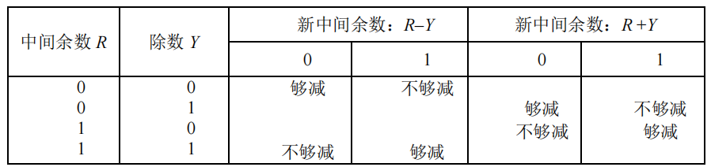
&emsp;&emsp;当被除数（中间余数）与除数同号时做减法；异号时，做加法。若加减运算后得到的新余数与原余数符号一致（余数符号未变）则够减；否则不够减。
&emsp;&emsp;以上是补码恢复余数除法，我们也可以类似的进行补码不恢复余数除法。
(1) 操作数的预置：除数装入除数寄存器 Y，被除数 X 符号位扩展后装入余数寄存器 R 和余数/商寄存器 Q。 
(2) 根据以下规则求第一位商 Qn。若 X 与 Y 同号，则做减法，即 R1=R - Y；否则，做加法，即 R1 =R+Y，并按以下规则确定商值Qn。
① 若新的中间余数 R1与 Y 同号，则 Q n 置１，转第（3）步。
② 若新的中间余数 R1与 Y 异号，则 Q n 置 0，转第（3）步。
Qn用来判断是否溢出，而不是真正的商。以下情况下会发生溢出：X 与 Y 同号且上商 Qn =1，或者，X 与 Y 异号且上商 Qn = 0。
(3) 对于 i =1 到 n ，按以下规则求出相应商。
① 若 Ri与 Y 同号，则 Qn-i置１，Ri+1 = 2Ri –Y，i = i +1。
② 若 Ri与 Y 异号，则 Qn-i置 0，Ri+1 =2Ri+Y，i = i +1。
(4) 商的修正：最后一次 Q 寄存器左移一位，将最高位 Qn移出，并在最低位置上商 Q0。若被除数与除数同号， Q 中就是真正的商；否则，将 Q 中的商的末位加 1。
(5) 余数的修正：若余数符号同被除数符号，则不需修正，余数在 R 中；否则，按下列规则进行修
</font>

### (2)功能表、原理图、关键设计语句与源码
这里实现的是不恢复余数除法
注意整除特判
源码:
```
`timescale 1ns / 1ps
module div_32b(
    output  [31:0] Q,          //商
    output  [31:0] R,          //余数
    output out_valid,        //除法运算结束时，输出为1
    output in_error,         //被除数或除数为0时，输出为1
    input clk,               //时钟 
    input rst,             //复位信号
    input [31:0] X,           //被除数
    input [31:0] Y,           //除数
    input in_valid          //输入为1时，表示数据就绪，开始除法运算
);

reg [5:0] cn;

reg [31:0] q, r;

reg endloop, fixup, div_fixup;

assign Q = q;
assign R = r;
assign out_valid = (!rst && cn == 0 && !in_error && fixup && div_fixup);
assign in_error = (X == 0 || Y == 0);

always @(posedge clk or posedge rst) begin
    if (rst) cn <= 0;
    else if (in_valid) cn <= 32;
    else if (cn != 0) cn <= cn - 1;
end

always @(posedge clk or posedge rst) begin
    if (rst) begin
        q <= 0;
        r <= 0;
        endloop <= 0;
        fixup <= 0;
        div_fixup <= 0;
    end
    else if (in_valid) begin
        q <= X;
        r <= (X[31] == Y[31]) ? {32{X[31]}} - Y : {32{X[31]}} + Y;
        endloop <= 0;
        fixup <= 0;
        div_fixup <= 0;
    end
    else if (cn != 0 && !out_valid) begin
        if (r[31] == Y[31]) begin
            q <= 2 * q + 1;
            r <= 2 * r - Y + (q[31] == 1);
        end
        else begin
            q <= 2 * q;
            r <= 2 * r + Y + (q[31] == 1);
        end
    end
    else if (cn == 0 && !endloop) begin
        if (r[31] == Y[31]) begin
            q <= 2 * q + 1;
        end
        else begin
            q <= 2 * q;
        end
        endloop <= 1;
    end
    else if (cn == 0 && !fixup) begin
        if (X[31] != Y[31]) begin
            q <= q + 1;
        end
        if (r[31] != X[31]) begin
            if (X[31] == Y[31]) begin
                r <= r + Y;
            end
            else begin
                r <= r - Y;
            end
        end
        fixup <= 1;
    end
    else if (cn == 0 && !div_fixup) begin
        if (X[31] == Y[31] && r - Y == 0) begin
            r <= r - Y;
            q <= q + 1;
        end
        else if (X[31] != Y[31] && r + Y == 0) begin
            r <= r + Y;
            q <= q - 1;
        end
        div_fixup <= 1;
    end
end
endmodule
```
### (3)实验数据仿真测试波形图
仿真测试源码:
```
`timescale 1ns / 1ps
module div_32b_tb();
parameter N = 32;               // 定义位宽
  parameter SEED = 1;              // 定义不同的随机序列
     reg clk, rst;
     reg signed [N-1:0] x, y;
     reg in_valid;
     wire [N-1:0] q,r;
     wire  out_valid;
     wire  in_error;

  div_32b my_div_32b (.Q(q),.R(r),.out_valid(out_valid),.in_error(in_error),.clk(clk),
  .rst(rst),.X(x),.Y(y),.in_valid(in_valid)); // 
  
   reg signed [N-1:0] temp_Q;
   reg signed [N-1:0] temp_R;
   integer i, errors;
  task checkP;
    begin
      temp_Q = x / y;
      temp_R = x % y;
       if (out_valid &&((temp_Q !=q)||(temp_R !=r))) begin
        errors=errors+1;
        $display($time," Error: x=%d, y=%d, expected Quot= %d, Rem=%d(%h),got Quot= %d,Rem=%d(%h)",
                 x, y, temp_Q,temp_R,temp_R, q,r, r); 
        end
    end
  endtask


  initial begin : TB   // Start testing at time 0
     clk = 0;
	 forever 
	#2 clk = ~clk;	     //模拟时钟信号
  end
    
 /*  initial begin
        errors=0;
        rst = 1'b0;
        #2
        rst = 1'b1;          
        x=32'hfffffff7;
        y=32'h00000002;
        #2
        rst = 1'b0;	
	    in_valid=1'b1;                        
	    #5
	    in_valid=1'b0;
        #150
        temp_Q = x / y;
        temp_R = x % y;
       if (out_valid &&((temp_Q !=q)||(temp_R !=r))) begin
        errors=errors+1;
        $display($time," Error: x=%d, y=%d, expected Quot= %d, Rem=%d(%h),got Quot= %d,Rem=%d(%h)",
                 x, y, temp_Q,temp_R,temp_R, q,r, r); 
        end
        rst = 1'b0;
        #2
        rst = 1'b1;     
        x=32'h00000004;
        y=32'hfffffffe;
        #2
        rst = 1'b0;	
	    in_valid=1'b1;                        
	    #5
	    in_valid=1'b0;
        #150
        temp_Q = x / y;
        temp_R = x % y;
       if (out_valid &&((temp_Q !=q)||(temp_R !=r))) begin
        errors=errors+1;
        $display($time," Error: x=%d, y=%d, expected Quot= %d, Rem=%d(%h),got Quot= %d,Rem=%d(%h)",
                 x, y, temp_Q,temp_R,temp_R, q,r, r); 
        end
        rst = 1'b0;
        #2
        rst = 1'b1;  
        x=32'hfffffffc;
        y=32'h00000002;
        #2
        rst = 1'b0;	
	    in_valid=1'b1;                        
	    #5
	    in_valid=1'b0;
        #150
        if (out_valid &&((temp_Q !=q)||(temp_R !=r))) begin
        errors=errors+1;
        $display($time," Error: x=%d, y=%d, expected Quot= %d, Rem=%d(%h),got Quot= %d,Rem=%d(%h)",
                 x, y, temp_Q,temp_R,temp_R, q,r, r); 
        end
   end*/
  initial 
   begin	
    errors = 0;
           x = $random(SEED);                        // Set pattern based on seed parameter
   for (i=0; i<10000; i=i+1) begin                //计算10000次
        rst = 1'b0;
        #2
        rst = 1'b1;                             //上电后1us复位信号
        x=$random; y=$random;
//	    x=0; y=1;
     	#2
    	rst = 1'b0;	
	    in_valid=1'b1;                        //初始化数据
	    #5
	    in_valid=1'b0;
	    #150;	                          // wait 150 ns, then check result
	     checkP;
      end  
    $display($time, " Divider32U test end. Errors %d .",errors); 
    $stop(1);          // end test
  end
endmodule
```
仿真测试波形图:
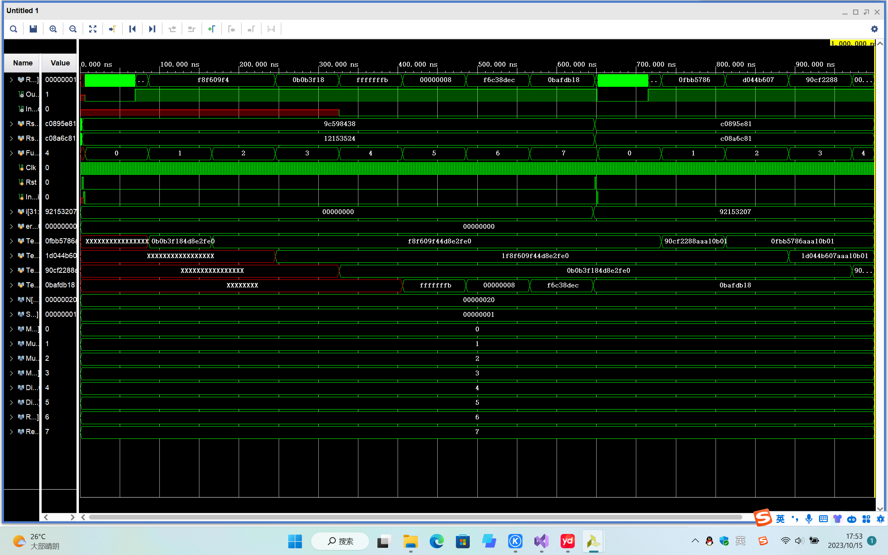

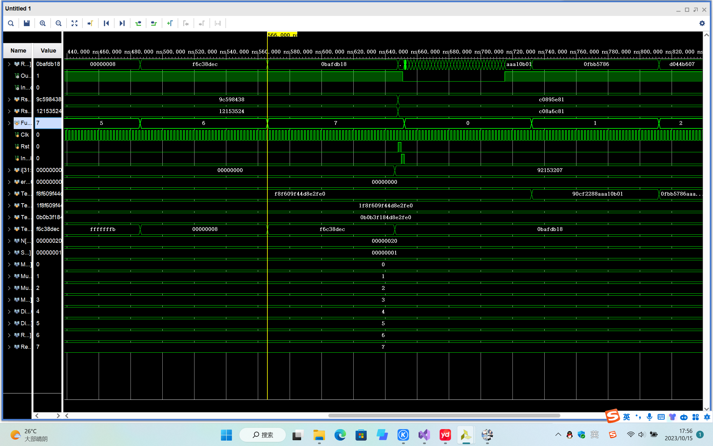
仿真测试后发现errors=0，说明没有出现错误。
### (4)验证
上述仿真测试即验证的一部分。
下面进行综合、实现,分析资源占用情况。
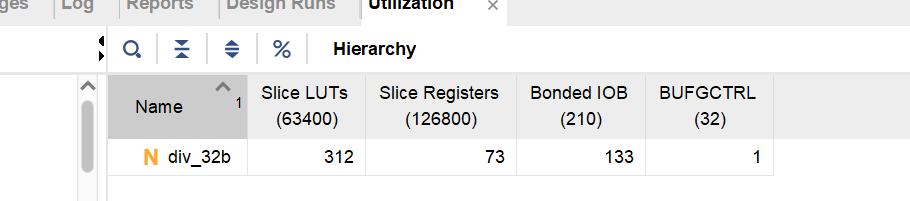

资源占用情况如上图。LUT占用312，IO引脚占用133.
### (5)错误现象及分析
&emsp;&emsp;在实验的过程中，出现了整除错误。即整除后余数恰好等于除数或其相反数。这种情况下，原来的纠商和纠余操作需要进一步修改。需要判断纠商纠余后，若被除数和除数同号，R-Y是否$==0$，等于0说明整除，需要继续纠商纠余;若被除数和除数异号，R+Y是否$==0$，等于0说明整除，需要继续纠商纠余。

## 4、RV32M 指令实现
### (1)实验整体方案设计
<font size=2>&emsp;&emsp;RV32M 类型指令是 RISC-V 基础指令集的扩展，为 RISC-V 架构提供了一组特定的指令，提供了一系列整数乘除指令，包括无符号数和带符号数的乘除指令、取余数指令等。这些指令用于执行高效的整数乘除运算，实现快速、高效的数据处理操作，从而提高系统的性能和效率。
&emsp;&emsp;RV32M 的指令都是 R 型指令。
指令操作码: 
指令功能: 
&emsp;&emsp;为了能够在实验板进行验证，操作数使用重复的 4 位二进制数，输出通过 led 指示灯和七段数码管来表示。具体定义如下：拨档开关 0~3 表示操作数 x；拨档开关 4~7 表示操作数 y；拨档开关 12~15 表示功能选择 funct3；如果需要，拨档开关 9 表示数据就绪 in_valid，拨档开关 10 表示复位信号 rst。32 位的 rd结果显示在 8 个七段数码管上，低 16 位显示在 16 个 led 指示灯上，指令运算结束 out_valid 显示在三色led1 的绿色灯上，错误标志 in_error 显示在三色 led2 等红色灯上。
顶层模块设计图:(上图)

</font>

### (2)功能表、原理图、关键设计语句与源码
原理图:(下图)

rv32m源码:
```
`timescale 1ns / 1ps
module rv32m(
    output  [31:0] rd,        //运算结果
    output out_valid,         //运算结束时，输出为1
    output in_error,          //运算出错时，输出为1
    input clk,               //时钟 
    input rst,               //复位信号，低有效
    input [31:0] rs1,          //操作数rs1
    input [31:0] rs2,          //操作数rs2
    input [2:0] funct3,        //3位功能选择码
    input in_valid           //输入为1时，表示数据就绪，开始除法运算
    );
    //add your code here
    wire [63:0] pu,ps;//无符号，带符号乘积
    wire [31:0] qu,ru,qs,rs;//无符号商与余数；带符号商与余数
    wire [63:0] temppsforhsu;//用于mulhsu指令的特殊中间值
    reg [31:0] result;//结果
    reg [63:0] ansforhsu;//指令mulhsu计算结果
    wire tempout_valid [4:0];
    wire tempin_error [1:0];
    reg finalout_valid;
    reg finalin_error;
    assign rd = result;
    assign out_valid=finalout_valid;
    assign in_error=finalin_error;
    mul_32u rvmul_32u(.p(pu),.out_valid(tempout_valid[0]),.clk(clk),.rst(rst),
    .x(rs1),.y(rs2),.in_valid(in_valid));
    mul_32b rvmul_32b(.p(ps),.out_valid(tempout_valid[1]),.clk(clk),.rst_n(rst),
    .x(rs1),.y(rs2),.in_valid(in_valid));
    div_32u rvdiv_32u(.Q(qu),.R(ru),.out_valid(tempout_valid[2]),.in_error(tempin_error[0]),
    .clk(clk),.rst(rst),.X(rs1),.Y(rs2),.in_valid(in_valid));
    div_32b rvdiv_32b(.Q(qs),.R(rs),.out_valid(tempout_valid[3]),.in_error(tempin_error[1]),
    .clk(clk),.rst(rst),.X(rs1),.Y(rs2),.in_valid(in_valid));
    mul_32b rvforhsu(.p(temppsforhsu),.out_valid(tempout_valid[4]),.clk(clk),.rst_n(rst),.x(rs1),
    .y({1'b0,rs2[30:0]}),.in_valid(in_valid));
    always@(*) begin
        case(funct3)
            3'b000: begin
                result=ps[31:0];
                finalout_valid=tempout_valid[1];
                finalin_error=1'b0;
            end
            3'b001: begin
                result=ps[63:32];
                finalout_valid=tempout_valid[1];
                finalin_error=1'b0;
            end
            3'b010: begin
                if(rs2[31]==1'b0)begin
                    ansforhsu=temppsforhsu;
                end
                else begin
                    ansforhsu=temppsforhsu+({rs1[31],rs1,31'b0});
                end
                result=ansforhsu[63:32];
                finalout_valid=tempout_valid[4];
                finalin_error=1'b0;
            end
            3'b011: begin
                result=pu[63:32];
                finalout_valid=tempout_valid[0];
                finalin_error=1'b0;
            end
            3'b100: begin
                result=qs;
                finalout_valid=tempout_valid[3];
                finalin_error=tempin_error[1];
            end
            3'b101: begin
                result=qu;
                finalout_valid=tempout_valid[2];
                finalin_error=tempin_error[0];
            end
            3'b110: begin
                result=rs;
                finalout_valid=tempout_valid[3];
                finalin_error=tempin_error[1];
            end
            3'b111: begin
                result=ru;
                finalout_valid=tempout_valid[2];
                finalin_error=tempin_error[0];
            end
        endcase
    end
endmodule
```
rv32m_top源码:
```
`timescale 1ns / 1ps
module rv32m_top(
    output  [15:0] rd_l,        //运算结果的低16位
    output out_valid,         //运算结束时，输出为1
    output in_error,          //运算出错时，输出为1
    output [6:0] segs,        // 7段数值
    output [7:0] AN,         //数码管选择
    input clk,               //时钟 
    input rst,               //复位信号，低有效
    input [3:0] x,           //操作数1，重复8次后作为rs1
    input [3:0] y,           //操作数2，重复8次后作为rs2
    input [2:0] funct3,        //3位功能选择码
    input in_valid          //输入为1时，表示数据就绪，开始运算
    );
    //add your code here
    wire [31:0]rd;
    assign rd_l=rd[15:0];
    rv32m myrv32m(.rd(rd),.out_valid(out_valid),.in_error(in_error),
    .clk(clk),.rst(rst),.rs1({8{x}}),
    .rs2({8{y}}),.funct3(funct3),.in_valid(in_valid));
    reg [15:0] counter;//数码管刷新计数器
    reg [7:0] anout;
    reg [6:0] segsout;
    wire [6:0] connection [7:0];
    assign segs=segsout;
    assign AN=anout;
    seg_decode seg_7(.in(rd[31:28]),.out(connection[7]));
    seg_decode seg_6(.in(rd[27:24]),.out(connection[6]));
    seg_decode seg_5(.in(rd[23:20]),.out(connection[5]));
    seg_decode seg_4(.in(rd[19:16]),.out(connection[4]));
    seg_decode seg_3(.in(rd[15:12]),.out(connection[3]));
    seg_decode seg_2(.in(rd[11:8]),.out(connection[2]));
    seg_decode seg_1(.in(rd[7:4]),.out(connection[1]));
    seg_decode seg_0(.in(rd[3:0]),.out(connection[0]));
    //数码管显示
always @(posedge clk) begin
    counter<=counter+1;
        case (counter)
            6000: begin
                anout<=8'b01111111;
                segsout<=connection[7];
            end
            12000: begin
                anout<=8'b10111111;
                segsout<=connection[6];
            end
            18000: begin
                anout<=8'b11011111;
                segsout<=connection[5];
            end
            24000: begin
                anout<=8'b11101111;
                segsout<=connection[4];
            end
            30000: begin
                anout<=8'b11110111;
                segsout<=connection[3];
            end
            36000: begin
                anout<=8'b11111011;
                segsout<=connection[2];
            end
            42000: begin
                anout<=8'b11111101;
                segsout<=connection[1];
            end
            48000: begin
                anout<=8'b11111110;
                segsout<=connection[0];
                counter<=0;
            end
        endcase
end
```
### (3)实验数据仿真测试波形图
rv32m仿真测试源码:
```
`timescale 1ns / 1ps
module rv32m_tb(   );
  parameter N = 32;               // 定义位宽
  parameter SEED = 1;              // 定义不同的随机序列
  wire [N-1:0] Rd;               //运算结果
  wire Out_valid,In_error;       //运算结束和错误输入标志
  reg [N-1:0]  Rs1,Rs2;         //32位数据输入
  reg [2:0]   Funct3;             //功能选择信号
  reg Clk,Rst;                        //复位信号
  reg In_valid;                   //输入为1时，表示数据就绪，开始运算
  integer i, errors;
  reg signed [63:0]  TempMul;
  reg signed [64:0]  TempMulsu;
  reg [63:0]  TempMulu;
  reg [31:0] TempRd;
  parameter Mul     = 3'b000,   // 定义不同运算的控制码
             Mulh    = 3'b001, 
             Mulhsu  = 3'b010, 
             Mulhu   = 3'b011, 
             Div     = 3'b100, 
             Divu    = 3'b101, 
             Rem     = 3'b110, 
             Remu    = 3'b111;

  initial begin : TB   // Start testing at time 0
     Clk = 0;
	 forever 
	#1 Clk = ~Clk;	     //模拟时钟信号
  end

   rv32m my_rv32m(.rd(Rd),.out_valid(Out_valid),.in_error(In_error),.clk(Clk),.rst(Rst),
   .rs1(Rs1),.rs2(Rs2),.funct3(Funct3),.in_valid(In_valid));

  task checkrv32m;
    begin
    case (Funct3)
    Mul: begin 
                 TempMul=Rs1 *  Rs2;   //带符号数乘法运算
                 if (TempMul[31:0]!=Rd) 
                  begin     
                       errors = errors + 1;
                      $display("ERROR: Funct3,Rs1,Rs2 = %3b,%8h,%8h, want= %8h, got=%8h,err=%1b." ,
                      Funct3, Rs1, Rs2, TempMul[31:0], Rd,In_error);                 
                  end
             end
    Mulh: begin 
                 TempMul=$signed(Rs1) * $signed( Rs2);   //带符号数乘法运算
                 if (TempMul[63:32]!=Rd) 
                  begin     
                       errors = errors + 1;
                      $display("ERROR: Funct3,Rs1,Rs2 = %3b,%8h,%8h, want= %8h, got=%8h,err=%1b." ,
                      Funct3, Rs1, Rs2, TempMul[63:32], Rd,In_error);                 
                  end
             end
    Mulhsu: begin                 //带符号数乘以无符号数运算
                 TempMulsu=$signed(Rs1) *$signed({1'b0, Rs2});   //无符号数乘法
                 if (TempMulsu[63:32]!=Rd)
                  begin     
                       errors = errors + 1;
                      $display("ERROR: Funct3,Rs1,Rs2 = %3b,%8h,%8h, want= %8h, got=%8h,err=%1b." ,
                      Funct3, Rs1, Rs2, TempMul[63:32], Rd,In_error);                 
                  end
             end
    Mulhu: begin                 //无符号数小于比较运算
                 TempMulu=Rs1 * Rs2;   
                 if (TempMulu[63:32]!=Rd) 
                  begin     
                       errors = errors + 1;
                      $display("ERROR: Funct3,Rs1,Rs2 = %3b,%8h,%8h, want= %8h, got=%8h,err=%1b." ,
                      Funct3, Rs1, Rs2, TempMul[63:32], Rd,In_error);                 
                  end
             end
      Div: begin 
                 TempRd=$signed(Rs1) / $signed(Rs2);   //带符号数除法运算
                 if (TempRd!=Rd) 
                  begin     
                       errors = errors + 1;
                      $display("ERROR: Funct3,Rs1,Rs2 = %3b,%8h,%8h, want= %8h, got=%8h,err=%1b." ,
                      Funct3, Rs1, Rs2, TempMul[63:32], Rd,In_error);                 
                  end
             end
      Divu: begin 
                 TempRd=Rs1 / Rs2;   //带符号数除法运算
                 if (TempRd!=Rd) 
                  begin     
                       errors = errors + 1;
                      $display("ERROR: Funct3,Rs1,Rs2 = %3b,%8h,%8h, want= %8h, got=%8h,err=%1b." ,
                      Funct3, Rs1, Rs2, TempMul[63:32], Rd,In_error);                 
                  end
             end
      Rem: begin 
                 TempRd=$signed(Rs1) % $signed(Rs2);   //带符号数除法运算
                 if (TempRd!=Rd) 
                  begin     
                       errors = errors + 1;
                      $display("ERROR: Funct3,Rs1,Rs2 = %3b,%8h,%8h, want= %8h, got=%8h,err=%1b." ,
                      Funct3, Rs1, Rs2, TempMul[63:32], Rd,In_error);                 
                  end
             end
      Remu: begin 
                 TempRd=Rs1 % Rs2;   //带符号数除法运算
                 if (TempRd!=Rd) 
                  begin     
                       errors = errors + 1;
                      $display("ERROR: Funct3,Rs1,Rs2 = %3b,%8h,%8h, want= %8h, got=%8h,err=%1b." ,
                      Funct3, Rs1, Rs2, TempMul[63:32], Rd,In_error);                 
                  end
             end
             
    endcase
    end
  endtask
  
  initial begin
    errors = 0;
           Rs1 = $random(SEED);                        // Set pattern based on seed parameter
   for (i=0; i<10000; i=i+1) begin                     //计算10000次
        Rst = 1'b0;    
        #2   Rst = 1'b1;               //复位信号有效
          Rs1 = 4; Rs2=-1;             //初始化数据
     	#2 	Rst = 1'b0;	 In_valid=1'b1;               //数据就绪         
	    #2  In_valid=1'b0;
             
          Funct3 = Mul;  #80 ; checkrv32m;    
          Funct3 = Mulh;  #80 ; checkrv32m;
          Funct3 = Mulhsu;  #80 ; checkrv32m; 
          Funct3 = Mulhu;  #80 ; checkrv32m;  
              
          Funct3 = Div;  #80 ; checkrv32m; 
          Funct3 = Divu;  #80 ; checkrv32m; 
          Funct3 = Rem;  #80 ; checkrv32m;  
          Funct3 = Remu;  #80 ; checkrv32m;   
    end
    $display("RV32M test done. Errors: %0d .", errors);
    $stop(1);
  end

endmodule
```
仿真测试图:


### (4)验证
综合实现后，电路图:

验证:
x=5,y=b,mul:

x=5,y=b,mulh:

x=5,y=b,mulhsu:

x=c,y=d,mulhu:

x=6,y=d,div:

x=c,y=3,divu:

x=6,y=6,rem:

x=c,y=5,remu:

### (5)错误现象及分析
&emsp;&emsp;实现rv32m的时候，调用了多个乘除法器，其out_valid输出我都是指用一个reg变量接收，导致多个输出同时驱动它而报错。经过修改后错误消除。

## 思考题
### 1、分析 rv32m 模块的资源占用和性能特点。
资源占用情况如图:
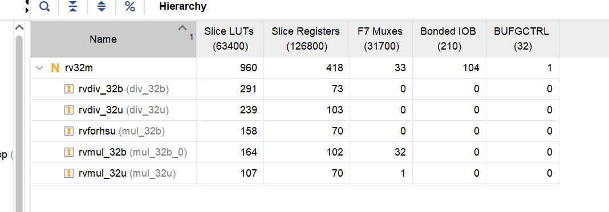
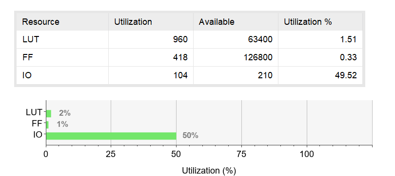
LUT总共消耗960，IO引脚占用104。
时间性能:
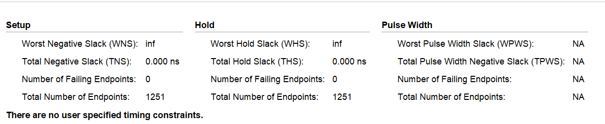
### 2、阐述浮点数的乘除法如何实现？
<font size=2>&emsp;&emsp;浮点数乘法：阶码相加、尾数相乘、结果规格化；浮点数除法：尾数调整、阶码求差、尾数相除。
&emsp;&emsp;在浮点乘除运算时，为便于浮点数判断溢出和尾数进行阵列乘除运算运算，假设浮点数的阶码采用双符号位补码表示，尾数采用单符号补码或原码表示。
浮点乘法、除法运算步骤如下：
①阶码相加减
按照定点整数的加减法运算方法对两个浮点数的阶码进行加减运算。
②尾数相乘或相除
按照定点小数的阵列乘除法运算方法对两个浮点数的尾数进行乘除运算。为了保证尾数相除时商的正确性，必须保证被除数尾数的绝对值一定小于除数尾数的绝对值。若被除数尾数的绝对值大于除数尾数的绝对值，需对被除数进行调整，即被除数的尾数每右移1位，阶码加1，直到被除数尾数的绝对值小于除数尾数的绝对值。
③结果规格化并进行舍入处理
浮点数乘除运算结果的规格化和舍入处理与浮点数加减运算结果的规格化和舍入处理方法相同。并且在浮点数乘除运算的结果中，由于乘积和商的绝对值一定小于1，因此在浮点乘除运算结果进行规格化处理时只存在向左规格化，不可能出现向右规格化。
④判断溢出
浮点数乘除运算结果的尾数不可能发生溢出，而浮点数运算结果的溢出则根据运算结果中浮点数的阶码来确定，溢出的判定和处理方法与浮点加减运算完全相同。</font>

### 3、分析当除数是一个常量时，如何通过乘以常量倒数的方法来得到近似的结果。与除法运算进行对比分析，比如常量是 3 或者 7 时。
<font size=2>&emsp;&emsp;一般来说我们会把除以c看作是乘以$\frac{1}{c}$，而将通常较慢的除法转换为通常更快的乘法问题。下文只考虑除数为奇数的情况，因为除数为偶数时，可通过先除以奇数再对结果进行移位实现计算。数学告诉我们，对任一奇数d，总存在另一个奇数m，使得$d*m=2^{n}-1$。因此：
$\frac{1}{d}=\frac{m}{2^{n}-1}=\frac{m}{2^{n}\cdot (1-2^{-n})}=\frac{m}{2^{n}}(1+2^{-n})(1+2^{-2n})(1+2^{-4n})\cdots$。
&emsp;&emsp;例如，常量为3。$3=2^{2}-1$。我们可以有$\frac{1}{3}=\frac{1}{2^{2}-1}=\frac{1}{2^{2}}\cdot (1+2^{-2})\cdot (1+2^{-4})\cdot (1+2^{-8})\cdots$来近似计算。假设被除数为z，要计算$frac{z}{3}$，这里可以计算q=z,后$q=q+q>>2$,后$q=q+q>>4$,后$q=q+q>>8$,最后$q=q>>2$。
</font>

### 4、通过查找资料，阐述提高乘除法器的运算性能的思路和方法。
<font size=2>提高乘除法器运算性能的几个方法:
1.移位相加乘法算法（SHIFT/ADD MULTIPLICATION ALGORITHMS）这个我们在前面实现的阵列乘法器就是这个方法的运用。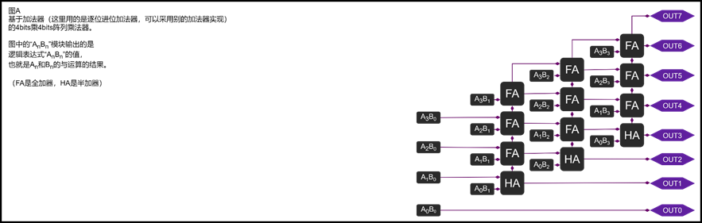 
2.补码除法可以用补码不恢复余数两位除法，这样减少一半的周期消耗。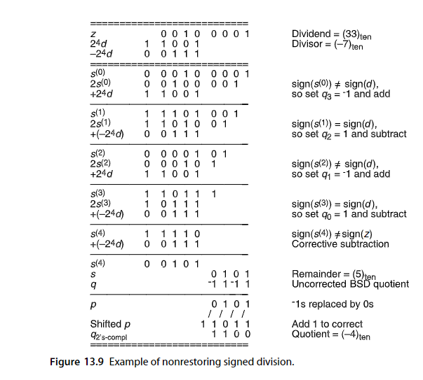
3.和思考题3一样，对于除以一个常数的情况，我们求近似答案，可以用乘以其倒数的方法。具体操作见思考题3。
4.基2 SRT除法
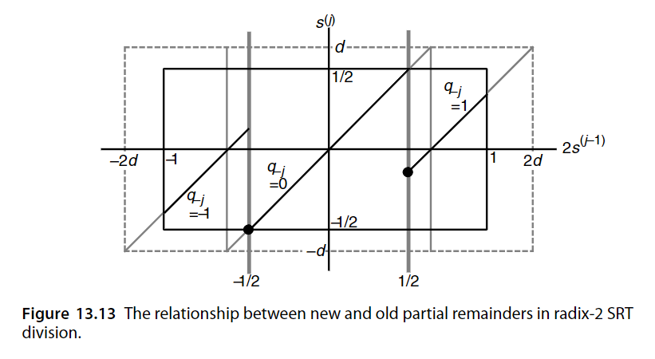
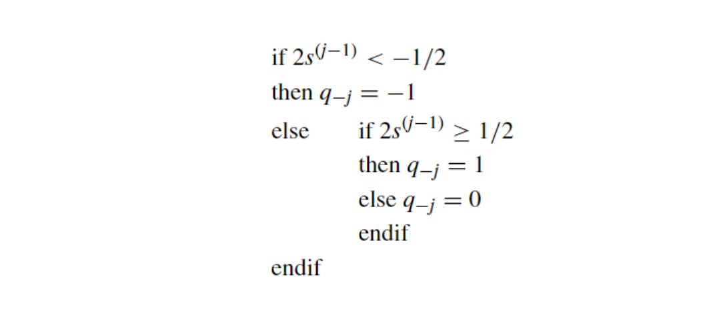
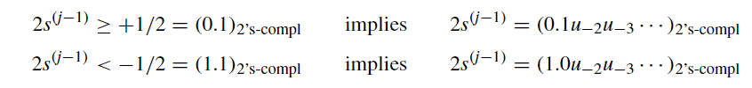
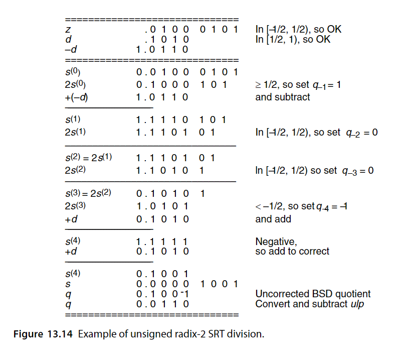
5.快速除法器
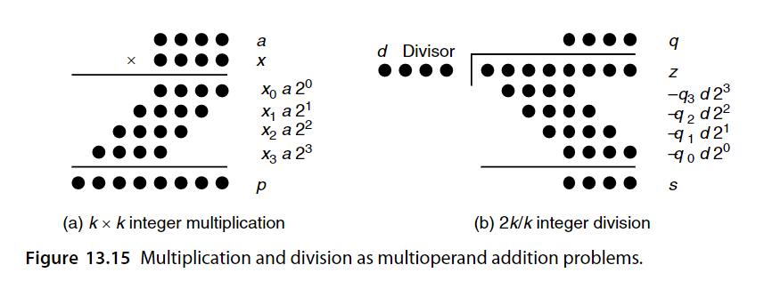
</font>