<center><font size=6>Lab7 存储器实验</font></center>

## 在进行实验之前，先看看存储器原理
1. 寄存器堆
寄存器堆实现如下:
```
module registerfile(
output wire [31:0] busa, //寄存器 ra 输出数据
output wire [31:0] busb, //寄存器 rb 输出数据
input clk,
input [4:0] ra, //读寄存器编号 ra
input [4:0] rb, //读寄存器编号 rb
input [4:0] rw, //写寄存器编号 rw
input [31:0] busw, //写入数据端口
input we //写使能端，为 1 时，可写入
);
 (* ram_style="registers" *) reg [31:0] regfiles[0:31]; //综合时使用寄存器实现寄存器堆
always @(posedge clk) begin 
if((we==1'b1)) regfiles[rw]<=busw; //写端口
end
 assign busa=(ra==5'b0) ? 32'b0 : regfiles[ra]; //读端口 ra
 assign busb=(rb==5'b0) ? 32'b0 : regfiles[rb]; //读端口 rb
endmodule
```
2. 主要存储器
关于MemOp控制信号的含义，如下表:
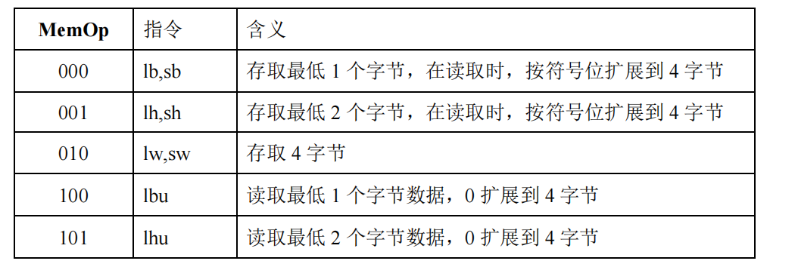
主要存储器实现如下：
```
module DataMem(
 output reg [31:0] dataout, //数据输出
 input clk, //时钟信号
 input we, //存储器写使能信号，高电平时允许写入数据
 input [2:0] MemOp, //读写字节数控制
 input [31:0] datain, //下输入数据
 input [15:0] addr //存储器地址
);
(* ram_style="block" *) reg [31:0] ram [2**16-1:0]; //设置使用块 RAM 综合成存储器
reg [31:0] intmp; 
reg [31:0] outtmp; 
always @(posedge clk) begin
 outtmp <= ram[addr[15:2]]; //上升沿读取存储器数据，先读取地址中数据
end
always @(negedge clk) begin
 if (we) ram[addr[15:2]] <= intmp; //下降沿写入存储器数据，写使能有效时，写入数据
end
always @(*)
begin
 if (~we) begin //读取操作
 case (MemOp)
 3'b000: //lb
begin dataout = {{24{outtmp[7]}}, outtmp[7:0]}; end
 3'b001: //lh
begin dataout = {{16{outtmp[15]}}, outtmp[15:0]}; end
 3'b010: begin dataout = outtmp; end
 3'b100: begin dataout = {24'h000000, outtmp[7:0]}; end
 3'b101: begin dataout = {16'h0000, outtmp[15:0]}; end
 default:dataout = outtmp;
 endcase
 end
 else begin //写入操作
 case (MemOp)
 3'b000: begin intmp = {outtmp[31:8], datain[7:0]}; end
 3'b001: begin intmp = {outtmp[31:16], datain[15:0]}; end
 3'b010: begin intmp = datain; end
 default:intmp = datain;
 endcase
 end
end
endmodule
```
1. 高速缓冲存储器
   
## 实验内容
## 1、存储器读写实验

### (1)整体实验方案设计
<font size=2>&emsp;&emsp;之前我们直接用的4字节存储的主存，而riscv指令集都是按字节编址的，在访存指令中也有取低位一字节、两字节，写入低位一字节、两字节的指令。如果我们的存储器本身也是按字节存储的话，那么在实现这些指令的时候会更加方便。
&emsp;&emsp;下面，利用 4 片 8 位 64KB 的 RAM 级联成一个 32 位 256KB 的存储器，每片 RAM 对应着 32 位存储器的特定字节数据。按字节编制，利用存储器地址的最低两位来选择对应的 8 位 RAM 片，其余的地址位连接到4 片 RAM 的地址引脚上，将 4 片 RAM 的 8 位数据输入输出引脚拼接成 32 位数据位。</font>

### (2)功能表、原理图、关键设计语句与源码
&emsp;&emsp;原理图如图:(姑且把Logism电路图视为原理图)
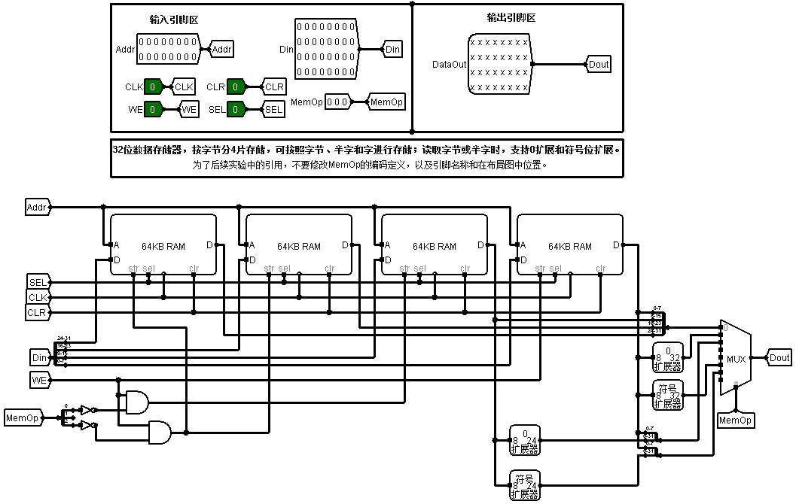
首先是单字节存储，代码如下:
```
`timescale 1ns / 1ps

module mem8b(
   output reg [7:0] dataout,   //输出数据
   input cs,                   //片选信号，高电平有效。有效时，存储器正常工作
   input clk,                   //时钟信号
   input we,                   //存储器写使能信号，高电平时允许写入数据
   input [7:0] datain,        //下输入数据
   input [15:0] addr           //16位存储器地址，存储容量64KB
);
 reg [7:0] ram [2**16-1:0];  //设置使用块RAM综合成存储器
// Add your code here
always @(negedge clk) begin
        if (cs && we)
            ram[addr] <= datain;
end
always @(posedge clk) begin
    if (cs)
        dataout <= ram[addr];
end
endmodule
```
后将4个单字节存储器级联为32位存储器:
```
`timescale 1ns / 1ps

module mem32b(
   output reg [31:0] dataout,   //输出数据
   input clk,                   //时钟信号
   input we,                   //存储器写使能信号，高电平时允许写入数据
   input [2:0] MemOp,          //读写字节数控制信号
   input [31:0] datain,        //输入数据
   input [15:0] addr           //16位存储器地址
);
// Add your code here
reg [3:0] write;
wire [7:0]tempout1;
wire [7:0]tempout2;
wire [7:0]tempout3;
wire [7:0]tempout4;
mem8b mem0(.datain(datain[7:0]),.we(write[0]),.addr(addr),.cs(1),.clk(clk),.dataout(tempout1));
mem8b mem1(.datain(datain[15:8]),.we(write[1]),.addr(addr),.cs(1),.clk(clk),.dataout(tempout2));
mem8b mem2(.datain(datain[23:16]),.we(write[2]),.addr(addr),.cs(1),.clk(clk),.dataout(tempout3));
mem8b mem3(.datain(datain[31:24]),.we(write[3]),.addr(addr),.cs(1),.clk(clk),.dataout(tempout4));

always@(*)begin
    case(MemOp)
        3'b000: begin if(we) begin write = 4'b0001; end 
        else begin write = 0; end dataout = {{24{tempout1[7]}},tempout1};end
        3'b001: begin if(we) begin write = 4'b0011; end 
        else begin write = 0; end dataout = {{16{tempout2[7]}},tempout2,tempout1};end
        3'b010: begin if(we) begin write = 4'b1111; end 
        else begin write = 0; end dataout = {tempout4,tempout3,tempout2,tempout1};end
        3'b100: begin if(we) begin write = 4'b0000; end 
        else begin write = 0; end dataout = {24'b0,tempout1};end
        3'b101: begin if(we) begin write = 4'b0000; end 
        else begin write = 0; end dataout = {16'b0,tempout2,tempout1};end
    endcase
end
endmodule
```
### (3)实验数据仿真测试波形图
仿真测试代码如下:
```
`timescale 1ns / 1ps


module men32b_tb(    );
 wire  [31:0] ram_rdata;   //时钟下降沿，并且写入使能为低电平时输出
 reg        clk;                //时钟信号
 reg        ram_wen;                //存储器写使能信号，高电平时允许写入数据
 reg [2:0]  memop;      //读写字节数控制
 reg [31:0] ram_wdata;       //下降沿写入数据
 reg [15:0] ram_addr;    //写入地址
 
mem32b u_ram_top(
    .dataout (ram_rdata),
    .clk      (clk       ),
    .we       (ram_wen   ),
    .MemOp    (memop  ),
    .datain   (ram_wdata ),
    .addr     (ram_addr ) 
);
reg[31:0] temp;
integer errors;

  task checkP;
    begin
       if (ram_rdata!=temp) begin
        errors=errors+1;
        $display($time," Data Memory read/writer error. MemOp=%d,we=%1b,addr=%h,DataOut=%h,Temp=%h",
                 memop, ram_wen, ram_addr, ram_rdata, temp); 
        end
    end
  endtask

//clkData Memory
initial 
begin
    clk = 1'b1;
end
always #5 clk = ~clk;
					
initial 
begin
	errors=0;
	ram_addr   = 16'd0;
	ram_wdata  = 32'd0;
	ram_wen    =  1'd0;
	memop =  3'd0;
	#10;
	
	$display("=============================");
	$display("Test Begin");
	
	// Part 0 Begin
	#10;
	memop      = 3'd0;
	ram_wen    = 1'b0;
	ram_addr   = 16'hf0;
	ram_wdata  = 32'hffffffff;
    #10;
	ram_wen    = 1'b1;
	ram_addr   = 16'hf0;
	ram_wdata  = 32'h01234567;
    #10;
	ram_addr   = 16'hf4;
    #10;
	ram_addr   = 16'hf8;
    #10;
	ram_wen    = 1'b0;
	ram_addr   = 16'hf0;
	#10
	temp       =  32'h01234567;
	checkP;
    #10;
    memop      = 3'd1;
	ram_addr   = 16'hf0;
	#10
	temp       =  32'h00000067;
	checkP;
	#10;
    memop      = 3'd2;
	ram_addr   = 16'hf0;
  	#10
	temp       =  32'h00004567;
	checkP;
    #10;
    // Part 1 Begin
    #10;
	memop      = 3'd5;
	ram_wen    = 1'b1;
	ram_addr   = 16'hf4;
	ram_wdata  = 32'h89abcdef;
 	#10;
	ram_wen    = 1'b0;
	ram_addr   = 16'hf4;
	#10
	temp       =  32'hffffffef;
	checkP;
 	#10;
	memop      = 3'd0;
	ram_addr   = 16'hf4;
	#10
	temp       =  32'h012345ef;
	checkP;
 	#10;
	memop      = 3'd1;
	ram_addr   = 16'hf4;
	#10
	temp       =  32'h000000ef;
	checkP;
 	#10;
	memop      = 3'd2;
	ram_addr   = 16'hf4;
	#10
	temp       =  32'h000045ef;
	checkP;

    #10;
	// Part 2 Begin
    #10;
	memop      = 3'd6;
	ram_wen    = 1'b1;
	ram_addr   = 16'hf8;
	ram_wdata  = 32'h89abcdef;
 	#10;
	ram_wen    = 1'b0;
	ram_addr   = 16'hf8;
	#10
	temp       =  32'hffffcdef;
	checkP;
 	#10;
	memop      = 3'd0;
	ram_addr   = 16'hf8;
	#10
	temp       =  32'h0123cdef;
	checkP;
 	#10;
	memop      = 3'd1;
	ram_addr   = 16'hf8;
 	#10
	temp       =  32'h000000ef;
	checkP;
	#10;
	memop      = 3'd2;
	ram_addr   = 16'hf8;
 	#10
	temp       =  32'h0000cdef;
	checkP;
	#20;
	$display("TEST Done. Errors=%d",errors);
	$finish;
end

endmodule
```
仿真测试波形图:
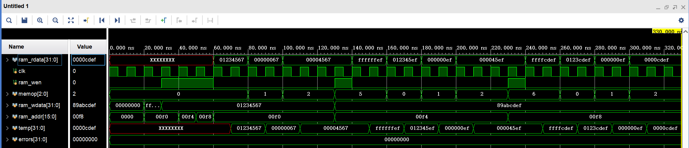
### (4)验证
&emsp;&emsp;为了能够上板子验证，需要设计验证的顶层模块。
&emsp;&emsp;验证的要求如下:
1）、根据 MemOp 信号能够按字节、半字和字读写数据。
2）、32 位输出数据显示在 8 个七段数码管上，低 16 位显示在 LED 指示灯上。
3）、利用按钮 BTNC 实现清零复位功能。
4）、利用开关 SWTICH[2:0]实现 MemOp 信号的输入，开关 SWTICH[3]表示写入使能信号，开关
SWTICH[7:4]表示地址信号的最低 4 位，开关 SWTICH[15:8]表示输入数据的最低 8 位。

下面是实现上板验证的顶层模块设计:
```
`timescale 1ns / 1ps
//////////////////////////////////////////////////////////////////////////////////
// Company: 
// Engineer: 
// 
// Create Date: 2023/11/13 23:25:23
// Design Name: 
// Module Name: mem32b_top
// Project Name: 
// Target Devices: 
// Tool Versions: 
// Description: 
// 
// Dependencies: 
// 
// Revision:
// Revision 0.01 - File Created
// Additional Comments:
// 
//////////////////////////////////////////////////////////////////////////////////


module mem32b_top(
 output [6:0]SEG, 
 output [7:0]AN, //显示 32 位输出数值
 output [15:0] dataout_L8b, //输出数据低 16 位
 input CLK100MHZ, //系统时钟信号
 input BTNC, //复位清零信号
 input [2:0] MemOp, //读写字节数控制信号
 input we, //存储器写使能信号，高电平时允许写入数据
 input [3:0] addr_L4b, //地址位低 4 位，高位可以指定为 0 或其他任意值
 input [7:0] datain_L8b //输入数据低 8 位，可重复 4 次，或高位指定为任意值
    );
(* ram_style="block" *)reg [15:0] countdown;
always@(posedge CLK100MHZ or posedge BTNC)begin
    if(BTNC)begin
        countdown <= 16;
    end
    else if(countdown != 0)begin
        countdown <= countdown - 1;
    end
 end
 wire [31:0] res;
reg [15:0] counter;//数码管刷新计数器
reg [7:0] anout;
reg [6:0] segsout;
wire [6:0] connection [7:0];
assign SEG=segsout;
assign AN=anout;
 wire [15:0] true_addr = {12'b0, addr_L4b};
 wire [31:0] true_datain = {4{datain_L8b}};
 wire [15:0] final_addr = (countdown == 0) ? true_addr : countdown - 1;
 wire [31:0] final_datain = (countdown == 0) ? true_datain : 32'd0;
 wire final_we = (countdown == 0) ? we : 1'b1;
 wire [2:0] final_MemOp = (countdown == 0) ? MemOp : 3'b010;
 mem32b mymem(.dataout(res),.clk(CLK100MHZ),.MemOp(final_MemOp),.we(final_we),
 .addr(final_addr),.datain(final_datain));
assign dataout_L8b=res[15:0];
seg_decode seg_7(.in(res[31:28]),.out(connection[7]));
seg_decode seg_6(.in(res[27:24]),.out(connection[6]));
seg_decode seg_5(.in(res[23:20]),.out(connection[5]));
seg_decode seg_4(.in(res[19:16]),.out(connection[4]));
seg_decode seg_3(.in(res[15:12]),.out(connection[3]));
seg_decode seg_2(.in(res[11:8]),.out(connection[2]));
seg_decode seg_1(.in(res[7:4]),.out(connection[1]));
seg_decode seg_0(.in(res[3:0]),.out(connection[0]));
always @(posedge CLK100MHZ) begin
    counter<=counter+1;
        case (counter)
            6000: begin
                anout<=8'b01111111;
                segsout<= connection[7];
            end
            12000: begin
                anout<=8'b10111111;
                segsout<= connection[6];
            end
            18000: begin
                anout<=8'b11011111;
                segsout<= connection[5];
            end
            24000: begin
                anout<=8'b11101111;
                segsout<=  connection[4];
            end
            30000: begin
                anout<=8'b11110111;
                segsout<= connection[3];
            end
            36000: begin
                anout<=8'b11111011;
                segsout<= connection[2];
            end
            42000: begin
                anout<=8'b11111101;
                segsout<= connection[1];
            end
            48000: begin
                anout<=8'b11111110;
                segsout<= connection[0];
                counter<=0;
            end
        endcase
end
endmodule
```
综合、实现后电路图如图:
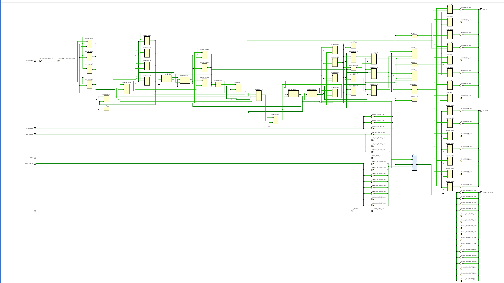

下面是验证:
地址0000H存55555555H
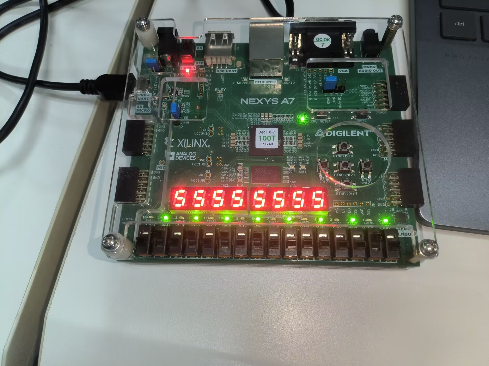
读取0000H低两位
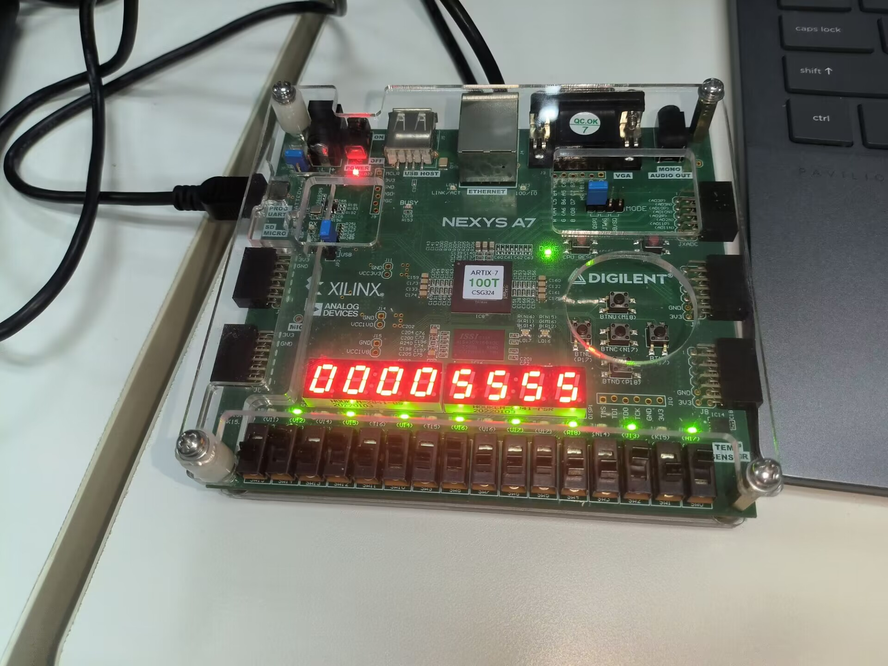
读取0000H最低位
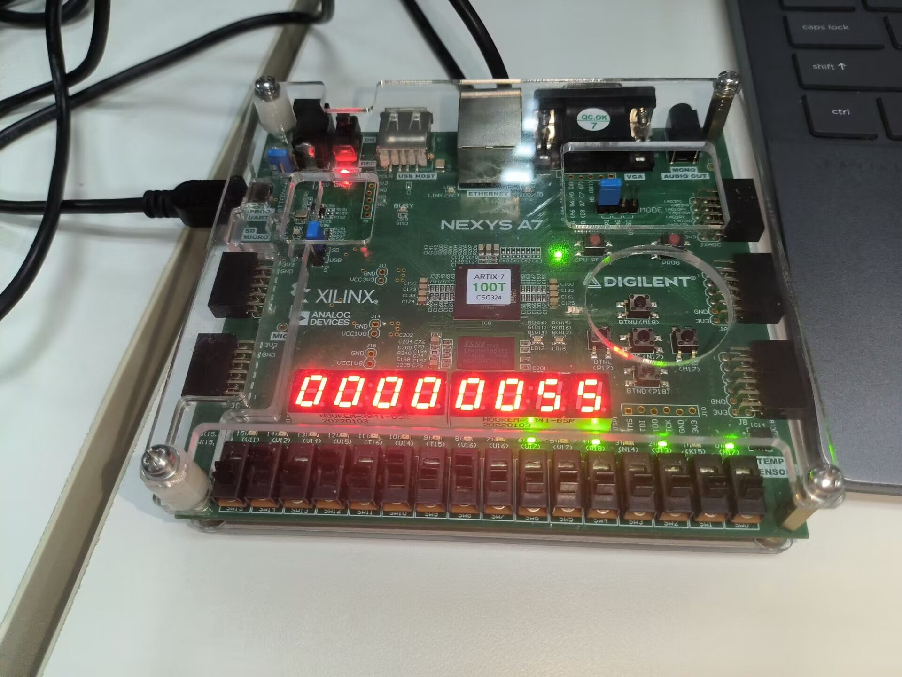
切换读取地址
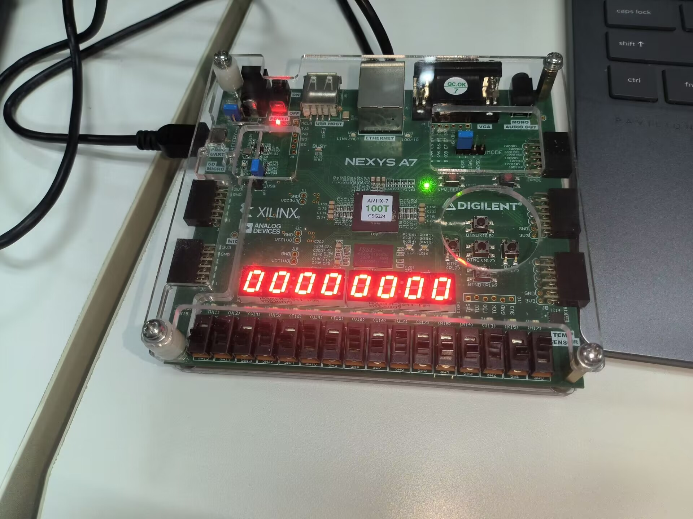
清零
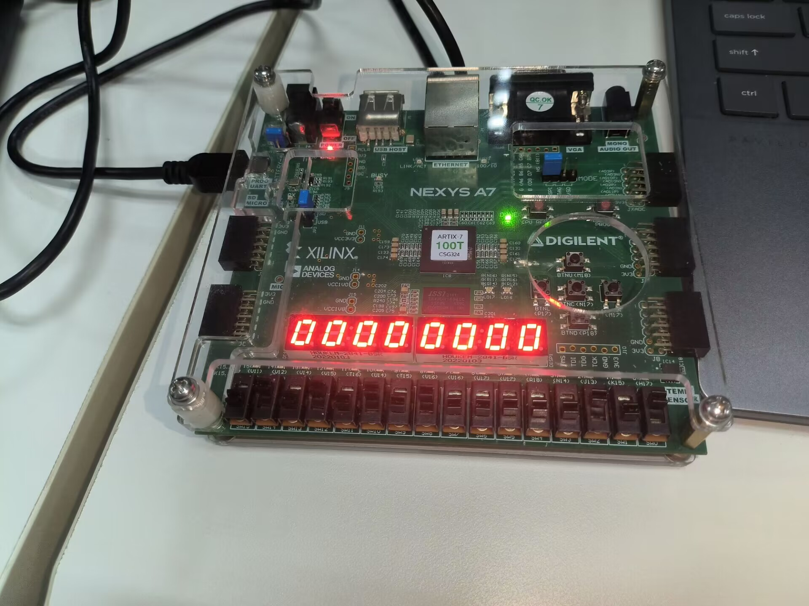
### (5)错误现象及分析
&emsp;&emsp;实验中，我开始在每个但字节存储器中加入新变量rst，用for循环遍历的方式进行清零。但这样效率是很低的，至少我是没能等到其综合完成。之后我改为在顶层模块利用4字节写入指令进行清零，没个时钟周期的下降沿对一个地址写入数据00000000H，这样，经过一定数目的时钟周期后，即可全部清零。由于时钟频率很快，对我们上班验证，清零并不需要很长时间。
&emsp;&emsp;由于开发板的特性，我们值用了4位表示地址，即只表示了16位地址的低4位，高12位全部补零。所以此处实验的清零部分可以进行特殊处理。我们不需要对全部的地址中的数据进行清零，只需要对地址00000000H~0000000FH这16个地址进行清零，即可达到我们预期的效果。

## 2、高速缓冲存储器实验（选做）
### (1)整体实验方案设计
<font size=2>&emsp;&emsp;Cache状态机如下:

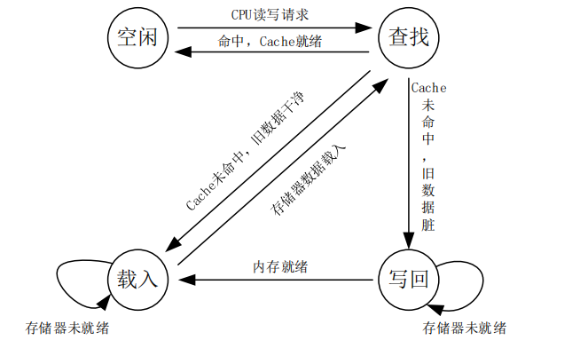
&emsp;&emsp;在 Cache 空闲时，状态机处于 Idle 状态。当有读写请求输入时，进入查找状态，首先检查 Cache 是否命中，如果命中，则返回空闲状态，并依据请求类型返回相应的数据，并更新 dirty 位信息；当未命中时，如果脏位 dirty 为真，则进入写回状态，存储器写回 Cache 中被更新的内存块，然后进入载入状态；如果脏位 dirty 为假，则进入载入状态，从存储器中读取内存块，替换 Cache 中块数据，返回查找状态。
&emsp;&emsp;空闲状态 IDEL：等待来自处理器的有效读写请求。
&emsp;&emsp;查找比对状态 COMPARE：根据地址比较读写请求是否命中，根据 Cache 的映射方式，比较请求地址数据是否在 cache 中。如果当前 cache 块的 valid 有效，请求地址段的 Tag 部分和 Cache 块的 Tag 相同；则命中 hit 信号有效，无论读写数据请求都返回 Cache 就绪信号。如果是写入请求，则当前 Cache 块的脏位Dirty 信号有效。如果未命中，则需要替换 cache 块内容，如果脏位 dirty 信号有效，则进入写回状态，否则进入载入状态。
&emsp;&emsp;写回状态 WRITEBACK：当存储器处于就绪状态后，根据 Cache 块的 tag 和 index 字段组合成地址信息，把 Cache 块的数据写回到存储器中。
&emsp;&emsp;载入状态 LOADMEM：当存储器处于就绪状态后，读取存储器的内容，替换 Cache 块，返回比对状态。
&emsp;&emsp;这是一个简单的 Cache 状态，在比对状态中把地址比较和读写合在一个单周期中，实际应用中，可以分开以便提升单周期的频率。另一个可以优化的方法是，建立一个写缓冲区，保存脏块数据。这样遇到脏位信号有效时，可以直接读取新的存储器数据，而不需要等待两个存储器访问周期。当 CPU 在处理请求数据时，cache 可以把缓冲区的数据写回存储器。</font>

### (2)功能表、原理图、关键设计语句与源码
原理图:
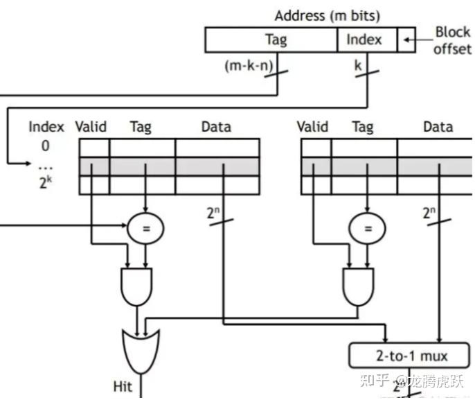
Cache源码：
```
module cache(
    input clk,
    input rst,
    input  [31:0] addr,
    input  rd_req,
    input  wr_req,
    input  [31:0] wr_data,
    output reg [31:0] rd_data,
    output [2:0] info
);
    parameter LINE_ADDR_LEN = 2;
    parameter SET_ADDR_LEN = 3;
    parameter TAG_ADDR_LEN = 12 - LINE_ADDR_LEN - SET_ADDR_LEN;
    parameter MEM_ADDR_LEN = 12;
    parameter UNUSED_ADDR_LEN = 32 - TAG_ADDR_LEN - SET_ADDR_LEN - LINE_ADDR_LEN - 2 ;//未用位表示的部分
    parameter LINE_SIZE = 1 << LINE_ADDR_LEN;
    parameter SET_SIZE = 1 << SET_ADDR_LEN;

    reg [31:0] cache_mem [SET_SIZE-1:0][LINE_SIZE-1:0];
    reg [TAG_ADDR_LEN-1:0] cache_tags [SET_SIZE-1:0];
    reg valid [SET_SIZE-1:0];//valid位
    reg dirty [SET_SIZE-1:0];//脏位

    wire [1:0]   word_addr;
    wire [LINE_ADDR_LEN-1:0]   line_addr;//行
    wire [SET_ADDR_LEN-1:0]    set_addr;
    wire [TAG_ADDR_LEN-1:0]    tag_addr;//tag
    wire [UNUSED_ADDR_LEN-1:0] unused_addr;//未用位
    
    reg [1:0] word_addr_reg;
    reg [LINE_ADDR_LEN-1:0] line_addr_reg;
    reg [SET_ADDR_LEN-1:0] set_addr_reg;
    reg [TAG_ADDR_LEN-1:0] tag_addr_reg;
    reg [UNUSED_ADDR_LEN-1:0] unused_addr_reg;

    reg [1:0] cache_stat;
    parameter IDLE = 2'b00;
    parameter COMPARE = 2'b01;
    parameter WRITEBACK = 2'b10;
    parameter LOADMEM = 2'b11;

    reg [SET_ADDR_LEN-1 :0] mem_rd_set_addr;
    reg [TAG_ADDR_LEN-1 :0] mem_rd_tag_addr;
    wire[MEM_ADDR_LEN-1 :0] mem_rd_addr = {mem_rd_tag_addr,mem_rd_set_addr,2'b00};
    reg [MEM_ADDR_LEN-1 :0] mem_wr_addr;
    reg  [32*LINE_SIZE-1:0] mem_wr_line;
    wire [32*LINE_SIZE-1:0] mem_rd_line;
    assign {unused_addr, tag_addr, set_addr, line_addr, word_addr} = addr;
    reg cache_hit;
    reg rd_or_wr_proc;
    reg state_renewed;
    reg mem_rd_ready;
    reg mem_wr_ready;
    assign info = {valid[set_addr],dirty[set_addr],cache_hit};

    integer i;
    integer j;
    integer k;
    integer l;
    always @ (posedge clk) begin
        if(rst) begin
            for(i=0; i<SET_SIZE; i = i + 1) begin
                dirty[i] <= 1'b0;
                valid[i] <= 1'b0;
                cache_tags[i] <= 0;
            end
            cache_hit <= 1'b0;
            cache_stat <= IDLE;
            mem_wr_line <= 0;            
            mem_wr_addr <= 0;
            state_renewed <= 1'b0;
            mem_rd_ready <= 1'b0;
            mem_wr_ready <= 1'b0;
            {mem_rd_tag_addr,mem_rd_set_addr} <= 0;
            rd_data <= 0;
        end else begin
            case(cache_stat)
                IDLE:begin
                    if(rd_req | wr_req) begin
                        cache_stat <= COMPARE;
                        {unused_addr_reg, tag_addr_reg, set_addr_reg, line_addr_reg, word_addr_reg} <= addr;
                        if (rd_req) begin
                            rd_or_wr_proc <= 1'b1;
                        end
                        else begin
                            rd_or_wr_proc <= 1'b0;
                        end    
                    end
                end
                COMPARE:begin
                    if(state_renewed) begin
                        state_renewed <= 1'b0;
                        if(cache_hit) begin
                            if(rd_or_wr_proc) begin
                                rd_data <= cache_mem[set_addr_reg][line_addr_reg];
                            end
                            else begin 
                                cache_mem[set_addr_reg][line_addr_reg] <= wr_data;
                                dirty[set_addr_reg] <= 1'b1;
                            end 
                            cache_stat <= IDLE;
                        end
                        else begin
                            {mem_rd_tag_addr,mem_rd_set_addr} <= {tag_addr_reg, set_addr_reg};
                            if(dirty[set_addr_reg]) begin
                                cache_stat  <= WRITEBACK;
                            end
                            else begin
                                cache_stat  <= LOADMEM;
                            end
                        end 
                    end
                    else begin
                        state_renewed <= 1'b1;
                        if(valid[set_addr_reg] && cache_tags[set_addr_reg] == tag_addr_reg) begin
                            cache_hit = 1'b1;            
                        end
                        else begin
                            cache_hit = 1'b0;            
                        end
                    end
                end
                WRITEBACK: begin
                    if(mem_wr_ready) begin
                        mem_wr_ready <= 1'b0;
                        cache_stat <= LOADMEM;
                    end
                    else begin
                        mem_wr_ready <= 1'b1;
                        mem_wr_addr <= {cache_tags[set_addr_reg],set_addr_reg};
                        mem_wr_line[31:0] <= cache_mem[set_addr_reg][0];
                        mem_wr_line[63:32] <= cache_mem[set_addr_reg][1];
                        mem_wr_line[95:64] <= cache_mem[set_addr_reg][2];
                        mem_wr_line[127:96] <= cache_mem[set_addr_reg][3];
                    end
                end
                LOADMEM: begin
                    if(mem_rd_ready) begin
                        mem_rd_ready <= 1'b0;
                        cache_stat <= COMPARE;
                        cache_mem[mem_rd_set_addr][0] <= mem_rd_line[31:0];
                        cache_mem[mem_rd_set_addr][1] <= mem_rd_line[63:32];
                        cache_mem[mem_rd_set_addr][2] <= mem_rd_line[95:64];
                        cache_mem[mem_rd_set_addr][3] <= mem_rd_line[127:96];
                        cache_tags[mem_rd_set_addr] <= mem_rd_tag_addr;
                        valid [mem_rd_set_addr] <= 1'b1;
                        dirty [mem_rd_set_addr] <= 1'b0;
                    end
                    else begin
                        mem_rd_ready <= 1'b1;
                    end
                end
            endcase
        end
    end

    wire [MEM_ADDR_LEN-1:0] mem_addr = (cache_stat == WRITEBACK) ? mem_wr_addr : mem_rd_addr;

    main_mem main_mem_0(
        .clk(clk),
        .rst(rst),
        .rd_en(cache_stat == LOADMEM && !mem_rd_ready),
        .rd_line(mem_rd_line),
        .wr_en(cache_stat == WRITEBACK && mem_wr_ready),
        .wr_line(mem_wr_line),
        .addr(mem_addr)
    );
endmodule

module main_mem(
    input clk,
    input rst,
    input rd_en,
    output reg [127:0] rd_line,
    input wr_en,
    input [127:0] wr_line,
    input [11:0] addr
);
    reg [31:0] ram [2**12-1:0];
    integer i;
    always @(posedge clk) begin
        if(rst) begin
            for(i = 0; i < 2**12; i = i + 1) begin
                ram[i] <= 0;
            end
        end
        else begin
            if(wr_en) begin
                ram[addr] <= wr_line[31:0];
                ram[addr+1] <= wr_line[63:32];
                ram[addr+2] <= wr_line[95:64];
                ram[addr+3] <= wr_line[127:96];
            end
            if(rd_en) begin
                rd_line[31:0] <= ram[addr];
                rd_line[63:32] <= ram[addr+1];
                rd_line[95:64] <= ram[addr+2];
                rd_line[127:96] <= ram[addr+3];
            end
        end
    end
endmodule
```
### (3)实验数据仿真测试波形图
仿真测试代码:
```
`timescale 1ns / 1ps


module cache_tb();
    reg resetn;
    reg clk;
    reg [31:0] addr;
    reg rd_req;
    reg wr_req;
    reg [31:0] wr_data;
    wire [31:0] rd_data;
    wire [2:0] info;

    cache myCache(
        .clk(clk),
        .rst(resetn),
        .addr(addr),
        .rd_req(rd_req),
        .wr_req(wr_req),
        .wr_data(wr_data),
        .rd_data(rd_data),
        .info(info)
    );

    reg [1:0] line_shift;
    reg [2:0] set_index;
    reg [6:0] tag;

    integer i;
    integer j;
    initial begin
        clk = 1'b0;
        forever #5 clk=~clk;
    end

    initial begin
        #10
        resetn = 1'b1;
        #5;
        #5;
        resetn = 1'b0;
        #5;
        #5;
        $display("=========================================================");
        $display("Test begin!");
        for (i = 0;i < 8 ;i = i + 1) begin
            set_index = i;
            $display("=========================================================");
            $display("Test index %d",i);
            for (j = 0;j < 4;j = j + 1) begin
                tag = $random();
                line_shift = $random();
                addr = {tag,set_index,line_shift,2'b00};
                wr_req = 1'b1;
                wr_data = $random();
                #100;
                wr_req = 1'b0;
                rd_req = 1'b1;
                #100;
                rd_req = 1'b0;
                $display("The data written is %d and the data read is %d",wr_data,rd_data);
                if (rd_data != wr_data) begin
                    $display("=========================================================");
                    $display("Test end!");
                    $display("----FAIL!!!");
                    $display("=========================================================");
                    $finish;
                end    
            end
        end
        $display("=========================================================");
        $display("Test end!");
        $display("----PASS!!!");
        $display("=========================================================");
        $finish;
    end

endmodule

```
### (4)验证
此次实验采用仿真测试验证，验证如下:
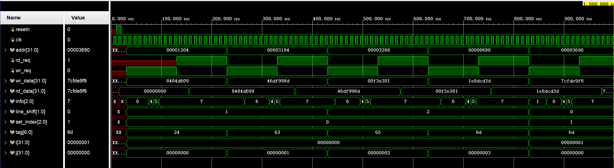
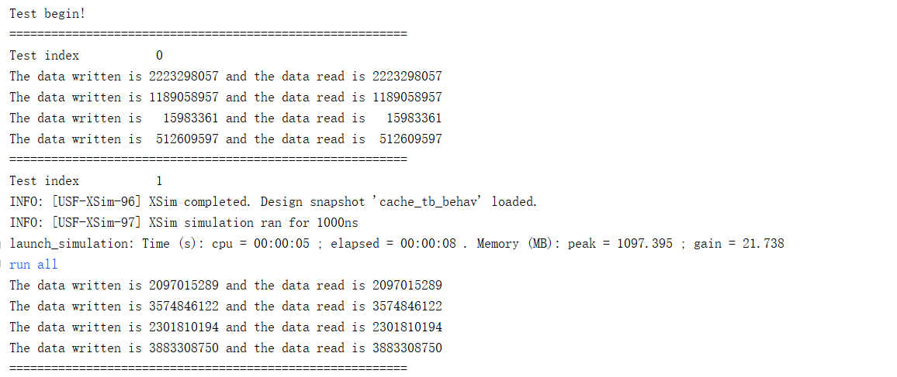
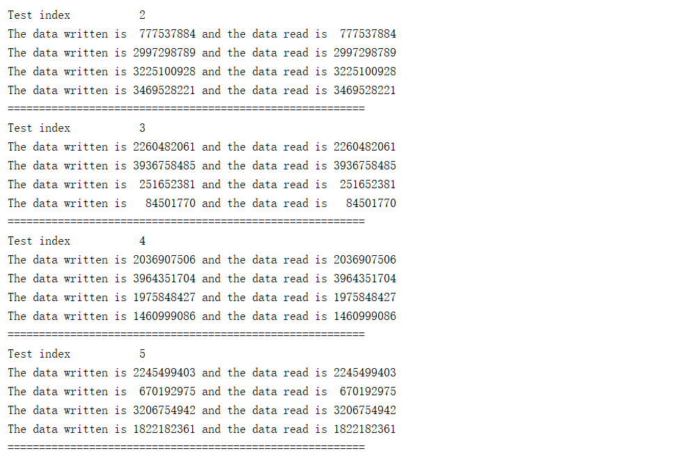
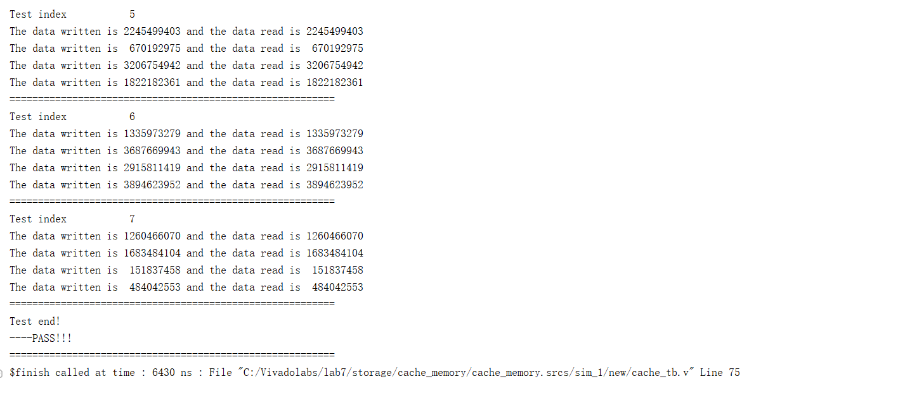
### (5)错误现象及分析
&emsp;&emsp;完成实验的过程中没有出现错误。

## 思考题
### 1、分别采用分布式 RAM 和块 RAM 实现存储器，通过仿真程序分析异步读和同步读的时序状态。
采用分布式RAM:
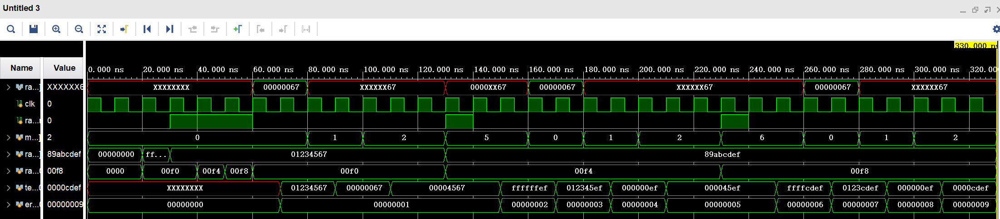
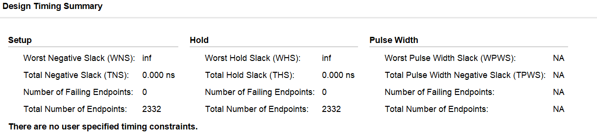
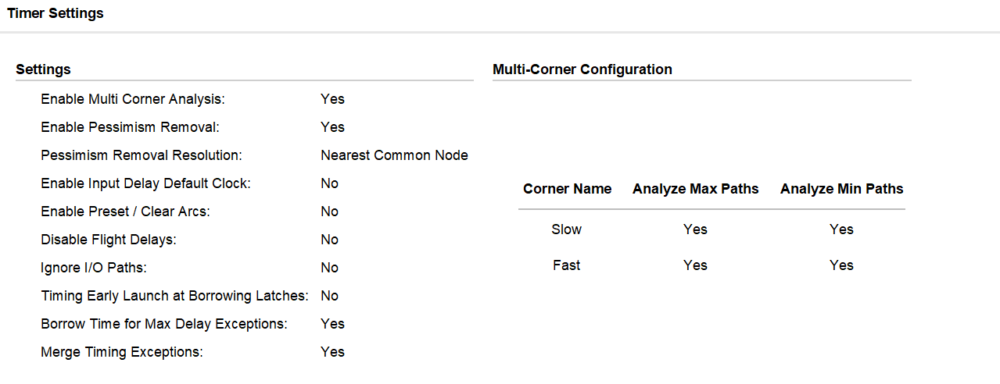
采用快RAM:
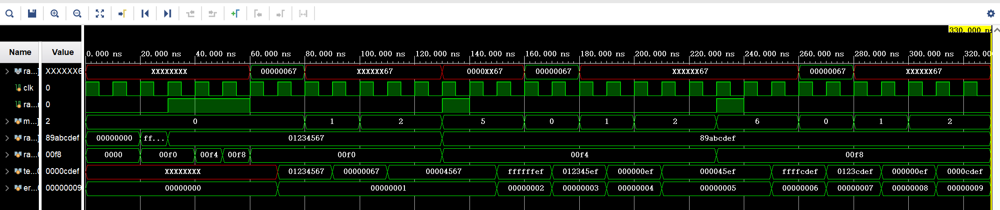
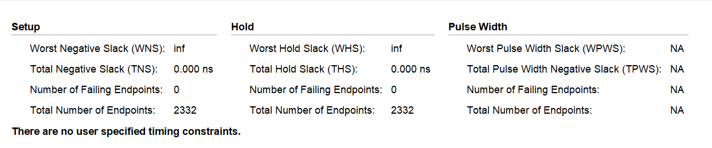
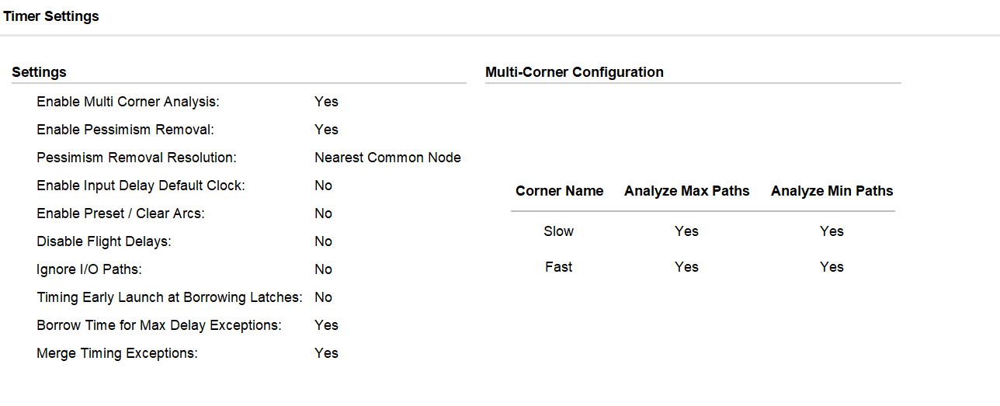
### 2、分析 Cache 大小对命中率的影响。
&emsp;&emsp;命中率是指在访问缓存时成功获取所需数据的概率。高命中率意味着大部分数据都能够从缓存中获取，从而减少了对慢速主存的访问次数。
&emsp;&emsp;缓存大小直接关联到其容量，即可以存储的数据量。较小的缓存容量可能会导致更频繁的缓存溢出（缓存中无法存储所有需要的数据），从而降低命中率。缓存的命中率受到程序的局部性原理的影响。这一原理包括时间局部性（最近访问的数据可能在不久的将来再次被访问）和空间局部性（最近访问的数据附近的数据可能也会被访问）。较大的缓存有助于更好地利用这些局部性原理，提高命中率。如下图:
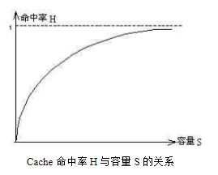
&emsp;&emsp;上面所讨论的是缓存容量和命中率的关系。当容量一定时，块大小对命中率也有影响。
&emsp;&emsp;当Cache的容量一定时，在采用组相联映像和变换方式的Cache中，块的大小对命中率的影响非常敏感。我们可以从下面的Cache影响逻辑表达式分析：
&emsp;&emsp;设Cache的总量为S，组数为M，组内块数为N，块大小为A。所以，有：S=M∗N∗A
&emsp;&emsp;由上式可知，在Cache的容量S和Cache组内块数N（也可换成是组数M）固定不变时Cache块大小与组数成反比。
&emsp;&emsp;因此，当Cache的块容量很小，组的数目就多，主存中的某一块可以映像到Cache中的块数就少，所以此时，Cache的命中率低。
&emsp;&emsp;随着块大小的增加，由于程序的空间局部性起主要作用，同一块中数据的利用率比较高。因此，Cache的命中率开始升高。但如果块变得过大的话，会减少Cache的总行数，而且，也会使得离所访问的位置较远的块被再次使用的概率变小。因此，这种增加趋势在某一个“最佳块大小”处使Cache命中率达到最大值。在这一点以后，命中率随着块大小的增加反而减小。因为实际上，当块的容量变得比较大时（此时还是在组相联映像中，并没有蜕变成全相联映像），进入Cache中的许多数据可能根本用不上。而且，随着块大小的增加，程序时间局部性的作用就会逐渐减弱。最后，当块大小等于整个Cache的容量时（此时主存块应该是按成组的方式被调入Cache），命中率趋近于零。如下图:
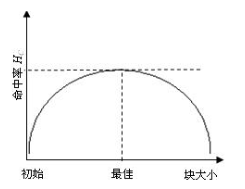
### 3、当指令 Cache 和数据 Cache 独立实现时，如何设计顶层 Cache 的有限状态机。
&emsp;&emsp;可如下设计:
1. 初始状态
   在系统启动时，Cache 处于初始化状态。在这个状态下，Cache 可能会进行一些初始化操作，如清空缓存内容、设置缓存大小和关联性、配置替换策略等。
2. 等待访问（Idle）
   在没有访问请求时，Cache 处于等待状态。在这个状态下，系统等待来自处理器的读取或写入请求。
3. 指令 Cache 访问
   当处理器请求执行指令时，顶层 Cache 进入指令 Cache 访问状态。在这个状态下，Cache 会尝试从指令 Cache 中获取所需的指令。如果指令命中，可以转移到下一个状态；否则，需要从主存中加载指令，并更新指令 Cache。
4. 数据 Cache 访问
   当处理器请求读取或写入数据时，顶层 Cache 进入数据 Cache 访问状态。在这个状态下，Cache 会尝试从数据 Cache 中获取所需的数据。如果数据命中，可以转移到下一个状态；否则，需要从主存中加载数据（对于读取操作）或将数据写入主存（对于写入操作），并更新数据 Cache。
5. 写回
   当数据 Cache 使用写回策略时，可能需要一个写回状态。在这个状态下，Cache 将脏数据写回主存，以保持一致性。
6. 异常处理
   在某些情况下，如缺页异常、缺失的指令等，Cache 可能需要转移到异常处理状态。在这个状态下，Cache 可能会协同处理器和内存管理单元来解决异常情况。