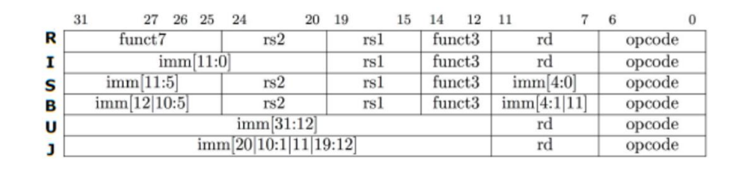
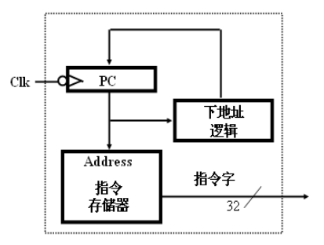
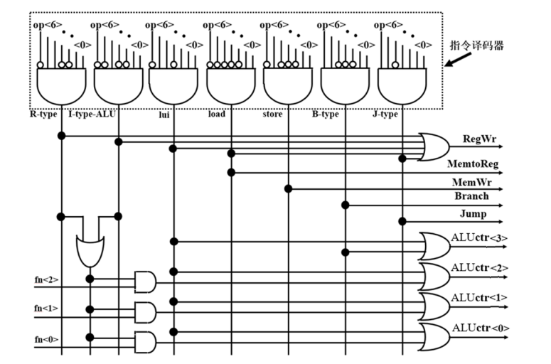
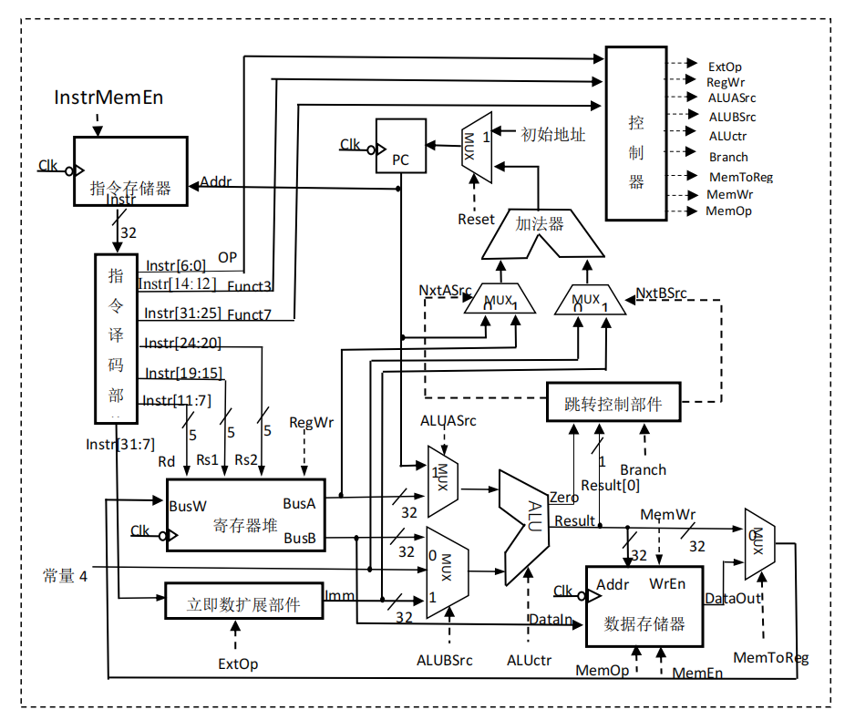
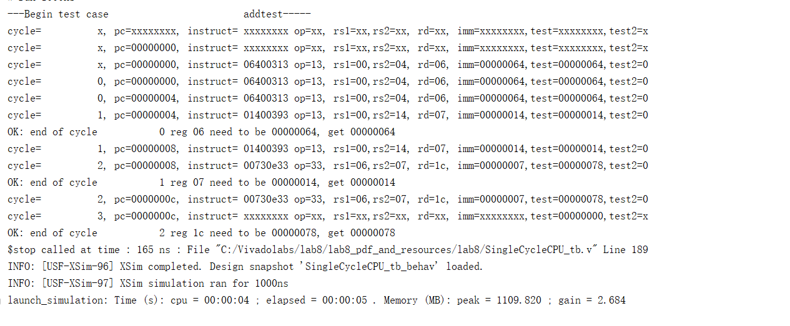
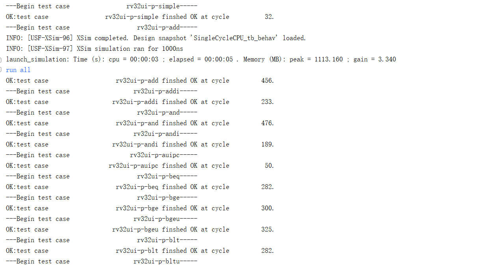
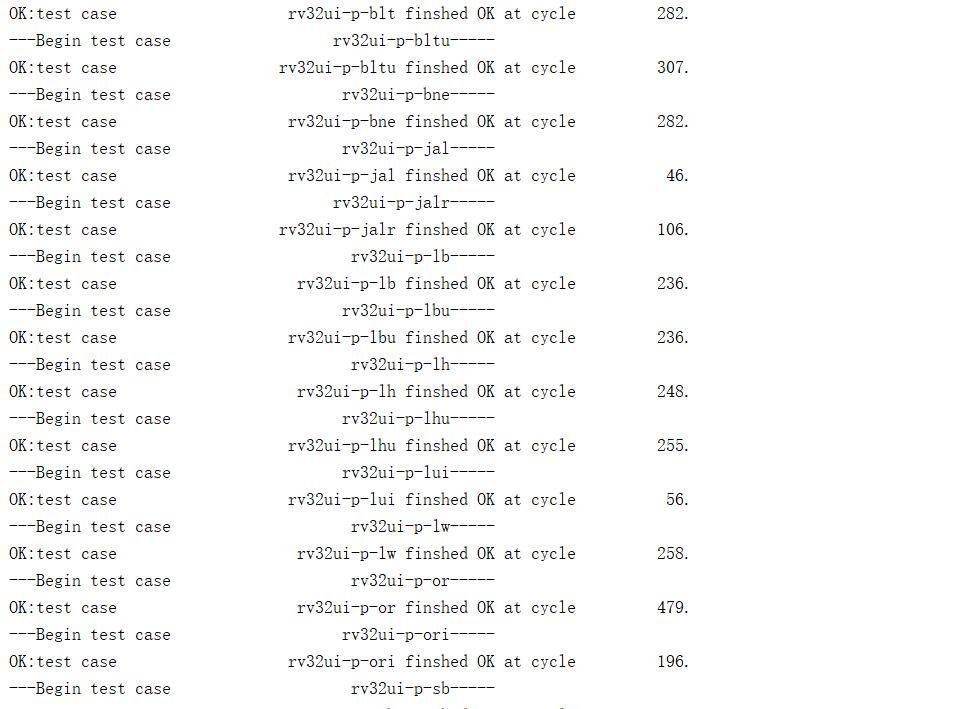
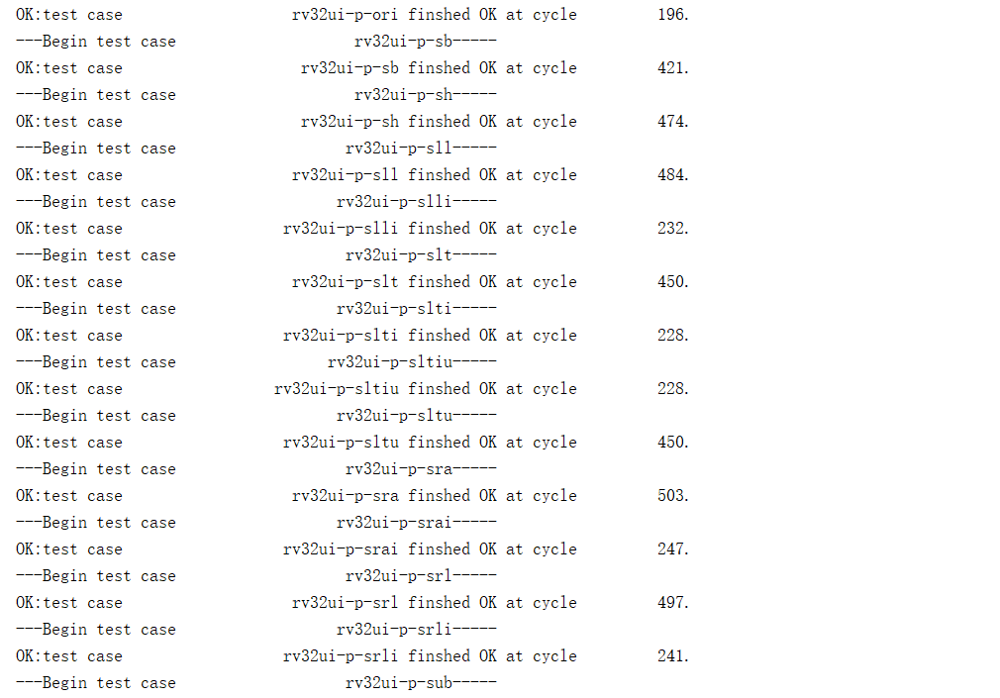
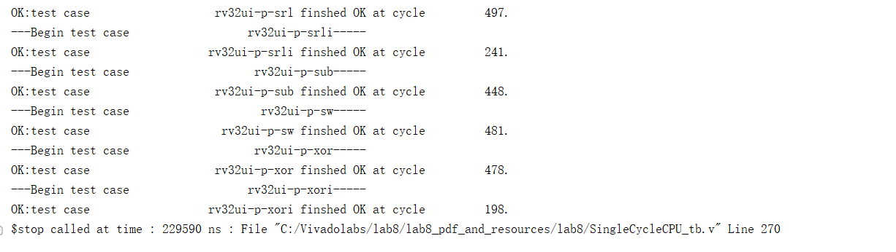

<center><font size=6>Lab8 单周期 CPU 设计</font></center>

## 在进行实验之前，先了解单周期CPU原理
通常，一条指令执行过程的大致如下。
（1）取指令。从 PC 指出的内存单元中取出指令送到指令寄存器（IR）。
（2）对 IR 中的指令操作码译码并计算下条指令地址，并根据指令操作码和功能码生成操作控制信号。
（3）计算源操作数地址并获取源操作数。根据寻址方式计算源操作数地址，根据若源操作数是存储器数据还是寄存器数据，分别进行不同的读取操作。
（4）对操作数进行相应的运算。在 ALU 或加法器等运算部件中对取出的操作数进行运算。
（5）计算目的操作数地址并存储结果。根据寻址方式计算目的操作数的地址，将运算结果存入存储单元中，或存入通用寄存器中。
&emsp;&emsp;首先看riscv指令集格式。如下图：

##### 1.数据通路。
1. 取指令部件

上图是其原理图。
&emsp;&emsp;指令存储器专门用来存放指令。在单周期 CPU 设计中，由于需要在一个时钟周期内完成所有的指令操作，因此指令存储器需要采用异步读的方式来实现，实验中的指令存储器采用 FPGA 中的分布式 RAM来实现。
&emsp;&emsp;指令存储器主要接口包括当前指令机器代码，以及时钟信号、当前指令地址线 PC、片选信号等输入信号。在 RV32I 中，每条指令的长度都是 4 个字节，因此所有代码地址都是 4 字节对齐，即 PC 最低两位总是 0。
   指令存储器:
```
module InstrMem(
 output reg [31:0] instr, //输出 32 位指令
 input [31:0] addr, //地址字长 32 位，实际有效字长根据指令存储器容量来确定
 input InstrMemEn, //指令存储器片选信号
 input clk //时钟信号，下降沿有效
 );
 (* ram_style="distributed" *) reg [31:0] ram[16384:0];//64KB 的存储器空间，可存储 16k 条指令，地
址有效长度 16 位
 always @ (posedge clk) begin
 if (InstrMemEn) instr = ram[addr[15:2]];
 end 
endmodule
```
 PC 输入、立即数输入，寄存器 A 口输入、跳转控制信号，输出下一条指令地址
```
module nextPC(
 output [31:0] nxtPC, //下一个取指令地址，32 位，取低 16 位
 input [31:0] BusA, //BusA
 input [31:0] curPC,Imm, //PC 值、立即数
 input NxtASrc, NxtBSrc //选择信号，由分支控制部件产生
 );
 wire [31:0] NxtA, NxtB;
 assign NxtA = NxtASrc ? BusA&32'hfffffffe:curPC;
 assign NxtB = NxtBSrc ? Imm&32'hfffffffe:32'd4;
 assign nxtPC=NxtA+NxtB;endmodule
```
2. 取操作数部件
指令解析:
```
module InstrParse(
 output [6:0] opcode, //指令编码 7 位
 output [4:0] rd, //目的寄存器编号 5 位
 output [2:0] funct3, //3 位功能码
 output [4:0] rs1, //源寄存器 1 编号 5 位
 output [4:0] rs2, //源寄存器 2 编号 5 位
 output [7:0] funct7, //7 位功能码
 input [31:0] instr //指令 
);
 assign opcode = instr[6:0];
 assign rd = instr[11:7];
 assign funct3 = instr[14:12];
 assign rs1 = instr[19:15];
 assign rs2 = instr[24:20];
 assign funct7 = instr[31:25];
endmodule
```
立即数扩展器:
```
module InstrToImm (
input [31:0] instr, //32 位指令
input [2:0] ExtOp, //扩展控制码
output reg [31:0] imm
);
wire [31:0] immI, immU, immS, immB, immJ;
assign immI = {{20{instr[31]}}, instr[31:20]};
assign immU = {instr[31:12], 12'b0};
assign immS = {{20{instr[31]}}, instr[31:25], instr[11:7]};
assign immB = {{20{instr[31]}}, instr[7], instr[30:25], instr[11:8], 1'b0};
assign immJ = {{12{instr[31]}}, instr[19:12], instr[20], instr[30:21], 1'b0};
always@(*)
begin
case(ExtOp)
 3'b000:
 imm = immI;
3'b001:
imm = immU;
3'b010:
 imm = immS;
3'b011:
imm = immB;
3'b100:
 imm = immJ;
default:
imm = immI;
endcase
end
endmodule
```
#### 2.控制器
控制器电路原理:

跳转控制模块:
```
module BranchControl(
 output reg NxtASrc, NxtBSrc,
input zero, result0,
 input [2:0] Branch 
 );
 always @ (*) begin
 case (Branch)
 3'b000: begin NxtASrc = 1'b0; NxtBSrc = 1'b0; end //非跳转指令
 3'b001: begin NxtASrc = 1'b0; NxtBSrc = 1'b1; end //jal
 3'b010: begin NxtASrc = 1'b1; NxtBSrc = 1'b1; end //jalr
 3'b100: begin NxtASrc = 1'b0; NxtBSrc = (zero===1'bx)?1'b1:zero; end //beq
 3'b101: begin NxtASrc = 1'b0; NxtBSrc = (zero===1'bx)?1'b1:~zero; end //bne
 3'b110: begin NxtASrc = 1'b0; NxtBSrc = (result0===1'bx)?1'b1:result0; end //blt, bltu
 3'b111: begin NxtASrc = 1'b0; NxtBSrc = (result0===1'bx)?1'b1:~result0; end //bge, bgeu
 default: begin NxtASrc = 1'b0; NxtBSrc = 1'b0; end
 endcase
 end
endmodule
```
## 实验内容
### (1)实验整体方案设计
&emsp;&emsp;为了保证 CPU 每次重启时，都能从相同的初始状态开始执行程序，设计一个复位信号 Reset，用来初始化 CPU 中各个部件的控制信号和设置 PC 寄存器的起始地址。
&emsp;&emsp;为了在后续的指令测试集验证和计算机系统实验中简化外设对存储器的访问，本次实验中将指令存储器和数据存储器作为独立模块，与 CPU 设计分离，放在顶层模块中引用。
&emsp;&emsp;由于指令存储器和数据存储器没有包含在 CPU 模块中，因此在 CPU 模块中需要提供指令存储器和数据存储器的输入输出端口信号以及时钟信号 clk 和复位信号 Reset。
### (2)功能表、原理图、关键设计语句与源码
原理图如下:

由于加了reset按钮，pc也要置零。这里添加一个pc是否清零模块:
```
`timescale 1ns / 1ps

module pc(
input [31:0] nxtPC,
input Reset,
input clk,
output reg [31:0] PC
    );
    always @(posedge clk) begin
    if (Reset) PC = 0;
    else PC = nxtPC;
end
endmodule
```
控制器代码:
```
`timescale 1ns / 1ps
//////////////////////////////////////////////////////////////////////////////////
// Company: 
// Engineer: 
// 
// Create Date: 2023/11/27 22:59:23
// Design Name: 
// Module Name: Control
// Project Name: 
// Target Devices: 
// Tool Versions: 
// Description: 
// 
// Dependencies: 
// 
// Revision:
// Revision 0.01 - File Created
// Additional Comments:
// 
//////////////////////////////////////////////////////////////////////////////////

//控制器
module Control(
    output [2:0] ExtOp,
    output RegWr,
    output ALUASrc,
    output [1:0] ALUBSrc,
    output [3:0] ALUctr,
    output [2:0] Branch,
    output MemtoReg,
    output MemWr,
    output [2:0] MemOp,
    input [6:0] opcode,
    input [2:0] funct3,
    input [6:0] funct7
    );
    wire U_lui   = opcode == 7'h37;
    wire U_auipc = opcode == 7'h17;
    wire I_Arith = opcode == 7'h13;
    wire R_Arith = opcode == 7'h33;
    wire J_jal   = opcode == 7'h6f;
    wire J_jalr  = opcode == 7'h67;
    wire B_Instr = opcode == 7'h63;
    wire I_load  = opcode == 7'h03;
    wire S_Instr = opcode == 7'h23;
    wire halt    = opcode == 7'h00;

    assign ExtOp = U_lui | U_auipc ? 3'b001
                 : S_Instr         ? 3'b010
                 : B_Instr         ? 3'b011
                 : J_jal           ? 3'b100
                 : 3'b000;
    assign RegWr = U_lui | U_auipc | J_jal | J_jalr | I_Arith | I_load | R_Arith;
    assign ALUASrc = U_auipc | J_jal | J_jalr;
    assign ALUBSrc = J_jal | J_jalr ? 2'b01
                   : U_lui | U_auipc | I_Arith | I_load | S_Instr ? 2'b10
                   : 2'b00;
    assign ALUctr[3] = U_lui | (R_Arith && funct3 == 3'b000 && funct7[5] == 1'b1) | 
    ((I_Arith || R_Arith) && funct3 == 3'b101 && funct7[5] == 1'b1);
    assign ALUctr[2] = U_lui | ((I_Arith || R_Arith) && funct3[2]);
    assign ALUctr[1] = U_lui | ((I_Arith || R_Arith) && funct3[1]) | B_Instr;
    assign ALUctr[0] = U_lui | ((I_Arith || R_Arith) && funct3[0]) | (B_Instr && funct3[2] && funct3[1]);
    assign Branch = J_jal                      ? 3'b001
                  : J_jalr                     ? 3'b010
                  : B_Instr & funct3 == 3'b000 ? 3'b100
                  : B_Instr & funct3 == 3'b001 ? 3'b101
                  : B_Instr & (funct3 == 3'b110 | funct3 == 3'b100) ? 3'b110
                  : B_Instr & (funct3 == 3'b101 | funct3 == 3'b111) ? 3'b111
                  : 3'b000;
    assign MemtoReg = I_load;
    assign MemWr = S_Instr;
    assign MemOp = funct3;
endmodule

```
单周期CPU：
```
`timescale 1ns / 1ps

module SingleCycleCPU(
    input 	      clock,
	input 	      reset,
	output [31:0] InstrMemaddr,      //指令存储器地址
	input  [31:0] InstrMemdataout,   //指令内容
	output        InstrMemclk,       // 指令存储器读取时钟，为了实现异步读取，设置读取时钟和写入时钟反相
	output [31:0] DataMemaddr,       //数据存储器地址
	input  [31:0] DataMemdataout,   //数据存储器输出数据
	output [31:0] DataMemdatain,    //数据存储器写入数据
	output 	      DataMemrdclk,     //数据存储器读取时钟，为了实现异步读取，设置读取时钟和写入时钟反相
	output	      DataMemwrclk,      //数据存储器写入时钟
	output [2:0]  DataMemop,         //数据读写字节数控制信号
	output        DataMemwe,         //数据存储器写入使能信号
	output [15:0] dbgdata            //debug调试信号，输出16位指令存储器地址有效地址
    );
    //读取操作在时钟的上升沿进行

assign InstrMemclk = clock;
assign DataMemrdclk = clock;
assign DataMemwrclk = ~clock;

wire InstrMemEn;
wire [6:0] opcode; 
wire [4:0] rd; 
wire [2:0] funct3;
wire [6:0] funct7;
wire [4:0] rs1;
wire [4:0] rs2;
wire [31:0] Imm;
wire [2:0] ExtOp;
wire RegWr;
wire ALUASrc;
wire [1:0] ALUBSrc;
wire [3:0] ALUctr;
wire [2:0] Branch;
wire MemtoReg;
wire MemWr;
wire [2:0] MemOp;
wire [31:0] BusA;
wire [31:0] BusB;
wire NxtASrc;
wire NxtBSrc;
wire [31:0] DataA = ALUASrc ? InstrMemaddr : BusA;
wire [31:0] DataB = ALUBSrc == 2'b00 ? BusB
                  : ALUBSrc == 2'b01 ? 4
                  : Imm;
wire zero;
wire result0 = DataMemaddr[0];
wire [31:0] BusW = MemtoReg ? DataMemdataout : DataMemaddr;
wire [31:0] nxtPC;
assign dbgdata = InstrMemaddr[15:0];
wire [31:0] pc = InstrMemaddr;
wire [6:0] op = opcode;
wire [31:0] instr = InstrMemdataout;
wire [31:0] imm = Imm;
wire [31:0] alua = DataMemaddr;

assign DataMemdatain = BusB;
assign DataMemop = MemOp;
assign DataMemwe = MemWr;

InstrMem myInstrMem(.instr(InstrMemdataout), .addr(InstrMemaddr), .InstrMemEn(InstrMemEn), .clk(InstrMemclk));
InstrParse myInstrParse(.opcode(opcode), .rd(rd), .funct3(funct3), .rs1(rs1), .rs2(rs2), 
.funct7(funct7), .instr(InstrMemdataout));
InstrToImm myInstrToImm(.instr(InstrMemdataout), .ExtOp(ExtOp), .imm(Imm));
Control myControl(.ExtOp(ExtOp), .RegWr(RegWr), .ALUASrc(ALUASrc), .ALUBSrc(ALUBSrc), 
.ALUctr(ALUctr), .Branch(Branch), 
.MemtoReg(MemtoReg), .MemWr(MemWr), .MemOp(MemOp), .opcode(opcode), .funct3(funct3), .funct7(funct7));
regfile32 myregfile(.busa(BusA), .busb(BusB), .busw(BusW), .ra(rs1), .rb(rs2), .rw(rd), 
.clk(DataMemwrclk), .we(RegWr));//NOTE: definition of clk modified
ALU32 myALU32(.result(DataMemaddr), .zero(zero), .dataa(DataA), .datab(DataB), .aluctr(ALUctr));
DataMem mydatamem(.dataout(DataMemdataout), .clk(DataMemrdclk), .we(MemWr), .MemOp(MemOp), .datain(BusB), 
.addr(DataMemaddr[15:0]));
BranchControl myBranchControl(.NxtASrc(NxtASrc), .NxtBSrc(NxtBSrc), .zero(zero), 
.result0(result0), .Branch(Branch));
nextPC mynextPC(.nxtPC(nxtPC), .BusA(BusA), .curPC(InstrMemaddr), .Imm(Imm), .NxtASrc(NxtASrc), 
.NxtBSrc(NxtBSrc));
pc myPCMem(.nxtPC(nxtPC), .Reset(reset), .clk(DataMemwrclk), .PC(InstrMemaddr));
endmodule
```
### (3)实验数据仿真测试波形图
仿真测试代码:
```
`timescale 1ns / 1ps

module SingleCycleCPU_tb(    );
integer numcycles;  //number of cycles in test

reg clk,reset;  //clk and reset signals

reg[8*30:1] testcase; //name of testcase

// CPU declaration

// signals
wire [31:0] iaddr,idataout;
wire iclk;
wire [31:0] daddr,ddataout,ddatain;
wire drdclk, dwrclk, dwe;
wire [2:0]  dop;
wire [15:0] cpudbgdata;


//main CPU
SingleCycleCPU  mycpu(.clock(clk), 
                 .reset(reset), 
				 .InstrMemaddr(iaddr), .InstrMemdataout(idataout), .InstrMemclk(iclk), 
				 .DataMemaddr(daddr), .DataMemdataout(ddataout), .DataMemdatain(ddatain), 
                 .DataMemrdclk(drdclk),
				  .DataMemwrclk(dwrclk), .DataMemop(dop), .DataMemwe(dwe),  
                  .dbgdata(cpudbgdata));

			  

 InstrMem myinstrmem(.instr(idataout),.addr(iaddr),.InstrMemEn(1'b1),.clk(iclk)	);
	

//data memory	

DataMem mydatamem(.dataout(ddataout), .clk(dwrclk),  .we(dwe),  .MemOp(dop), .datain(ddatain),.addr(daddr));

//useful tasks
task step;  
//step for one cycle ends 1ns AFTER the posedge of the next cycle
	begin
		#9  clk=1'b0; 
		#10 clk=1'b1;
		numcycles = numcycles + 1;	
		#1 ;
	end
endtask
				  
task stepn; //step n cycles
   input integer n; 
	integer i;
	begin
		for (i =0; i<n ; i=i+1)
			step();
	end
endtask

task resetcpu;  //reset the CPU and the test
	begin
		reset = 1'b1; 
		step();
		#5 reset = 1'b0;
		numcycles = 0;
	end
endtask

task loadtestcase;  //load intstructions to instruction mem
	begin
		$readmemh({testcase, ".hex"},myinstrmem.ram);
		$display("---Begin test case %s-----", testcase);
	end
endtask
	
task checkreg;//check registers
   input [4:0] regid;
	input [31:0] results; 
	reg [31:0] debugdata;
	begin
	    debugdata=mycpu.myregfile.regfiles[regid]; //wait for signal to settle
		 if(debugdata==results)
		 	begin
				$display("OK: end of cycle %d reg %h need to be %h, get %h", 
                numcycles-1, regid, results, debugdata);
			end
		else	
			begin
				$display("!!!Error: end of cycle %d reg %h need to be %h, get %h", 
                numcycles-1, regid, results, debugdata);
			 end
	end
endtask

task checkmem;//check registers
   input [31:0] inputaddr;
   input [31:0] results;	
	reg [31:0] debugdata;
	reg [14:0] dmemaddr;
	begin
	    dmemaddr=inputaddr[16:2];
	    debugdata=mydatamem.ram[dmemaddr]; 
		 if(debugdata==results)
		 	begin
				$display("OK: end of cycle %d mem addr= %h need to be %h, get %h", 
                numcycles-1, inputaddr, results, debugdata);
			end
		else	
			begin
				$display("!!!Error: end of cycle %d mem addr= %h need to be %h, get %h", 
                numcycles-1, inputaddr, results, debugdata);
			 end
	end
endtask

task checkpc;//check PC
	input [31:0] results; 
	begin
		 if(mycpu.pc==results)
		 	begin
				$display("OK: end of cycle %d PC need to be %h, get %h", numcycles-1,  
                results, mycpu.pc);
			end
		else	
			begin
				$display("!!!Error: end of cycle %d PC need to be %h, get %h", numcycles-1, 
                results, mycpu.pc);
			 end
	end
endtask

integer maxcycles =10000;

task run;
   integer i;
	begin
	   i = 0;
	   while( (mycpu.instr!=32'hdead10cc) && (i<maxcycles))
		begin
		   step();
			i=i+1;
		end
	end
endtask

task checkmagnum;
    begin
	    if(numcycles>maxcycles)
		 begin
		   $display("!!!Error:test case %s does not terminate!", testcase);
		 end
		 else if(mycpu.myregfile.regfiles[10]==32'hc0ffee)
		    begin
		       $display("OK:test case %s finshed OK at cycle %d.", 
               testcase, numcycles-1);
		    end
		 else if(mycpu.myregfile.regfiles[10]==32'hdeaddead)
		 begin
		   $display("!!!ERROR:test case %s finshed with error in cycle %d.", 
           testcase, numcycles-1);
		 end
		 else
		 begin
		    $display("!!!ERROR:test case %s unknown error in cycle %d.", 
            testcase, numcycles-1);
		 end
	 end
endtask

task loaddatamem;
    begin
	     $readmemh({testcase, "_d.hex"},mydatamem.ram);
	 end
endtask

task run_riscv_test;
    begin
	   loadtestcase();
	   loaddatamem();
	   resetcpu();
	   run();
	   checkmagnum();
	 end
endtask
	
initial begin:TestBench
      #80
      // output the state of every instruction
	//	$monitor("cycle=%d, pc=%h, instruct= %h op=%h, 
    rs1=%h,rs2=%h, rd=%h, imm=%h,test=%h,test2=%h", 
	//	       numcycles,  mycpu.pc, mycpu.instr, mycpu.op, mycpu.
    rs1,mycpu.rs2,mycpu.rd,mycpu.imm,mycpu.alua,mycpu.zero);
/*
     testcase = "addtest";
     loadtestcase();
     resetcpu();
     step();
     checkreg(6,100); //t1==100
     step();
     checkreg(7,20); //t2=20
     step();
     checkreg(28,120); //t3=120
     $stop;
*/
		
		testcase = "rv32ui-p-simple";
		run_riscv_test();
		testcase = "rv32ui-p-add";
		run_riscv_test();
		testcase = "rv32ui-p-addi";
		run_riscv_test();
		testcase = "rv32ui-p-and";
		run_riscv_test();
		testcase = "rv32ui-p-andi";
		run_riscv_test();
	    testcase = "rv32ui-p-auipc";
		run_riscv_test();
		testcase = "rv32ui-p-beq";
		run_riscv_test();
		testcase = "rv32ui-p-bge";
		run_riscv_test();
		testcase = "rv32ui-p-bgeu";
		run_riscv_test();
		testcase = "rv32ui-p-blt";
		run_riscv_test();
		testcase = "rv32ui-p-bltu";
		run_riscv_test();
		testcase = "rv32ui-p-bne";
		run_riscv_test();
		testcase = "rv32ui-p-jal";
		run_riscv_test();
		testcase = "rv32ui-p-jalr";
		run_riscv_test();
		testcase = "rv32ui-p-lb";
		run_riscv_test();
		testcase = "rv32ui-p-lbu";
		run_riscv_test();
		testcase = "rv32ui-p-lh";
		run_riscv_test();
		testcase = "rv32ui-p-lhu";
		run_riscv_test();
		testcase = "rv32ui-p-lui";
		run_riscv_test();
		testcase = "rv32ui-p-lw";
		run_riscv_test();
		testcase = "rv32ui-p-or";
		run_riscv_test();
		testcase = "rv32ui-p-ori";
		run_riscv_test();
		testcase = "rv32ui-p-sb";
		run_riscv_test();
		testcase = "rv32ui-p-sh";
		run_riscv_test();
		testcase = "rv32ui-p-sll";
		run_riscv_test();
		testcase = "rv32ui-p-slli";
		run_riscv_test();
		testcase = "rv32ui-p-slt";
		run_riscv_test();
		testcase = "rv32ui-p-slti";
		run_riscv_test();
		testcase = "rv32ui-p-sltiu";
		run_riscv_test();
		testcase = "rv32ui-p-sltu";
		run_riscv_test();
		testcase = "rv32ui-p-sra";
		run_riscv_test();
		testcase = "rv32ui-p-srai";
		run_riscv_test();
		testcase = "rv32ui-p-srl";
		run_riscv_test();
		testcase = "rv32ui-p-srli";
		run_riscv_test();
		testcase = "rv32ui-p-sub";
		run_riscv_test();
		testcase = "rv32ui-p-sw";
		run_riscv_test();
		testcase = "rv32ui-p-xor";
		run_riscv_test();
		testcase = "rv32ui-p-xori";
		run_riscv_test();
		
		
		$stop;
		
end

endmodule

```
反震测试结果:





### (4)验证
为了验证，需要加上顶层模块，显示结果。
也需要提前准备riscv程序机器码，将其读入到指令存储器中;同时将数据读入到数据存储器中。
底层模块:
```
`timescale 1ns / 1ps

module SingleCycleCPU_top(
output [6:0] segs,           //七段数码管字形输出
output [7:0] AN,            //七段数码管显示32位运算结果 
input CLK100MHZ,
input BTNC,
input [11:0] nin
    );
    clk_wiz clk_wiz_inst(
    .clk_out1(clk),     // output clk_out1
    .reset(1'b0), // input reset
    .locked(1'b0),       // output locked
    .clk_in1(CLK100MHZ));      // input clk_in1


// signals
wire [31:0] iaddr;
wire [31:0] idataout;
wire iclk;
wire [31:0] daddr,ddataout,ddatain;
wire drdclk, dwrclk, dwe;
wire [2:0]  dop;
wire [15:0] cpudbgdata;

wire [31:0] dddataout;

//main CPU
SingleCycleCPU  mycpu(.clock(clk), 
                 .reset(BTNC), 
				 .InstrMemaddr(iaddr), .InstrMemdataout(idataout), .InstrMemclk(iclk), 
				 .DataMemaddr(daddr), .DataMemdataout(dddataout), 
                 .DataMemdatain(ddatain), .DataMemrdclk(drdclk),
				  .DataMemwrclk(dwrclk), .DataMemop(dop), .
                  DataMemwe(dwe),  .dbgdata(cpudbgdata));

reg [31:0] value;

always @(negedge clk) begin
    if (BTNC) begin 
        value <= 0; 
    end
    else begin
        value <= mycpu.myregfile.regfiles[10];
    end
end

Segdisplay mySegdisplay(.clk(clk), .value(value), .segs(segs), .AN(AN));
endmodule

```
### (5)错误现象及分析
暂无。


## 思考题
### 1、分析比较运算实用独立比较器件和利用减法运算来实现的区别。
&emsp;&emsp;单周期CPU是一种基本的计算机架构，其中每个指令在一个时钟周期内完成。在这样的CPU中，执行不同操作的指令可能需要不同的时钟周期数。
&emsp;&emsp;独立比较器件通常是一种专门的硬件电路，用于执行比较操作。这些比较器件可以是单一功能的，专门用于执行比较操作，或者是集成在大型集成电路中的一部分。独立比较器件通常能够在一个时钟周期内完成比较操作，因为它们专门设计用于执行这个特定的任务。集成独立比较器件可能会增加硬件成本，因为需要额外的硬件电路来支持比较操作。
&emsp;&emsp;使用独立比较器件通常更快，因为它们专门设计用于比较操作。利用减法运算可能更经济，因为减法器是通用组件，而不是专门为比较设计的硬件。利用减法运算的方法可能会增加指令执行的复杂性，因为需要多个步骤来执行比较操作。独立比较器件能够提供更简单的接口。
### 2、分析为什么单周期 CPU 中指令存储器的读操作必须是异步读取？寄存器堆如何实现写后读操作？
问题一：
&emsp;&emsp;在单周期CPU中，指令存储器的异步读取是为了确保在一个时钟周期内完成读取操作，以匹配整个CPU的单周期执行模型。
&emsp;&emsp; 异步读取确保指令存储器的输出能够在下一个时钟周期内有效。这有助于维持整个CPU的时序一致性，确保每个阶段的操作都在规定的时钟周期内完成，从而简化控制逻辑。
&emsp;&emsp; 同时，异步读取可以简化指令存储器的控制逻辑。在同步读取中，需要考虑时钟边沿和同步信号的处理，这会增加逻辑复杂性。而异步读取通常只需要一个有效的地址信号，读取过程会在数据准备好时自动触发。
问题二：
&emsp;&emsp;写后读操作是指在一个寄存器或内存位置发生写操作之后，紧接着发生对同一位置的读操作。
1. 并行写入和读取端口： 为每个寄存器提供独立的写入和读取端口。这样，即使有一个写入操作正在进行，仍然可以同时进行读取操作。
2. 数据路径和控制逻辑： 在寄存器堆中，有一个数据路径，连接着所有寄存器。控制逻辑负责根据指令流水线的需要控制数据的读写。
3. 写入操作： 当执行写入操作时，将写入的数据写入目标寄存器的写入端口。这将在一个时钟周期内完成。
4. 读取操作： 当执行读取操作时，从目标寄存器的读取端口读取数据。读取操作也在一个时钟周期内完成。
5. 写后读冲突的解决： 如果检测到写后读冲突，需要确保读取操作能够获取到写入操作后的最新数据。这可能需要在写入完成后延迟读取，或者使用一些缓冲机制。
### 3、思考如何实现支持 RV32M 指令集的单周期中央处理器？
&emsp;&emsp;将一个原本支持 RISCV32I 指令集的单周期中央处理器升级以支持 RV32M 指令集，需要添加对乘法（M）、除法（D）以及整数乘累加（A）等指令的硬件支持。需要再以下方面作出修改:
1. 指令解码： 在已有的指令解码模块中扩展以支持 RV32M 指令集。RISCV32I 的指令长度为 32 位，而 RV32M 指令集可能引入新的操作码或者对已有操作码进行扩展。确保指令解码器能够正确地解析 RV32M 指令。
2. 寄存器文件： RISCV32I 使用通用寄存器文件（Register File）来存储数据。在支持 RV32M 指令集时，可能需要扩展寄存器文件以支持更多的寄存器或者添加专门用于乘法和除法的寄存器。
3. 算术逻辑单元（ALU）： 在 ALU 中添加乘法器和除法器的支持。这可能涉及到修改 ALU 的操作控制逻辑，以便执行 RV32M 指令集中的相应运算。
4. 控制单元： 修改控制单元，以支持 RV32M 指令集中新增的操作。这包括生成适当的控制信号，以启动乘法和除法的操作。
5. 数据通路设计： 将新的硬件模块（如乘法器和除法器）与现有的数据通路连接起来。确保数据正确流动，同时满足 RV32M 指令集的执行需求。
6. 存储器接口： RV32M 指令集可能需要使用存储器来存储乘法和除法的中间结果。确保存储器接口能够支持这些需要。